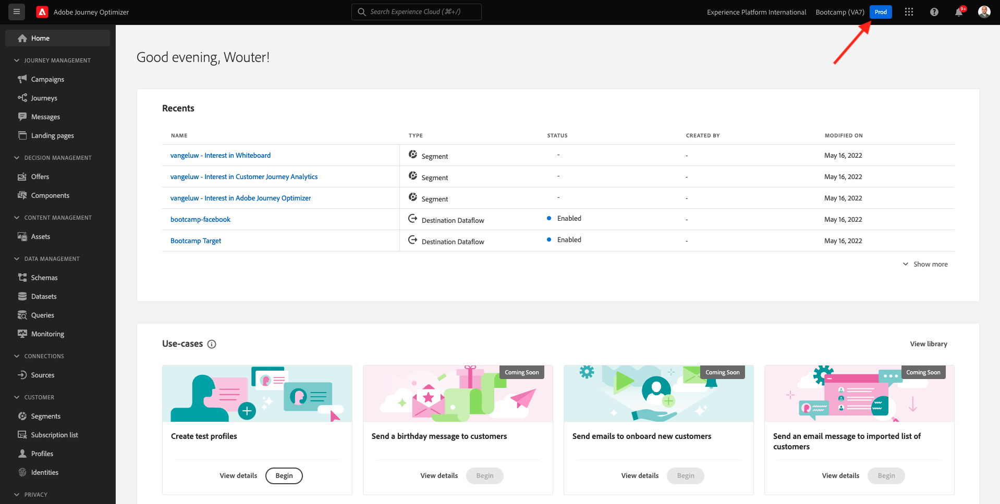
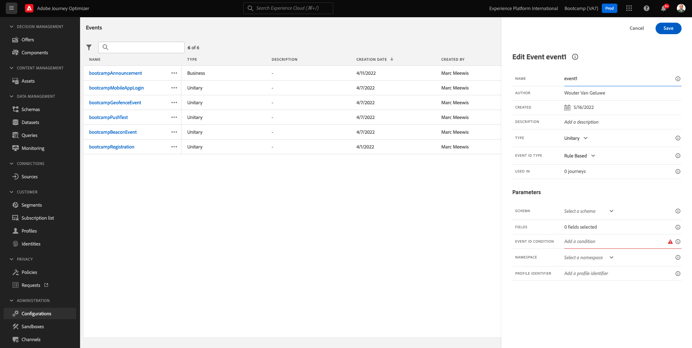

# 2.2 Crie seu evento

Adobe Journey Optimizer Acessando에서 패사 로그인 [Adobe Experience Cloud](https://experience.adobe.com). Clique em **Journey Optimizer**.

Vokheserá rereconado para visualizaçao da **홈** Journey Optimizer 없음. Primeiro, verifique se voca esto o sandbox correto. O nome do sandbox que deve ser usado `Bootcamp`. Para alternar de um sandbox para, lista를 클릭합니다. 네스트 모예, 노메 도 샌드박스 é **Bootcamp**. Vokheestarala na visualizahan da **홈** 샌드박스 보내기 `Bootcamp`.

메뉴 항목 없음, 역할 파라 바이소 e clique em **구성**. Em Seguida, Client no botang **관리** 에이소드 **이벤트**.

Vokheverá vischang geral de todos os eventos disoniveis. Clique em **이벤트 만들기** 파라 코카 치아 세우 프로프리오 evento.

우마 노바 야넬라 데 에벤토 바지라 아파레서

Em Primeiro Lugar, dre um nome ao seu evento, por example: `seuSobrenomeAccountCreationEvent` eVar의 예시: `Account Creation Event`.

Em Seguida, certifique-se de que **유형** 에스파디니도 코모 **단일** e, 파라 셀레카오 드 **이벤트 ID 유형**, selecione **시스템 생성**.

에타파 세구인테-셀레상 두 스키마. Um 스키마 Foi Prepara Explisioncio 스키마 사용 `Demo System - Event Schema for Website (Global v1.1) v.1`.

데포이스 드 셀레치오나 스키마, 보케 베라 바드리오스 캄포스 센카도 셀레치오나오 **필드**. 아고라 보케 데 파사르 마우스소브레아 세상 **필드** 세라오 엑시비도스 클리케 노 아이콘 **편집**.

Vokheverá janela 팝업 드 **필드** e- 메일 전자 메일, 음성 데브 셀리시온어 알건스 도스 캄포스(campos que precisamozamas para personalizar o e-mail. Escolheremos outoutros attriputos de perfil posteriormente, utilizzando os djah existenthas Adobe Experience Platform.

옵저토 없음 `_experienceplatform.demoEnvironment`, pcertifique se de selecionar os campos **brandLogo** e **brandName**.

옵저토 없음 `_experienceplatform.identification.core`, certifique se de selecionar o campo **이메일**.

Clique em **확인** 파라 소아제

Em Seguida, Tela Abaixo deve Ser Exibida. Clique em **저장**  마아베스 파라 아터라수..

Seu evento agora esta configurado e salvo.

클리케 노 세벤토 노바멘테 파라 브리어 마이스 우마 **이벤트 편집**. 마우스소브레 **필드** 파라버 os 3 비아콘 아우트라베스 클리케 노 아이콘 **페이로드 보기**.

아고라 보베라 우모예 카르가 에스페라다
Seu evento tem eventID de orqueststraçuniau, que pode encontra roballao nessa carutil(payload) até visualizar `_experience.campaign.orchestration.eventID`.

O eventID é o que deve ser envado a Adobe Experience Platform para acionar a jornada que vociraem um dos prluxiomos exlicios. Lembre-se destine eventID, voke pode precyar posteriormente.
`"eventID": "19cab7852cdef99d25b6d5f1b6503da39d1f486b1d585743f97ed2d1e6b6c74f"`

Clique em **확인** e, em seguida, client em **취소**.

아고라 보케어 운동

프로시마 에타파: [ 2.3 Crie sua mensaem de e-mail](./ex3.md)

[레토나르 플루소 드 우수아리오 2](./uc2.md)

[레토날라 파라 토도스 오모두로스](../../overview.md)
