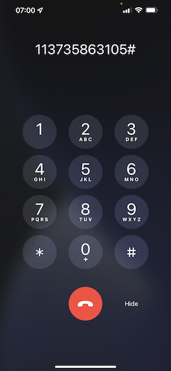

# 2.6 개인화상 콜 센터 없음

이미 부트캠프 동안 여러 번 논의했듯이 고객 경험을 개인화하는 것은 옴니채널 방식으로 이루어져야 합니다. 종종 콜 센터는 나머지 고객 여정과 꽤 연결되지 않으며 이로 인해 종종 고객 경험이 좌절되지만 그럴 필요가 없습니다. 콜 센터를 Adobe Experience Platform에 실시간으로 쉽게 연결할 수 있는 방법의 예를 살펴보겠습니다.

## 플루소 다 조나다 두 클리엔테

운동 금지 전적, 우산도 오 압리카티보 마우벨, 보테 콤프로우 프루투 클리칸도 노 보탄오 **Buy**.

아모스 수퍼 쿠마 테누마 페르군타 소브레가 세우페디도, 쿠포파리아? 정상문, 보레 리가리아 파라 콜센터

낭트 드 리가르라 콜센터, 보정밀 사브르 세우 **충성도 ID**. Visualizador de Perfil 사이트에서 Voqpode Encontrolar Seu ID de Fidelidade.

Nesse caso, o **충성도 ID** é **5863105**. 코모 파르트 드 노사 구현상 페르사아 페르사리사다가 다시 콜 센터 노 앰비앙테 드 데라상, 보테 데 디치오나르 프레픽소 오 세우 **충성도 ID**. O 프레픽소 é **11373**, 포르토어 또는 사용자 usado neste ensé 예시 ID de fidelidade **11373 5863105**.

아모스 페이저아고라 Use seu telifone e ligue para o numero **+1 (323) 745-1670**.

세라 세루디타케 인트라 세이디데 세기도 **#**. Digite Seu ID de Vidiidade.

보쿠비라 **여보세요, 수놈**&#x200B;네, 네. Esse nome é retirado do Perfil do Cliente em tempo real na Adobe Experience Platform. 보이팀 3 에스코라입니다 프레시온 오누메로 **1**, **주문 상태**.

데포이스 데 아우비르 o status do seu pedido, vokte terla a opçao de pressionar **1** para voltar 메뉴 주문서 ou pressionar 2. 프레시온 **2개**.

Em 세구이다, 세라 세라이타도 쿠크 아발리 수아 experiencia de 콜 센터, 셀레치오난도 누메로 1 e 5, 센도 1 baixo e 5 알토. 수아에콜라 파사.

수아차마다파라 콜센터 세라 엔케라다

Acesse [Adobe Experience Platform](https://experience.adobe.com/platform). 데포이스 데 파저 로그인, 보히라 아세사(Voqiera acessar a página initial da da Adobe Experience Platform)

낭트 드 티니어, 보어 정밀 선택 **샌드박스**. ONome do sandbox a ser selecionado ``Bootcamp``. É Poishivel 페이저는 Clicacando no texto **[!UICONTROL 프로덕션 제품]** 나린하 아줄 나파테 수페리어 다 데라 디포이즈 드 셀리시오나 [!UICONTROL 샌드박스] 고유도, 보카 베라 텔라 뮤다 아구 에스파아 [!UICONTROL 샌드박스] 전용.

Esquerda 메뉴 없음, Acesse **프로필** e **찾아보기**.

셀레치온 오 **ID 네임스페이스** **이메일** e insight o enderço de e-mail do seu perfil de clientte. Clique em **보기**. Clique para abrir seu perfil.

Voqe verá seu perfil de clinovanente. Acesse **이벤트**.

Em eventos, voke verla 2 eventos com um eventType de **callCenter**. O primeiro evento é o resultado da sua resposta à pergunta Avalie o seu n **통화 만족도 평가**.

역할 엄포코 파라오 보카 보베라 오 에벤토 포이 히셀레치오오 포카상 데 베리피카 오 **주문 상태**.

Acesse **세그먼트 멤버십**. 아고라 보베르아 케 2 세그멘토스 세퀴피엠 em seu perfil, em tempo real, com base nas interacx que teve por meio do 콜 센터. 에사스의 아서상 데 세그멘토 데브엠 경 우사다 파라 임탄타 쿠알퀴라상 피스타오 아콘테케 em qualquer outtro 운하입니다.

보스케어 운동선수

[레토나르 플루소 드 우수아리오 2](./uc2.md)

[레토날라 파라 토도스 오모두로스](../../overview.md)
