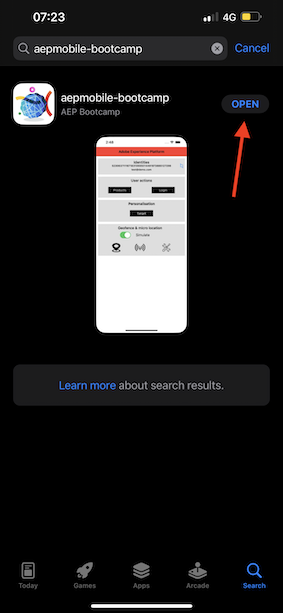
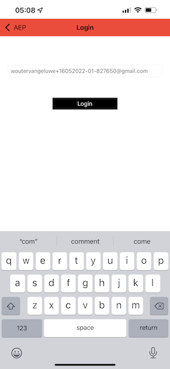
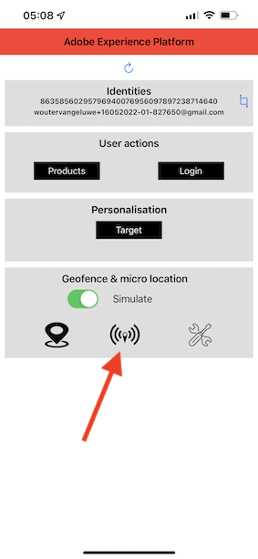

# 3.1 Use o aplicativo móvel e acione um beacon

## 아플리카티보 모벨

Antes de instalar o aplicativo, é necessário habilitar o **Rastreamento** no seu dispositivo iOS. Para isso, accesse **Configurações** > **Privacidade e segurança** > **Rastreamento** e verifque a opção **Permitir que os aplicativos solictem o rastreamento**.

App Store da Apple e pesquise `aepmobile-bootcamp`에 액세스하십시오. **다운로드**&#x200B;에서 em **설치**&#x200B;를 클릭합니다.

Depois que o aplicativo estimver instalado, 클릭 em **Abrir**.

**확인**&#x200B;을 클릭합니다.

**사용 기간**&#x200B;을 클릭합니다.

**동의함**&#x200B;을 클릭하세요.

**Permiter enquanto usa o aplicativo**&#x200B;를 클릭합니다.

**사용 기간**&#x200B;을 클릭합니다.

Agora você está no aplicativo, na página inicial, pronto(a) para verificar toda a jornada do cliente.

## 플루소 다 조르나다 두 클리엔테

Primeiramente, é necessário fazer 로그인. **로그인**&#x200B;을 클릭합니다.

Depois de criar sua conta nos exercícios anteriores, isso é exibido no site. Agora é necessário reutilizar o endereço de e-mail da conta que você criou no aplicativo para fazer o login.

Digite o endereço de e-mail que você usou no site e clique em **로그인**.

Você receberá uma confirmmação de que está conectado e receberá uma notificação push.

Returne para a página inicial do aplicativo e os recursos adicionais irão aparecer.

Primeiro, **제품**&#x200B;에 액세스 Qualquer 제품, neste 예제 클릭: **테이크아웃**.

Você verá a página do produto **Coffee to go** no aplicativo.

Agora você irá simular um evento de sinalização (beacon) em uma loja offline. O objetivo da simulação é personalizar a experiencia do cliente nas telas da loja. Para visualizar a experiência na loja, foi criada uma página que mostrará de forma dinâmica as informatções relevantes para o cliente ao entrar na loja.

Antes de continuar, abra esta página da Web em seu computador: [https://bootcamp.aepdemo.net/content/aep-bootcamp-experience/language-masters/en/screen.html](https://bootcamp.aepdemo.net/content/aep-bootcamp-experience/language-masters/en/screen.html)

Em seguida, a tela abaixo será exibida :

Em seguida, retorne para a página incial. **beacon** 작업을 수행하지 않습니다.

아포스 에사 에타파, 오 세구인테 세라 엑시비도. Primeiro, **Bootcamp 화면 비콘**&#x200B;을(를) 선택하십시오. **** Isso permitirá que você simule uma intrada de sinalização com beacon.

Agora는 tela da loja를 확인합니다. Você verá o ultimo 제품 visualizado aparecer nessa tela em 5 segundos.

Em seguida, 레트론 para **제품**. Clique em qualquer 제품, neste 예제: **해변 담요 탄**.

Em seguida, retorne para a página incial. **beacon** 작업을 수행하지 않습니다.

Em seguida, selectione **Bootcamp Screen Beacon** e clique no botão de **Entrada** novamente. Isso permitirá que você simule uma entrada de sinalização(비콘).

아고라, 텔라 다 로하 노바멘테 확인해봐 Você verá o ultimo 제품 visualizado aparecer nessa tela em 5 segundos.

Agora, vamos verificar também o seu Visualizador de Perfil no site. Você verá muitos eventos que foram adicionados, para mostrar que qualquer interação com um cliente coletada e armazenada na Adobe Experience Platform.

Nos próximos exercícios, você irá configurar e testar sua própria jornada de entrada do beacon.

Próxima etapa: [3.2 Crie seu evento](./ex2.md)

[레토르나르 파라 플루소 데 우수아리오 3](./uc3.md)

[레토르나르 파라 토도스](../../overview.md)
