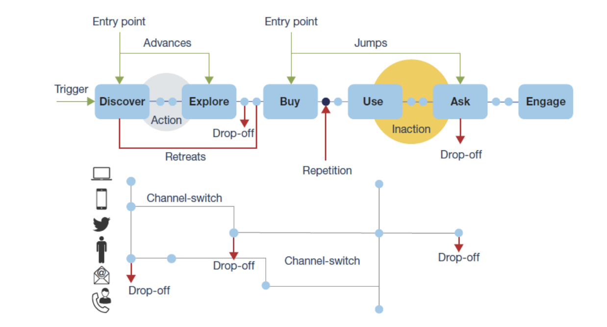

# 4.1 Customer Journey Analytics 101

## 오베티보

- 엔텐다 오 케 오 CJA
- CJA를 위한 엔엔엔덴다 메테 오파펠도
- CJA에서 워크플로우의 내용을 입력합니다. da conexaang de dados insights

## 4.1.1 Customer Journey Analytics의 É?

O Customer Journey Analytics(CJA) for necuma 인터페이스 em que os times de Analytics, Negocios e Technologia conceguem unir todos os os dados da companies e analisar a jornada cross-channel (online e offline) do clientte de ponta a ponta 를 참조하십시오. O CJA é capaz de fornecer contexto e clareza para jonada, trazendo visacionavel em cima dificuldades no processesso de conversaway e possibilitando o planenceponcias de experienceancias 관계 e personalizadas pontos는 관련이 있습니다.

O CJA에서 Analysis Workspace으로 Contado Adobe Experience Platform으로 이동합니다. Adobe Experience Platform é o cébro da comunicaçao e da orqueststraçao, com o CJA에서 마르카스 아고라 podepodepodepocontextualizar e visualizar todos dedos, parque de negocios e insights posam aprender com eles, analnada on-line do clientte를 제공하는 데 negonsios e insights posam aprender com elers, anda a jornada on-line do clientte.

de negocios e insights podem conversar com o CJA로서, fazer perguntas e obter retempostas real com은 usuário de arrastar e soltar, apontar e callicar e fácil de usar do Analysis Workspace의 인터페이스를 통해 제공됩니다.

## 4.1.2 원칙 변수

상:

- 커패시디드 de disponibilizar insights para todos(ou seja, dematizar 또는 acesso aos dados).
- Aem uma jonada 문맥(ou seja, os dados podeos podeos pedos sequencialmente, abrangendo mltiplos online on-line e off-line) 캐시어를 위한 캐패시드 드입니다.
- 커패시다드 드 아프로베이타 o 포더 도스 델 카도 하하(ou seja, permite que individos usem dblood insights e anallises profundas para ativaçao de marketing).

## 4.1.3 ## 4.1.3 포어(또는 Customer Journey Analytics)

O CJA nang se destina a substittuir um aplicativo de BI atual, como Power BI, 마이크로전략, Locker ou Tableau. O objetivo에서 aplicativos de BI é visualizar para painéis corativos que todos em uma organizaçao posam ver méristates rapidamente te. O objetivo do CJA é trazer poder de análise para as de Marketing e Negocios, torndo-o uma ferramenta de análise obrigtoria paras pessoas

Tradicionalmente, os aplicativos de BI tetum sido incapazes de permiter a verdadeira intelligencia do cliente:

- 엘레스 나오 포데모족 페처트베이상 나흐장 안나레스 데 조나다 두 클리엔테.
- Os aplicatitvos de BI precassam shave a pergunta com antecencia
- 컨설팅으로, 상투리미트라에스트라두루타도 방코디도스
- Habilidades de SQL 상투성.
- Os aplicativos de BI nang permitem que vopergunte o 동기를 부여 de um acontecimento.
- Os aplicativos de BI nao conexaang direta com os pontos de conato do clientte.

포르토어, 우아시로스 데 네고르시오스 에날리스타스 체감, 007 사이다 쿠아제 이메디아타멘테, 토르난도 아날리스카라, 렌타, 인프렉시벨 e 데스코타다 시스테마오 드 아상.

Com o CJA vopode ter vischo complete a jornada do clientte, usando dadodes offline e online, com as ferramentas certas para reduzir o tempo de insight, tornado os usuários independentepor phr que algo aconteeu e como responder a isso.

## 4.1.4 Compreenda o fluxo de trabalho do Customer Journey Analytics

낭트 드 인시어 os 프롤시모스 운동장, é essencial complemental quais etapas 상투과자 드라자 다 Adobe Experience Platform 파라 o CJA 파라 시각화-로스 e obter algins insights profumdos. CJA에서 É o que chamamos de fluxo de trabalho입니다. Vamos verificar:

에타파스 아키마로서 낭트 드 이니시아르, 나오 세케사 다 에타파 0, que é compremender os estao is estao disoniveis na Adobe Experience Platform.

**쓰레기통, 쓰레기통** Vokde teruma ideia clara de quais ados disoniveis e como os esquemas na Adobe Experience Platform 상투체 구성 도입니다. 아멕더 os 데카오 또는 Adobe Experience Platform 촉진라(coisas), 나오 소 파르테 드 콘나사오 데 다도스, 마스타베임 나 호라 드 포르주르 아마지르 e 페서 아날레스.

## 4.1.5 Etapa 0: Adobe Experience Platform에서 포괄적인 esquemas e 데이터 세트

URL을 사용하여 Adobe Experience Platform에 로그인할 수 있습니다. [https://experience.adobe.com/platform](https://experience.adobe.com/platform).

데포이스 데 파저 로그인, 보히라 아세사(Voqiera acessar a página initial da da Adobe Experience Platform)

낭트 드 티니어, 보어 정밀 선택 **샌드박스**. ONome do sandbox a ser selecionado ``Bootcamp``. 보이포데 파저 이소클리칸도 노 아이콘 **[!UICONTROL Prod]** 더 좋은 디레토 다 텔라 데포이스 드 셀레치오나와 샌드박스 고유도, 보스케라 알라 아구아 에스파아셈스 세우 샌드박스

Adobe Experience Platform에서 스키마 데이터 세트 를 확인합니다.

| 데이터 세트 | 스키마 |
| ----------------- |-------------| 
| 데모 시스템 - 웹 사이트의 이벤트 데이터 세트(글로벌 v1.1) | 데모 시스템 - 웹 사이트용 이벤트 스키마(글로벌 v1.1) |
| 데모 시스템 - 콜 센터의 이벤트 데이터 세트(글로벌 v1.1) | 데모 시스템 - 콜 센터용 이벤트 스키마(글로벌 v1.1) |
| 데모 시스템 - 음성 도우미에 대한 이벤트 데이터 세트(글로벌 v1.1) | 데모 시스템 - Voice Assistants용 이벤트 스키마(글로벌 v1.1) |

Certifique-se de verificado ao 메뉴:

- ID: CRMID, phoneNumber, ECID, 이메일. 보조 식별자인 기본 식별자는 무엇입니까?
스키마를 열고 개체를 보면 식별자를 찾을 수 있습니다 `_experienceplatform.identification.core`. 스키마 보기 [데모 시스템 - 웹 사이트용 이벤트 스키마(글로벌 v1.1)](https://experience.adobe.com/platform/schema).

- 식별자: CRMID, phoneNumber, ECID, 이메일. 퀴스는 상투들을 식별해서 프리마리오스와 퀘이시 상투상 식별자인 시쿤다리오스를 식별합니까?
Vokpode encontrar os identifier abrindo um schema e observando objto `_experienceplatform.identification.core`. 스키마 확인 [데모 시스템 - 웹 사이트용 이벤트 스키마(글로벌 v1.1)](https://experience.adobe.com/platform/schema).

- Objto de comércio dentro do 스키마 탐색 [데모 시스템 - 웹 사이트용 이벤트 스키마(글로벌 v1.1)](https://experience.adobe.com/platform/schema).

- 시각화 도구 os [데이터 세트](https://experience.adobe.com/platform/dataset/browse?limit=50&amp;page=1&amp;sortDescending=1&amp;sortField=created) e verifique os dados

아고라 보케스타 프레온 파라 코케샤는 우아리오 도 Customer Journey Analytics 인터페이스입니다.

프로시마 에타파: [데이터 세트 대신 Adobe Experience Platform에 Customer Journey Analytics 없음](./ex2.md)

[레토나르 플루소 드 우시오 4](./uc4.md)

[레토날라 파라 토도스 오모두로스](../../overview.md)
