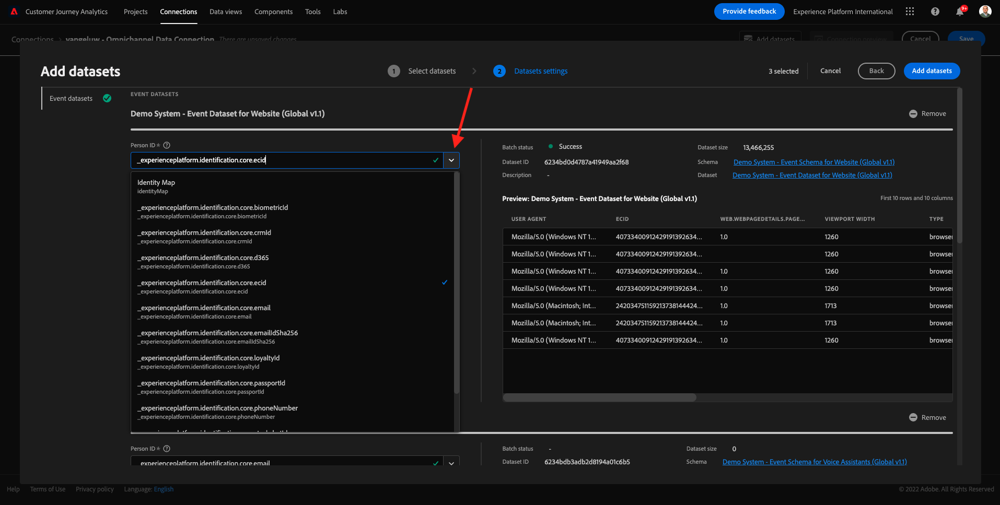

# 4.2 Customer Journey Analytics에서 Adobe Experience Platform 데이터 세트 연결

## 목표

- Data Connection UI 이해
- Adobe Experience Platform 데이터를 CJA로 가져오기
- 개인 ID 및 데이터 결합 이해
- Customer Journey Analytics의 데이터 스트리밍에 대한 개념을 알아봅니다

## 4.2.1 연결

이동 [analytics.adobe.com](https://analytics.adobe.com) Customer Journey Analytics에 액세스합니다.

Customer Journey Analytics 홈페이지에서 **연결**.

여기서는 CJA와 플랫폼 간에 서로 다른 모든 연결을 볼 수 있습니다. 이러한 연결은 Adobe Analytics의 보고서 세트와 동일한 목표를 갖습니다. 그러나 이 자료의 수집은 전혀 다르다. 모든 데이터는 Adobe Experience Platform 데이터 세트에서 가져옵니다.

첫 번째 연결을 만들어 보겠습니다. **새 연결 만들기**&#x200B;를 클릭합니다.

그러면 **연결 만들기** UI.

이제 연결에 이름을 지정할 수 있습니다.

다음 명명 규칙을 사용하십시오. `yourLastName – Omnichannel Data Connection`.

예: `vangeluw - Omnichannel Data Connection`

사용할 올바른 샌드박스를 선택해야 합니다. 샌드박스 메뉴에서 다음 샌드박스를 선택합니다 `Bootcamp`. 이 예제에서 사용할 샌드박스는 다음과 같습니다 **Bootcamp**. 또한 **일일 평균 이벤트 수** to **100만 미만**.

샌드박스를 선택한 후 이 연결에 데이터 세트 추가를 시작할 수 있습니다. 클릭 **데이터 세트 추가**.

## 4.2.2 Adobe Experience Platform 데이터 세트 선택

데이터 집합 검색 `Demo System - Event Dataset for Website (Global v1.1)`. 클릭 **+** 데이터 세트를 이 연결에 추가하려면

이제 확인란을 검색하고 선택합니다 `Demo System - Event Dataset for Voice Assistants (Global v1.1)` 및 `Demo System - Event Dataset for Call Center (Global v1.1)`.

그럼 이걸로 주세요 **다음**&#x200B;을 클릭합니다.

## 4.2.3 개인 ID 및 데이터 결합

### 개인 ID

이제 목표는 이러한 데이터 세트에 참여하는 것입니다. 선택한 모든 데이터 세트에 대해 **개인 ID**. 각 데이터 세트에는 고유한 개인 ID 필드가 있습니다.

보시다시피 대부분 개인 ID가 자동으로 선택됩니다. Adobe Experience Platform의 모든 스키마에서 기본 ID가 선택되기 때문입니다. 예를 들어, 다음 식에 대한 스키마가 있습니다 `Demo System - Event Schema for Call Center (Global v1.1)`여기서 기본 ID가 `phoneNumber`.

그러나 연결을 위해 데이터 세트를 함께 결합하는 데 사용할 식별자에 여전히 영향을 줄 수 있습니다. 데이터 세트에 연결된 스키마에 구성된 모든 식별자를 사용할 수 있습니다. 드롭다운을 클릭하여 각 데이터 세트에서 사용할 수 있는 ID를 탐색합니다.

언급했듯이 각 데이터 세트에 대해 서로 다른 개인 ID를 설정할 수 있습니다. 이를 통해 여러 소스의 다양한 데이터 세트를 CJA에서 함께 가져올 수 있습니다. NPS나 설문 조사 데이터를 가져오면 상황에 대해 이해하고 어떤 일이 왜 일어났는지 이해하는 데 매우 흥미롭고 도움이 됩니다.

개인 ID 필드의 값이 해당하는 한 개인 ID 필드의 이름은 중요하지 않습니다. 이제 `email` 하나의 데이터 세트에 `emailAddress` 를 입력합니다. If `delaigle@adobe.com` 는 두 데이터 세트 모두에서 개인 ID 필드에 대해 동일한 값이며 CJA는 데이터를 결합할 수 있습니다.

현재 알려진 대로 익명 동작을 결합하는 등의 몇 가지 다른 제한 사항이 있습니다. 다음 FAQ를 검토하십시오. [FAQ](https://experienceleague.adobe.com/docs/analytics-platform/using/cja-overview/cja-faq.html?lang=ko-KR).

### 개인 ID를 사용하여 데이터 결합

이제 개인 ID를 사용하여 데이터 세트 결합의 개념을 이해했으므로 `email` 를 각 데이터 세트에 대한 개인 ID로 사용.

각 데이터 세트로 이동하여 개인 ID를 업데이트합니다.

이제 필드 Person ID를 입력하여 `email` 드롭다운 목록에서 클릭합니다.

세 개의 데이터 세트를 결합하면 계속 진행할 수 있습니다.

| 데이터 세트 | 개인 ID |
| ----------------- |-------------| 
| 데모 시스템 - 웹 사이트의 이벤트 데이터 세트(글로벌 v1.1) | 이메일 |
| 데모 시스템 - 음성 도우미에 대한 이벤트 데이터 세트(글로벌 v1.1) | 이메일 |
| 데모 시스템 - 콜 센터의 이벤트 데이터 세트(글로벌 v1.1) | 이메일 |

또한 모든 데이터 세트에 대해 이러한 옵션이 활성화되어 있는지 확인해야 합니다.

- 모든 새 데이터 가져오기
- 기존 데이터 모두 채우기

클릭 **데이터 세트 추가**.

클릭 **저장** 다음 연습으로 가보세요.
을(를) 만든 후 **연결** CJA에서 데이터를 사용할 수 있으려면 몇 시간이 걸릴 수 있습니다.

다음 단계: [4.3 데이터 보기 만들기](./ex3.md)

[사용자 흐름 4로 돌아가기](./uc4.md)

[모든 모듈로 돌아가기](./../../overview.md)
