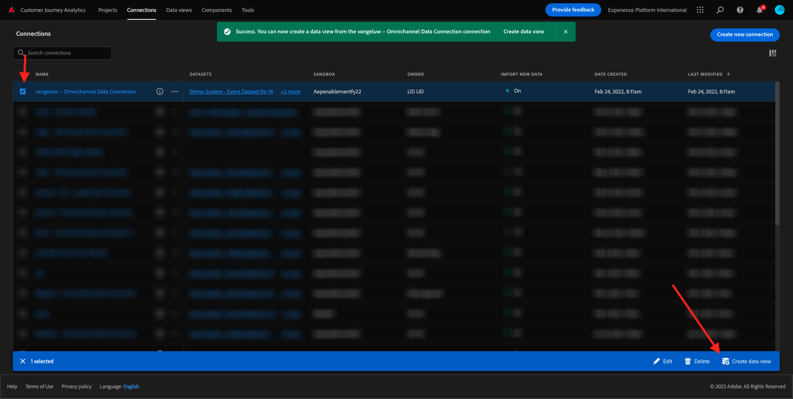
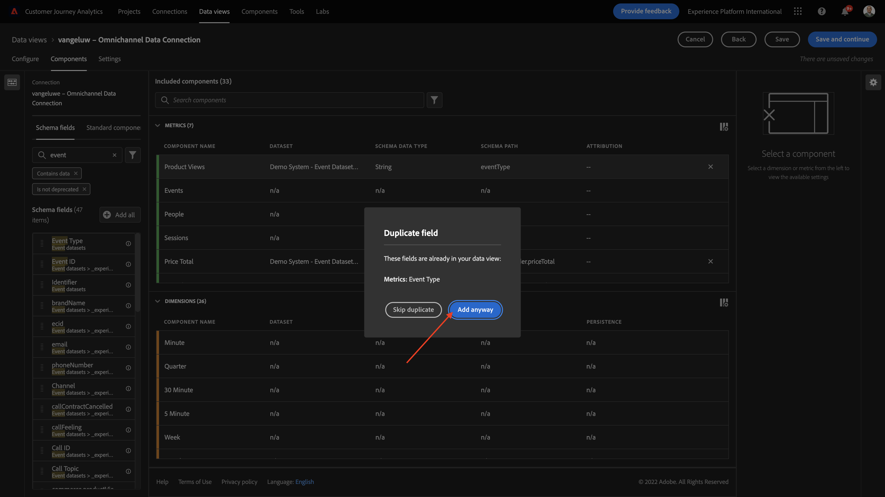

# 4.3 Crie uma Visualização de Dados

## Objetivos

- Entenda a UI de Visualização de Dados
- Compreenda as configurações básicas de definição de visita
- Compreenda a a atribuição e a Persistência em uma 시각화

## 4.3.1 Visualização de Dados

Agora, com sua conexão concluída, é posível progredir para influenciar a visualização. Uma differença entre o Adobe Analytics e o CJA é que o CJA precisa de uma visualização de dados para limpar e preparar os dados antes da visualização.

Uma Visualização de Dados é semelhante ao conceito de 가상 보고서 세트 no Adobe Analytics, onde você estabelecee as definições de visita com reconheciimento de contexto, filtragem e também como os components são chamados.

Será neceário, no mynimo, uma Visualização de Dados por conexão. No entanto, para alguns casos de uso, é ótimo ter múltiplas Visualizações de Dados para mesma conexão, com o objetivo de fornecer insights para equipes diffintas. Se você deseja que sua empresa seja orientada por dados, deve adaptar a forma como os dados são visos em cada equipe. 알고리즘 예시:

- Métricas de UX apenas para equipe de UX 디자인
- 사용 os mesmos nomes para KPIs e metricas para o Google Analytics e para o Customer Journey Analytics, para que a equipe de análise digital fale apenas 1 idioma.
- Visualização de Dados filtrada para mostrar, por orimo, dados para apenas um mercado, ou uma marca, ou apenas para Dispositivos móveis.

Na tela de **연결** marque a caixa de seleção da conexão que você acabou de criar. **데이터 보기 만들기**&#x200B;를 클릭합니다.

Você será redirectionado para o fluxo de trabalho **데이터 보기 만들기** 워크플로우입니다.

## 4.3.2 Definição de Visualização de Dados

Agora você pode configurar as definições básicas para sua Visualização de dados.

**연결** que você criou no exercício anterior já está seleionada. Sua conexão se chama `yourLastName – Omnichannel Data Connection`.

Em seguida, dê um nome à sua Visualização de Dados seguindo este 모델 de nomenclatura: `yourLastName – Omnichannel Data View`.

Insira 또는 mesmo 발로 para a 설명: `yourLastName – Omnichannel Data View`.

| 이름 | 설명 |
| ----------------- |-------------| 
| `yourLastName – Omnichannel Data View` | `yourLastName – Omnichannel Data View` |

파라 **시간대**, 후소 호라리오 **베를림, 에스토콜모, 로마, 베르나, 브루셀라, 비에나, 암스테르담 GMT+01:00** 선택 Este um cenário realmente interest, pois algumas empresas operam em differents países e geografias. Alocar o fuso horário certo para cada país evitará erros típicos de dados, como, por orimo, acreditar que a maioria das pesoas combra camisetas às 4h no Peru.

Você também pode modificar a nomenclatura das métricas principais (Pessoa, Sessão e Evento). Isso não é obrigatório, mas alguns clientes gostam de usar Pesoas, Visitas e Acessos em vez de Pessoa, Sesão e Eventos (convenção de nomenclatura padrão do Customer Journey Analytics).

Agora você deve ter as seguintes configuraões definidas:

**저장 후 계속**&#x200B;을 클릭합니다.

## 4.3.3 Components da Visualização de Dados

Neste exercício, você irá configurar os components necessários para analisar os dados e visualizá-los usando o Analysis Workspace. Nesta IU, há três áreas principais :

- Lado esquerdo: Components disponíveis dos dataset selectionados
- 미디어: Components adicioneados à Visualização de Dados
- Lado direito: Configurações do componente

>[!IMPORTANT]
>
>Se você não encontrar uma métrica ou dimensions são esecífica, verifique se o campo `Contains data` foi removido de sua visualização de dados. 카소 콘트라리오, 에세 캄포
>
>

Agora você precisa-e soltar os 구성 요소는 필요한 para a análise nos **추가된 구성 요소**&#x200B;입니다. Para isso, você deve selecionar os components no menu à esquerda e arrastá-los e soltá-los na tela no meio.

Primeiro 구성 요소의 Vamos começar com: **이름(web.webPageDetails.name)**. Pesquise esse componente arraste-o e solte-o na tela.

Ese componente o nome da página, como você pode derivar da leitura do campo do schema `(web.webPageDetails.name)`.

No entanto, usar **이름** como o nome não é a melhor convenção de nomenclatura para um usuário corporativo comprender rapidamente essa dimensão.

Vamos mudar o nome para **페이지 이름**. 구성 요소 없음을 클릭합니다. **구성 요소 설정**.

As Configurações de persistência são **지속성 설정**. Os conceitos de eVars e prop não existem no CJA, mas as configurações de Persistência possibilitam um comportamento semelhante.

Se você não alterar essas configurações, o CJA irá interratar a dimensional são como um **Prop** (nível de ocorência). Além disso, podemos alterar a Persistência para tornar a dimensão uma **eVar** (persistir o valor ao longo da jornada).

Se você não estiver familiarizado com eVars e Props, [leia mais sobre isso na documentação](https://experienceleague.adobe.com/docs/analytics/landing/an-key-concepts.html).

Vamos deixar o Nome da Página como Prop. Dessa forma, você não precisa alterar nenhuma **지속성 설정**.

| 검색할 구성 요소 이름 | 새 이름 | 지속성 설정 |
| ----------------- |-------------| --------------------| 
| 이름(web.webPageDetails.name) | 페이지 이름 |          |

Em seguida, escalha a dimensional **phoneNumber** e solte-a na tela. 새 이름 개발자 사용자 **전화 번호**&#x200B;이(가) 없습니다.

Por fim, vamos alterar as Configurações de persistência, pois o Número do Cellar deve persistir no nível do usuário.

Para alterar a Persistência, 역할 para baixo no menu à direita e abra a aba **지속성**:

Marque a caixa de seleção para modificar as configurações de persistência. **가장 최근** e o escopo **개인(보고 기간)**, pois nos preocupamos apenas com o último número de celular da pesoa. Se o cliente não preencher o celular em visitas futuras, você ainda verá esse valor preenchido.

| 검색할 구성 요소 이름 | 새 이름 | 지속성 설정 |
| ----------------- |-------------| --------------------| 
| 전화번호 | 전화번호 | 가장 최근, 개인(보고 기간) |

O próximo 구성 요소 é `web.webPageDetails.pageViews.value`.

메뉴 없음(`web.webPageDetails.pageViews.value`), 세부 정보. Arraste e solte essa métrica na tela.

**구성 요소 설정**&#x200B;에서 para **페이지 보기 수**&#x200B;를 변경할 수 없습니다.

| 검색할 구성 요소 이름 | 새 이름 | 속성 설정 |
| ----------------- |-------------| --------------------| 
| web.webPageDetails.pageViews.value | 페이지 보기 횟수 |         |

Para as configurações de atribuição, deixaremos em branco.

Observação : As configurações de persistência nas métricas também podem ser alteradas no Analysis Workspace. Em alguns casos, você pode optar por configurá-las aqui para evitar que os usuários de negócios tenham que pensar qual é o melhor modelo de persistência.

Em seguida, você terá que configurar várias Dimensões Métricas, conforme indado na tabela abaixo.

### 디안수에스

| 검색할 구성 요소 이름 | 새 이름 | 지속성 설정 |
| ----------------- |-------------| --------------------| 
| brandName | 브랜드 이름 | 가장 최근, 세션 |
| 냉정감 | 콜감 |          |
| 호출 ID | 호출 상호 작용 유형 |          |
| callTopic | 통화 주제 | 가장 최근, 세션 |
| ecid | ECID | 가장 최근, 개인(보고 기간) |
| 이메일 | 이메일 ID | 가장 최근, 개인(보고 기간) |
| 결제 유형 | 결제 유형 |          |
| 제품 추가 방법 | 제품 추가 방법 | 가장 최근, 세션 |
| 이벤트 유형 | 이벤트 유형 |         |
| 이름(productListItems.name) | 제품 이름 |         |
| SKU | SKU(세션) | 가장 최근, 세션 |
| 거래 ID | 거래 ID |         |
| URL (web.webPageDetails.URL) | URL |         |
| 사용자 에이전트 | 사용자 에이전트 | 가장 최근, 세션 |

### 메트리카

| 검색할 구성 요소 이름 | 새 이름 | 속성 설정 |
| ----------------- |-------------| --------------------| 
| 수량 | 수량 |          |
| commerce.order.priceTotal | 매출 |         |

Sua configuração deve ser semelhante ao seguinte:

Não se equeça de Salvar sua Visualização de Dados. Então clique em **저장**.

## 4.3.4 메트리카스

Embora tenhamos organizado todos os components na Visualização de dados, você ainda deve adaptar alguns deles para que os usuários de negócios estejam prontos para iniciar suas análises.

Se você se lembra, não trouxemos especificamente Métricas como Adicionar ao Carrinho, Visualização do produto ou Compras para Visualização de dados. Entato가 없습니다. temos uma 차원 chamada: **이벤트 유형**. Então, vamos derivar deses tipos de interação criando 3 métricas calculladas.

Vamos começar com a primeira Métrica: **제품 보기**.

Lado esquerdo가 없습니다. **이벤트 유형**&#x200B;에서 차원을 선택합니다. Em seguida, arraste-o e solte-o na tela **포함된 구성 요소**.

Clique para selectionar a nova métrica **이벤트 유형**.

Agora altere o nome e a descrição do componente para os seguintes valores:

| 구성 요소 이름 | 구성 요소 설명 |
| ----------------- |-------------| 
| 제품 보기 | 제품 보기 |

Agora vamos conttar apenas eventos de **제품 보기**. Para fazer isso, 역할 para baixo em **구성 요소 설정** até ver Valores de **제외 값 포함**. Certifique-se de habilitar a opção **포함/제외 값 설정**.

Como queremos contar apenas **제품 보기**, 특히 **commerce.productViews** nos critérios.

아고라 아 수아 메트리카 캘쿨라다 에스타 프로타!

Em seguida, repita o mesmo processo para os eventos **장바구니에 추가** e **구매**.

### 장바구니에 추가

Primeiro, arraste에 mesma 차원 **이벤트 유형**&#x200B;이(가) 있습니다.

Você verá um alerta pop-up de um Campo Duplicado, pois estamos usando a mesma variável. **계속 추가**&#x200B;를 클릭합니다.

Agora, siga o mesmo processo que fizemos para a métrica Visualizações de product:
- Primeiro altere o nome e a descrição.
- Por fim, adicione **commerce.productListAdds** como critério para contar apenas 장바구니에 추가

| 이름 | 설명 | 기준 |
| ----------------- |-------------| -------------|
| 장바구니에 추가 | 장바구니에 추가 | commerce.productListAdds |

### 구매

Primeiro, arraste e solte a mesma dimensional **Event Type** como fizemos para as as duas métricas anteriores.

Você verá um alerta pop-up de um Campo Duplicado, pois estamos usando a mesma variável. **계속 추가**&#x200B;를 클릭합니다.

Agora, siga o mesmo processo que fizemos para as métricas 제품 보기 e 장바구니에 추가:
- Primeiro altere o nome e a descrição.
- Por fim, adicione **commerce.purchases** como critérios para contabilizar apenas as compras

| 이름 | 설명 | 기준 |
| ----------------- |-------------| -------------|
| 구매 | 구매 | commerce.purchases |

Sua configuração final deve ser semelhante ao seguinte. **저장 후 계속**&#x200B;을 클릭합니다.

## 4.3.5 Components da Configuração de Dados

Você deve ser redirectionado para tela:

Nesta aba, você pode modificar algumas configurações importantes para alterar a forma como os dados são processados. Vamos começar 정의 o **세션 시간 초과** como 30분. Graças ao registro de data e hora de cada evento de experiência, você pode estender o conceito de uma sessão em todos os canais. Por formo, o que acontece se um cliente ligar para o call center depois de visitar o site? Usando Tempos Limite de Sesão personalizados, você tem muita flexibilidade para decisdir o que é uma sessão e como essão irá mesclar os dados.

Nesta aba você modificar outtras coisas como filtrar os dados usando um segmento/filtro. Você não precisará fazer isso neste exercício.

Quando 터미널에서 **저장하고 완료**&#x200B;를 클릭하세요.

>[!NOTE]
>
>Você pode voltar a esta Visualização de dados posteriormente alterar as configuraçõe os componentes a qualquer momento. As alterações afetarão a forma como os dados históricos são mostrados.

Agora você pode continuar com a parte de visualização e análise!

Próxima etapa: [4.4 Preparação de dados em Customer Journey Analytics](./ex4.md)

[레토르나르 파라 플루소 데 우수아리오 4](./uc4.md)

[레토르나르 파라 토도스](./../../overview.md)
