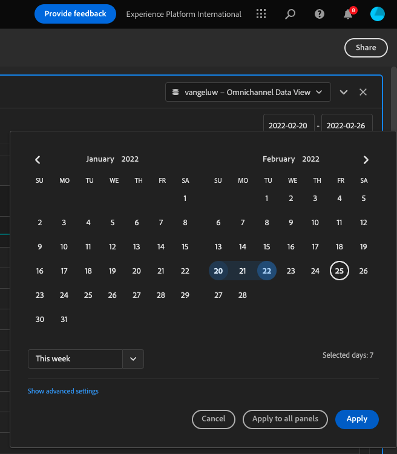
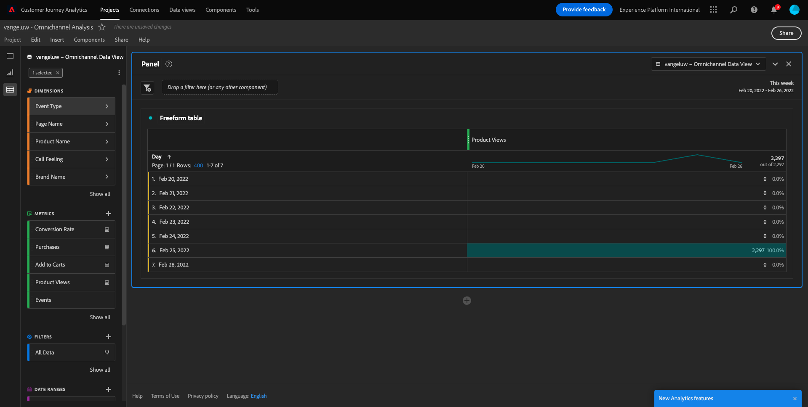
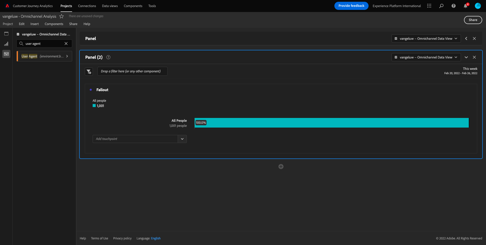
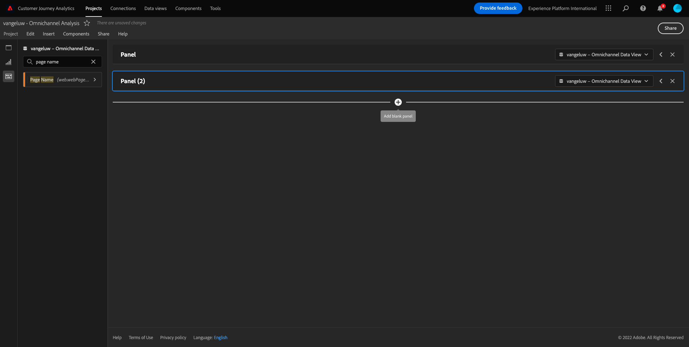
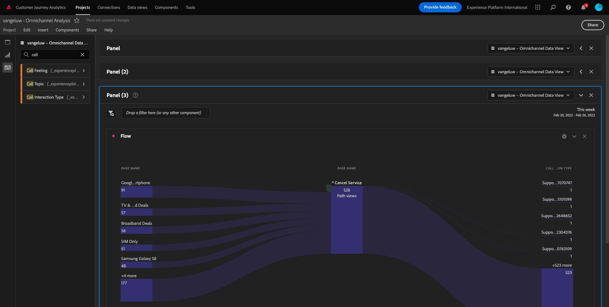

# 4.5 Visualização usando o Customer Journey Analytics

## Objetivos

- Entenda a UI do Analysis Workspace
- Conheça alguns recursos que tornam o Analysis Workspace tão diferente.
- Aprenda a analisar no CJA usando o Analysis Workspace

## Contexto

Neste exercício, você usará o Analysis Workspace no CJA para analisar visualizações de produdutos, funis de produdutos, rotatividade 등

Vamos usar o projeto que você criou em  [4.4 Preparação de dados no Analysis Workspace](./ex4.md), 엔탕 아체세 [https://analytics.adobe.com](https://analytics.adobe.com).

아브라 세우 프로젝트 `yourLastName - Omnichannel Analysis`.

Com seu project aberto e Visualização de dados `yourLastName - Omnichannel Analysis` seleionado, você está pronto para começar a construir suas primeiras visualizações.

## Quantas visualizações de produdutos temos diariamente?

Em primeiro lugar, precisamos seleionar as datas certas para analisar os dados. Accesse o menu suspenso do calendário no lado direito da tela. Clique nele e selecione o intervalo de datas aplicável.

>[!IMPORTANT]
>
>Selecione um intervalo de datas como **이번 주** ou **이번 달**. Os dados disponíveis mais recentes foram absorvidos em 19 de setembro de 2022.

No menu do lado esquerdo (área de componentes), encontre as métricas calculladas **제품 보기**. Selecione-as e arraste e solte na tela, no canto superior direito da tabela de forma livre.

Automticamente a dimension **일** 세라 adicionada para criar sua primeira tabela. Agora você pode ver sua pergunta respondida imediatamente.

Em seguida, clique com o botão direito do mouse no resumo da métrica.

클리크 **시각화** e selectione **라인** 코모 시각화

Você verá as suas visualizações de produto por dia.

Você pode alterar o escopo de tempo para o dia clicando em **설정** na visualização.

클리크 노 폰토 아오 라도 데 **라인** e **데이터 소스 관리**.

Em seguida, clique em **선택 사항 잠금** e selectione **선택한 항목** para bloquear esta visualização para que ela sempre exiba uma linha do tempo de Visualizações de produdutos.

## 5 제품 mais visos

Quais são os 5 제품 mais vistos?

Lembre-se de salvar o project de tempos em.

| OS | 지름길 |
| ----------------- |-------------| 
| Windows | Control + S |
| Mac | Command+S |

Vamos começar a encontrar os 5 제품 mais visos. No menu do lado esquerdo, encontre o nome do produto - Dimensão.

아고라 아라스테 **제품 이름** 차원 파라 대체 **일**:

Este será o resultado.

Em seguida, tente dividir um dos produdutos por Nome da marca. 페스퀴즈 **brandName** e arraste para baixo do primeiro nome do produto.

Em seguida, faça um detalhamento usando o Agente de usuário. 페스퀴즈 **사용자 에이전트** e arraste-o para baixo do nome da marca.

Em seguida, será exibida a tela abaixo :

Por fim, você pode adicionar mais visualizações. No lado esquerdo, em visualizações, pesquise `Donut`. 페그 `Donut`, arraste e solte na tela sob a visualização **라인** 

그런 다음 표에서 처음 5개를 선택합니다 **사용자 에이전트**  아래에 수행한 분류의 행 **Google 픽셀 XL 32GB 블랙 스마트폰** > **Citi 신호**. 5개 행을 선택할 때 **CTRL** 단추(Windows) 또는 **명령** 버튼(Mac).

Em seguida, na Tabela, selectione as primeiras 5 linhas de **사용자 에이전트** 도 데탈하멘토 케 피제모스 em **Google 픽셀 XL 32GB 블랙 스마트폰** > **Citi 신호**. Ao seleionar as 5 linhas, segure o botão **CTRL** (Windows 없음) ou o botão **명령** (Mac 없음).

Você verá o gráfico de donut alterado:

Você pode até adaptar o design para ser mais legível, tornando o gráfico de **라인** 오 그라피코 데 **도넛** um pouco menor para que sejam exibidos lado a lado:

클리크 노 폰토 아오 라도 데 *도넛** 파라 **데이터 소스 관리**. Em seguida, clique em **선택 사항 잠금** para bloquear essa visualização para que ela sempre exiba uma linha do tempo de Visualizações de product.

Saiba mais sobre visualizações usando o Analysis Workspace em:

- [https://experienceleague.adobe.com/docs/analytics/analyze/analysis-workspace/visualizations/freeform-analysis-visualizations.html](https://experienceleague.adobe.com/docs/analytics/analyze/analysis-workspace/visualizations/freeform-analysis-visualizations.html)
- [https://experienceleague.adobe.com/docs/analytics/analyze/analysis-workspace/visualizations/t-sync-visualization.html](https://experienceleague.adobe.com/docs/analytics/analyze/analysis-workspace/visualizations/t-sync-visualization.html)

## Funil de interação do produto, da visualização à compra

Existem muitas formats de resolver esta questão. Uma delas é usar o Tipo de Interação de Produto e usá-lo em uma tabela de formato livre. 우트라포르마에우사르 **폴아웃 시각화**. Vamos usar o ultimo, pois queremos visualizar e analisar ao mesmo tempo.

페니엘 진부한 아쿠아:

아고라 아디시오네 움 노보 페넬 엠 브랑코 클리칸도 엠 **+ 빈 패널 추가**.

Clique na visualização de **폴아웃**.

메즈모 인터발로 데 다타스 중 하나를 고르면 전방을 연습할 수 있다.

Em seguida, você verá:

차원 입력 **이벤트 유형** lado esquerdo가 없는 nos 구성 요소:

Clique na seta para abrir a dimensão:

Você verá todos os Tipos de eventos disponíveis.

항목 중 하나 선택 **commerce.productViews** e arraste e solte-o no campo **터치포인트 추가** 덴트로 다 **폴아웃 시각화**.

파사오메즈모 com **commerce.productListAdds** 및 **commerce.purchase** 솔테오노캄포 **터치포인트 추가** 덴트로 다  **폴아웃 시각화**. Sua visualização agora deve ser semelhante ao seguinte:

Você pode fazer muitas coisas aqui. Alguns 예시 : comparar cada passo por dispositivo 비교 por fidelidade. No entanto, se quisermos analisar coisas interesantes como porque os clientes não compram depois de adicionar um item ao carrinho, podemos usar a melhor ferramenta do CJA: clicar com o botão direito.

Clique com o botão direito do mouse no touchpoint **commerce.productListAdds**. Em seguida, clique em **이 터치포인트에서 폴아웃 분류**.

Uma nova tabela de formato livre será criada para analisar o que as pesoas fizeram se não compararam.

알테레 오 **이벤트 유형** 작성자: **페이지 이름**, na nova tabela de formato livre, para ver em quais páginas eles estão indo, em vez da Página de confirmmação de compra.

## O que as pesoas fazem no site antes de sessar a página Cancelar serviço?

Novamente, há muitas formats de realizar essa análise. Vamos usar a análise de fluxo para iniciar parte da descoberta.

페니엘 진부한 아쿠아:

아고라 아디시오네 움 노보 페넬 엠 브랑코 클리칸도 엠 **+ 빈 패널 추가**.

클리크 나 비주얼리자상 **플로우**.

Em seguida, será exibido:

메즈모 인터발로 데 다타스 중 하나를 고르면 전방을 연습할 수 있다.

차원 입력 **페이지 이름** lado esquerdo가 없는 nos 구성 요소:

Clique na seta para abrir a dimensão:

파기나스 비스타로서 보테 엔콘트라라 토다스. 나메 다 파기나의 조언자: **서비스 취소**.
Arraste e solte **서비스 취소** na Visualização de fluxo no campo do meio:

Em seguida, será exibido:

Vamos agora analisar se os clientes que visitaram a página C **서비스 취소** no site também ligaram para o call center e qual foi o resultado.

Nas dimension, retorne e encontre Tipo de interação de chamada. Arraste e solte **호출 상호 작용 유형** para substitutiir a primeira interação à direita em **플로우 시각화**.

Agora você visualiza o ticket de suporte dos clientes que ligaram para a central de atendimento depois de visitar a página **서비스 취소**.

Em seguida, nas dimension, procuure **콜감**. Arraste e solte para substitiir a primeira interação à direita na visualização de fluxo.

Em seguida, será exibido:

Como pode ver, executamos uma análise omnichannel usando a visualização de fluxo. Graças a isso, descobrimos que alguns clientes que estavam pensando em cancelar o serviço tiveram uma avaliação positiva depois de ligar para o 콜 센터. Talvez tenhamos mudado de ideia com uma promoção?

## Qual é o desempenho dos clientes com um contato de 콜 센터 Positivo em relação aos principais KPIs?

Primeiramente , vamos segmentar os dados para obter apenas usuários com chamadas **양수**. CJA는 없습니다. Segmentos são chamados de Filtros. Accesse para filtros na área de componentes (no lado esquerdo) e clique em **+**.

Dentro do Constructor de filtro, dê um nome ao filtro

| 이름 | 설명 |
| ----------------- |-------------| 
| 통화 느낌 - 긍정적 | 통화 느낌 - 긍정적 |

Nos 구성 요소 (덴트로 도 콘스트루터 드 필트로), 엔드류 **콜감** e arraste e solte na Definição do constructor de filtro.

아고라 셀레치오네 **양수** 코모 발로르 파라 오 필트로

알테레 오 에스코포 파라 오 니벨 **개인**.

파라 finalizar, 바스타 클리카 em **저장**.

엔탕, 보체 이라 레토르나르 파라 텔라 세아이다나오 레토르누, 페체오 페넬 전방향

아고라 아디시오네 움 노보 페넬 엠 브랑코 클리칸도 엠 **+ 빈 패널 추가**.

메즈모 인터발로 데 다타스 중 하나를 고르면 전방을 연습할 수 있다.

클리크 **자유 형식 테이블**.

Agora arraste e solte o filtro que você acabou de criar.

호라 데 아디치오나 알구마스 메트리카스 Comece com **제품 보기**. Arraste e solte na tabela de forma livre. 보테 탐베 포데 익스클루어 아 메트리카 **이벤트**.

파사오메즈모 com **사람**, **장바구니에 추가** e **구매**. Você vai acabar com uma tabela como a seguinte.

Graças à primeira análise de fluxo, uma nova pergunta surgiu. Então decidimos cria esta tabela e verificar alguns KPIs em um segmento para responder a essa pergunta. Como você pode ver, o tempo de insight é muito mais rápido do que usar SQL ou usar outtras soluções de BI.

## Recapitulação do Analysis Workspace e do Customer Journey Analytics

O Analysis Workspace limitações típicas de um relatório do Analytics로 todas를 제거합니다. Ele fornece uma tela robusta e flexível para criar project de analytics personalizados. Arraste e solte qualquer número de tabelas de dados, visualizações e componentes (dimensões, métricas, segmentos e granularidades de tempo) para um projeto. Você pode criar de forma de forma instantânea filtros e analises, gráficos de coorte, alertas, segmentos, análises de fluxo e relatórios de curadoria e agendamento para compartilhar com qualquer pessoa em seu negócio.

프록시마 에타파: [4.6 인사이트 a ação](./ex6.md)

[레토르나르 파라 플루소 데 우수아리오 4](./uc4.md)

[레토르나르 파라 토도스](./../../overview.md)
