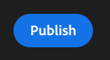

# 4.6 도스 인사이트 아 아상

## Objetivos

- Entenda como criar um público com base em uma visão coletada no Customer Journey Analytics
- Use esse público no CDP em tempo real e no Adobe Journey Optimizer

## 4.6.1 Crie uma audyncia e publish-a

Em seu projeto, você criou um filtro chamado **Call Sensitions** e conseguiu visualizar a quantidade de usários que tiveram suas ligasções ao call center classificadas como **positivas**. Agora, você poderá criar um segmento com은 usuários e ativação-los em jornadas ou em canais de comunicação를 이용합니다.

O primeiro passo é: no painel criado no ultimo exercício, selectione a linha **1. 통화 느낌 - 긍정적**, clique com o botão direito de seu mouse e opção **선택 항목에서 대상 만들기**:

Em seguida, dê um nome para a sua audiência seguindo o modelo **yourLastName - cia audience call feeling positive**:

Note que é posível ter um preview da audyncia que está sendo criada:

Para finalizar, em **Publicar**&#x200B;을(를) 클릭합니다.

## 4.6.2 Use sua audyncia como parte de um segmento

Voltando para a Adobe Experience Platform , vá em **세그먼트 > 찾아보기** e você conseguirá visualizar o seu segmento criado no CJA pronto e disponível para usado nas suas ativações e jornadas!

Vamos agora usar esse segmento em uma ativação no Facebook e em uma jornada do cliente!

## 4.6.3 Use seu segmento na Real-Time CDP em tempo real

Na Adobe Experience Platform, vá em **세그먼트 > 찾아보기** CJA에서 audiência que você:

클릭 번호 seu segmento e, em seguida, 클릭 번호 em **대상에 활성화**:

목적지 선택 chamada bootcamp-facebook e, em seguida, 클릭 em Next:

Em seguida, clique em Next novamente:

Opção **대상자 출처 선택** e defina como **고객으로부터 직접** e clique Next:

Por fim, na página **Review** clique em 완료!

프론토! Agora o seu segmento está vinculado aos públicos personalizados do Facebook.
아고라, 바모스 유틸리자르 에세 세그멘토 노 AJO!

## 4.6.4 Adobe Journey Optimizer에서 seu segmento 사용

인터페이스 da Adobe Experience Platform clique em Journey Optimizer e, em seguida, no menu lateral esquerdo, clique em **여정** e comece a criar uma jornada clicando em **여정 만들기**:

Em seguida, no menu lateral esquerdo, em Eventos, select ione **세그먼트 자격** e arraste-o até a jornada:

Em seguida, em **세그먼트** 클릭 em **편집** para selectionar um segmento:

Selectione a audiência que você criou no CJA e clique em **저장**:

프론토! A partir daí você pode criar uma jornada para clientes que se qualificam para esse segmento!

[사용자 흐름으로 돌아가기 4](./uc4.md)

[Voltar para todos 운영 체제](./../../overview.md)
