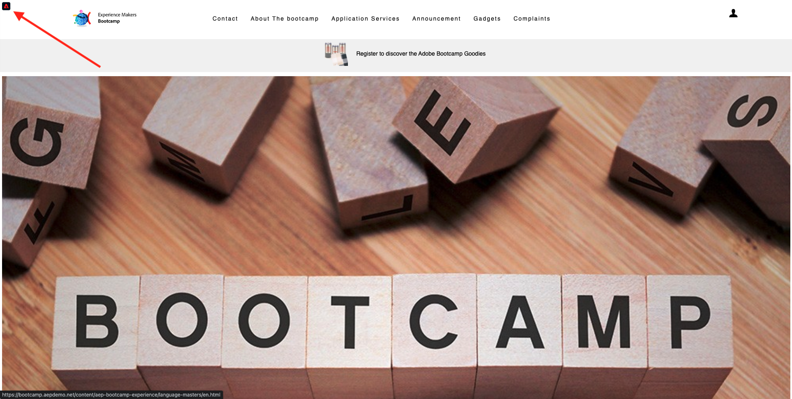

# 1.1 알 수 없음에서 웹 사이트에 알려짐

## 컨텍스트

알 수 없음에서 알려진 대로 여정은 고객 여정에서 획득까지 유지되는 것 같이 최근 브랜드들 중에서 가장 중요한 항목 중 하나입니다.

Adobe Experience Platform은 이 여정에서 큰 역할을 합니다. 플랫폼이 의사소통의 뇌이고 **기록 경험 시스템**.

플랫폼은 고객이 알려진 고객보다 더 광범위한 환경입니다. 웹 사이트의 알 수 없는 방문자도 플랫폼의 관점에서 고객의 경우 알 수 없는 방문자와 같은 모든 동작이 Platform으로 전송됩니다. 이러한 접근 방식 덕분에 이 방문자가 결국 알려진 고객이 되면 브랜드는 그 순간 이전에 발생한 상황을 시각화할 수 있습니다. 이것은 속성 및 경험 최적화 관점에서 도움이 됩니다.

## 고객 여정 흐름

이동 [https://bootcamp.aepdemo.net](https://bootcamp.aepdemo.net). 클릭 **모두 허용**.

화면 왼쪽 상단 모서리에서 Adobe 로고 아이콘을 클릭하여 프로필 뷰어를 엽니다.

를 사용하여 프로필 뷰어 패널 및 실시간 고객 프로필을 봅니다. **Experience Cloud ID** 을 현재 알 수 없는 이 고객에 대한 기본 식별자로 사용하십시오.

고객의 행동을 기반으로 수집된 모든 경험 이벤트를 볼 수도 있습니다. 현재 목록이 비어 있지만 곧 변경됩니다.

로 이동합니다. **응용 프로그램 서비스** 메뉴 옵션을 클릭하고 제품을 클릭합니다. **Real-Time CDP**.

그러면 제품 세부 사항 페이지가 표시됩니다. 유형의 경험 이벤트 **제품 보기** 이제 모듈 1에서 검토한 웹 SDK 구현을 사용하여 Adobe Experience Platform으로 보내졌습니다. 프로필 뷰어 패널을 열고 **경험 이벤트**.

로 이동합니다. **응용 프로그램 서비스** 메뉴 옵션을 클릭하고 제품을 클릭합니다. **Adobe Journey Optimizer**. 다른 경험 이벤트가 Adobe Experience Platform에 전송되었습니다.

프로필 뷰어 패널을 엽니다. 이제 2개의 경험 이벤트 유형이 표시됩니다 **제품 보기**. 이 동작은 익명으로 수행되지만 모든 클릭은 Adobe Experience Platform에서 추적 및 저장됩니다. 익명의 고객이 알려지면 Adobe에서는 모든 익명의 행동을 알려진 프로필에 자동으로 병합할 수 있습니다.

이제 고객 프로필을 분석한 다음 행동을 사용하여 웹 사이트에서 고객 경험을 개인화하겠습니다.

다음 단계: [1.2 실시간 고객 프로필 시각화 - UI](./ex2.md)

[사용자 흐름 1로 돌아가기](./uc1.md)

[모든 모듈로 돌아가기](../../overview.md)
