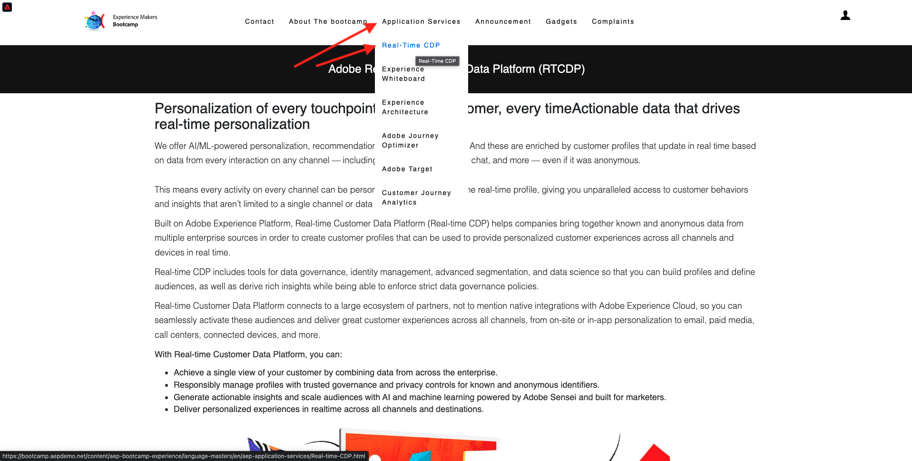

# 1.1 알 수 없음에서 웹 사이트에 알려짐

## 컨텍스트

알 수 없음에서 알려짐까지의 여정은 획득에서 유지에 이르는 고객 여정과 마찬가지로 요즘 브랜드 중에서 가장 중요한 주제 중 하나입니다.

Adobe Experience Platform은 이 여정에서 큰 역할을 합니다. 플랫폼은 커뮤니케이션의 두뇌로, **기록의 경험 시스템**&#x200B;입니다.

플랫폼은 고객이라는 단어가 단지 알려진 고객들보다 더 넓은 환경이다. 웹 사이트에서 알 수 없는 방문자도 플랫폼의 관점에서 고객이며 따라서 알 수 없는 방문자로서의 모든 행동도 Platform으로 전송됩니다. 이러한 접근 방식 덕분에 이 방문자가 결국 알려진 고객이 되면 브랜드는 그 순간 이전에 발생한 사항도 시각화할 수 있습니다. 이는 속성 및 경험 최적화 관점에서 도움을 줍니다.

## 고객 여정 흐름

[https://bootcamp.aepdemo.net](https://publish9122.adobedemo.com/content/aep-bootcamp-experience/language-masters/en.html)(으)로 이동합니다. **모두 허용**&#x200B;을 클릭합니다.

화면 왼쪽 상단 모서리에 있는 Adobe 로고 아이콘을 클릭하여 프로필 뷰어를 엽니다.

프로필 뷰어 패널과 현재 알 수 없는 이 고객의 기본 식별자로 **Experience Cloud ID**&#x200B;를 사용하는 실시간 고객 프로필을 살펴보십시오.

또한 고객의 행동을 기반으로 하여 수집한 모든 경험 이벤트를 볼 수 있습니다. 현재 목록이 비어 있지만 곧 변경될 예정입니다.

**응용 프로그램 서비스** 메뉴 옵션으로 이동하여 **Real-Time CDP** 제품을 클릭합니다.

그러면 제품 세부 사항 페이지가 표시됩니다. 모듈 1에서 검토한 Web SDK 구현을 사용하여 **제품 보기** 유형의 경험 이벤트가 Adobe Experience Platform으로 전송되었습니다. 프로필 뷰어 패널을 열고 **경험 이벤트**&#x200B;를 확인합니다.

**응용 프로그램 서비스** 메뉴 옵션으로 이동하여 **Adobe Journey Optimizer** 제품을 클릭합니다. 다른 경험 이벤트가 Adobe Experience Platform으로 전송되었습니다.

프로필 뷰어 패널을 엽니다. 이제 **제품 보기** 유형의 경험 이벤트 2개가 표시됩니다. 비헤이비어는 익명이며 모든 클릭은 추적되어 Adobe Experience Platform에 저장됩니다. 익명 고객이 알려지면 모든 익명 동작을 알 수 있는 프로필에 자동으로 병합할 수 있습니다.

이제 고객 프로필을 분석한 다음 행동을 사용하여 웹 사이트에서 고객 경험을 개인화하겠습니다.

다음 단계: [1.2 실시간 고객 프로필 시각화 - UI](./ex2.md)

[사용자 흐름 1로 돌아가기](./uc1.md)

[모든 모듈로 돌아가기](../../overview.md)
