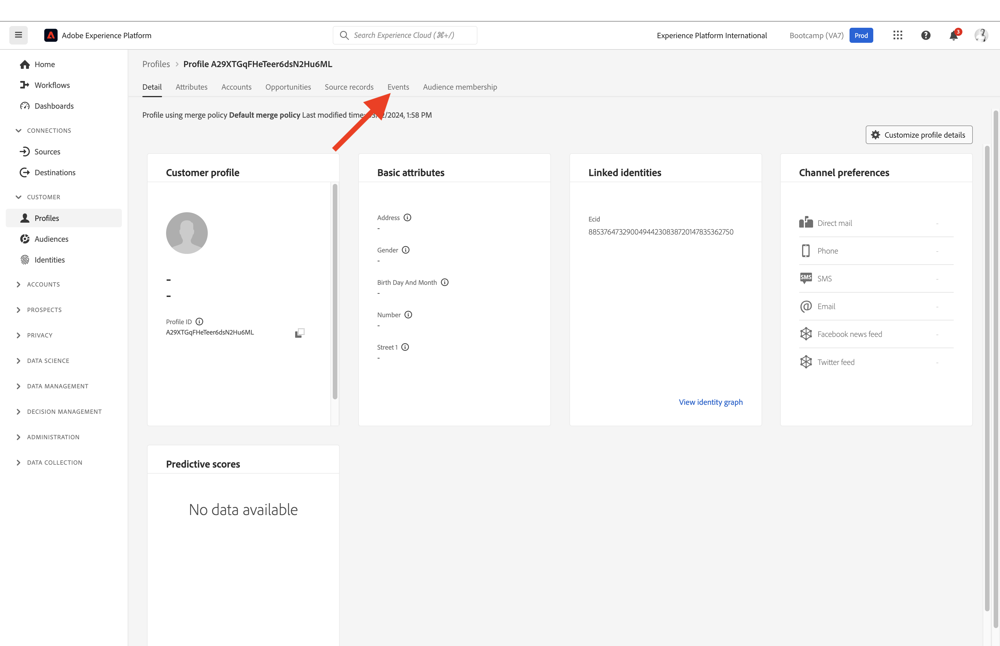
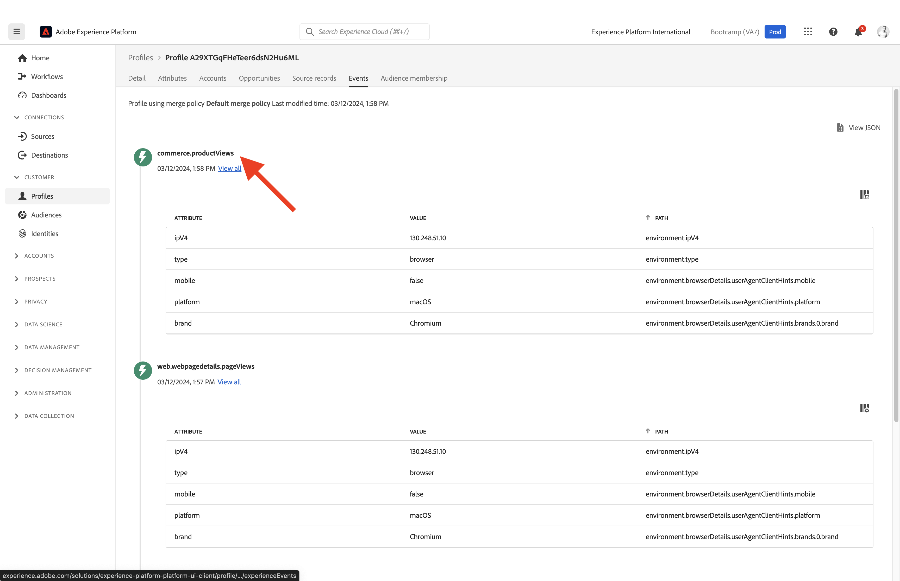

# 1.2 자신의 실시간 고객 프로필 시각화 - UI

이 연습에서는 Adobe Experience Platform에 로그인하여 UI에서 자신의 실시간 고객 프로필을 봅니다.

## 스토리

실시간 고객 프로필에는 기존 세그먼트 멤버십은 물론 이벤트 데이터와 함께 모든 프로필 데이터가 표시됩니다. 표시된 데이터는 Adobe 애플리케이션 및 외부 솔루션에서 어디에서나 가져올 수 있습니다. 이것은 기록의 진정한 경험 시스템인 Adobe Experience Platform에서 가장 강력한 보기입니다.

## 1.2.1 Adobe Experience Platform에서 고객 프로필 보기 사용

다음으로 이동 [Adobe Experience Platform](https://experience.adobe.com/platform). 로그인하면 Adobe Experience Platform 홈페이지에 접속하게 됩니다.

계속하기 전에 **샌드박스**. 선택할 샌드박스 이름이 로 지정됩니다. ``Bootcamp``. 텍스트를 클릭하여 이 작업을 수행할 수 있습니다 **[!UICONTROL 프로덕션 프로덕션]** 화면 상단의 파란색 선. 적절한 을(를) 선택한 후 [!UICONTROL 샌드박스], 화면 변경 사항이 표시되며 이제 전용 모드로 전환됩니다. [!UICONTROL 샌드박스].

왼쪽 메뉴에서 **프로필** 및 종료 **찾아보기**.

웹 사이트의 프로필 뷰어 패널에서 ID 개요를 찾을 수 있습니다. 모든 ID는 네임스페이스에 연결됩니다.

현재 프로필 뷰어 패널에서 이 ID를 볼 수 있습니다.

| 네임스페이스 | 신원 |
|:-------------:| :---------------:|
| ECID(Experience Cloud ID) | 19428085896177382402834560825640259081 |

Adobe Experience Platform을 사용하면 모든 ID가 동일하게 중요합니다. 이전에는 ECID가 Adobe 컨텍스트에서 가장 중요한 ID였으며 다른 모든 ID는 계층 구조로 ECID에 연결되어 있었습니다. Adobe Experience Platform에서는 더 이상 해당되지 않으며 모든 ID를 기본 식별자로 간주할 수 있습니다.

일반적으로 기본 식별자는 컨텍스트에 따라 다릅니다. 콜센터에 문의하시면, **가장 중요한 ID는 무엇입니까?** 그들은 아마 대답할 것입니다, **전화번호!** 하지만 CRM 팀에게 물어보면 대답할 거야 **이메일 주소!**  Adobe Experience Platform은 이러한 복잡성을 이해하고 자동으로 관리합니다. Adobe 애플리케이션이든, Adobe 애플리케이션이 아니든 모든 애플리케이션은 기본 애플리케이션으로 간주하는 ID를 참조하여 Adobe Experience Platform과 통신합니다. 그리고 그것은 단순히 효과가 있습니다.

필드용 **ID 네임스페이스**, 선택 **ECID** 및 필드 **ID 값** bootcamp 웹 사이트의 Profile Viewer 패널에서 찾을 수 있는 ECID를 입력합니다. 클릭 **보기**. 그러면 목록에 프로필이 표시됩니다. 다음을 클릭합니다. **프로필 ID** 을 클릭하여 프로필을 엽니다.

이제 몇 가지 중요한 사항에 대한 개요를 볼 수 있습니다 **프로필 속성** 고객 프로필의

다음으로 이동 **이벤트**&#x200B;프로필에 연결된 모든 경험 이벤트에 대한 항목을 볼 수 있는 입니다.

마지막으로 메뉴 옵션으로 이동합니다. **세그먼트 멤버십**. 이제 이 프로필에 적합한 모든 세그먼트가 표시됩니다.

이제 익명의 또는 아는 고객을 위해 고객 경험을 개인화할 수 있는 새 세그먼트를 만들어 보겠습니다.

다음 단계: [1.3 세그먼트 만들기 - UI](./ex3.md)

[사용자 흐름 1로 돌아가기](./uc1.md)

[모든 모듈로 돌아가기](../../overview.md)
