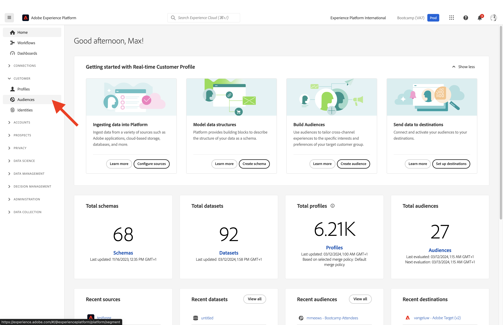
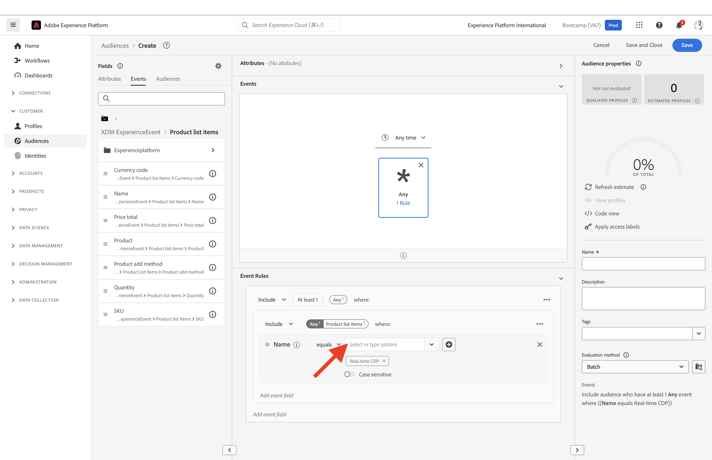

# 1.3 대상 만들기 - UI

이 연습에서는 Adobe Experience Platform의 대상 빌더를 사용하여 대상을 만듭니다.

## 스토리

다음으로 이동 [Adobe Experience Platform](https://experience.adobe.com/platform). 로그인하면 Adobe Experience Platform 홈페이지에 접속하게 됩니다.

계속하기 전에 **샌드박스**. 선택할 샌드박스 이름이 로 지정됩니다. ``Bootcamp``. 텍스트를 클릭하여 이 작업을 수행할 수 있습니다 **[!UICONTROL 프로덕션 프로덕션]** 화면 상단의 파란색 선. 적절한 을(를) 선택한 후 [!UICONTROL 샌드박스], 화면 변경 사항이 표시되며 이제 전용 모드로 전환됩니다. [!UICONTROL 샌드박스].

왼쪽에 있는 메뉴에서 **대상**. 이 페이지에는 다음에 대한 필수 정보가 포함된 대시보드가 표시됩니다. **대상자** 성능.

클릭 **찾아보기** 기존 대상자의 개요를 살펴보십시오. 을(를) 클릭합니다 **+ 대상자 만들기** 단추를 클릭하여 새 대상을 만듭니다.

다음을 원하는지 여부를 묻는 Pop-Ip가 나타납니다. **&#39;대상자 구성&#39;** 또는 **&#39;규칙 작성&#39;**. 선택 **&#39;규칙 작성&#39;** 을 클릭하여 계속합니다. **만들기**.

![세그먼테이션][def]

대상 빌더에 로그인하면 즉시 **속성** 메뉴 옵션 및 **XDM 개별 프로필** 참조.

XDM은 경험 비즈니스를 지원하는 언어이므로 XDM은 대상 빌더의 기반이기도 합니다. Platform에서 수집되는 모든 데이터는 XDM에 대해 매핑되어야 하며, 따라서 모든 데이터는 해당 데이터의 출처에 관계없이 동일한 데이터 모델의 일부가 됩니다. 이렇게 하면 대상을 작성할 때 이 하나의 대상 빌더 UI에서 동일한 워크플로우의 모든 원본의 데이터를 결합할 수 있으므로 큰 이점이 있습니다. Audience Builder 내에 빌드된 대상은 Adobe Target, Adobe Campaign 또는 기타 활성화 채널과 같은 솔루션으로 보낼 수 있습니다.

이제 제품을 본 모든 고객의 대상을 만들어야 합니다 **Real-Time CDP**.

이 대상을 빌드하려면 경험 이벤트를 추가해야 합니다. 다음을 클릭하여 모든 경험 이벤트를 찾을 수 있습니다. **이벤트** 아이콘 **필드** 메뉴 모음

다음으로, 당신은 최고 수준을 볼 것입니다, **XDM 경험 이벤트** 노드. 클릭 **XDM ExperienceEvent**.

다음으로 이동 **제품 목록 항목**.

선택 **이름** 을(를) 끌어서 놓습니다. **이름** 왼쪽 메뉴에서 audience builder 캔버스로의 객체 **이벤트** 섹션. 그러면 다음과 같은 결과가 표시됩니다.

비교 매개 변수는 다음과 같아야 합니다. **다음과 같음** 입력 필드에 을 입력합니다. **Real-time CDP**.

대상 빌더에 요소를 추가할 때마다 **예상 새로 고침** 단추를 클릭하여 대상의 모집단 예상을 새로 확인합니다.

다음으로: **평가 방법**, 선택 **Edge**.

마지막으로 대상에 이름을 지정하고 저장하겠습니다.

명명 규칙으로 다음을 사용합니다.

- `yourLastName - Interest in Real-Time CDP`

그런 다음 **저장 및 닫기** 버튼을 클릭하여 대상자를 저장합니다.

이제 대상 개요 페이지로 돌아갑니다. 그러면 대상의 자격을 규정하는 고객 프로필의 샘플 미리보기가 표시됩니다.

이제 다음 연습을 계속하여 Adobe Target에서 대상자를 사용할 수 있습니다.

다음 단계: [1.4 조치 취하기: 대상자를 Adobe Target으로 보내기](./ex4.md)

[사용자 흐름 1로 돌아가기](./uc1.md)

[모든 모듈로 돌아가기](../../overview.md)

[def]: ./images/segmentationpopup.png
