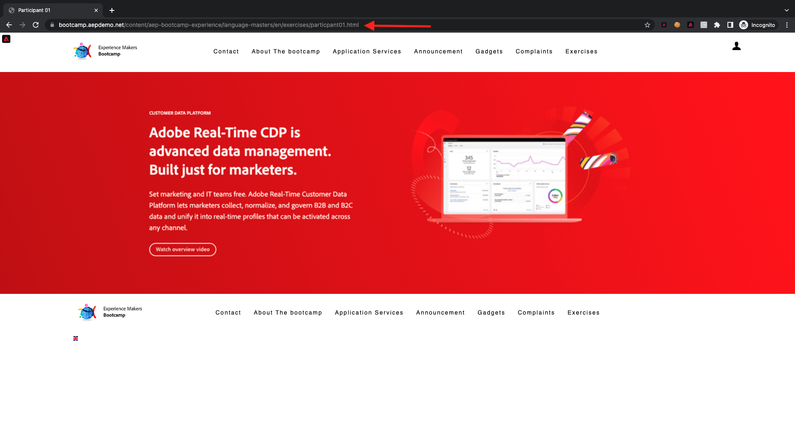

# 1.4 조치 취하기: 대상자를 Adobe Target으로 보내기

[Adobe Experience Platform](https://experience.adobe.com/platform)(으)로 이동합니다. 로그인하면 Adobe Experience Platform 홈페이지에 접속하게 됩니다.

계속하려면 **샌드박스**&#x200B;를 선택해야 합니다. 선택할 샌드박스 이름이 ``Bootcamp``입니다. 화면 상단의 파란색 선에 있는 텍스트 **[!UICONTROL 프로덕션]**&#x200B;을(를) 클릭하면 됩니다. 적절한 [!UICONTROL 샌드박스]를 선택하면 화면이 변경되고 이제 전용 [!UICONTROL 샌드박스]에 있게 됩니다.

## 1.4.1 Adobe Target 대상에 대상 활성화

Adobe Target은 Real-Time CDP에서 대상으로 사용할 수 있습니다. Adobe Target 통합을 설정하려면 **대상**, **카탈로그**(으)로 이동하십시오.

**카테고리** 메뉴에서 **Personalization**&#x200B;을(를) 클릭합니다. 그러면 **Adobe Target** 대상 카드가 표시됩니다. **대상자 활성화**&#x200B;를 클릭합니다.

대상 ``Bootcamp Target``을(를) 선택하고 **다음**&#x200B;을(를) 클릭합니다.

사용 가능한 대상 목록에서 [1.3 대상 만들기](./ex3.md)에서 만든 대상(이름: `yourLastName - Interest in Real-Time CDP`)을 선택합니다. 그런 다음 **다음**&#x200B;을 클릭합니다.

다음 페이지에서 **다음**&#x200B;을 클릭합니다.

**마침을 클릭합니다**.

이제 대상자가 Adobe Target을 향해 활성화됩니다.

>[!IMPORTANT]
>
>Real-Time CDP에서 Adobe Target 대상을 방금 만든 경우 대상이 활성 상태가 되는 데 최대 1시간이 걸릴 수 있습니다. 백엔드 구성 설정으로 인한 일회성 대기 시간입니다. 초기 1시간 대기 시간 및 백엔드 구성이 완료되면 Adobe Target 대상으로 전송된 새로 추가된 Edge Audiences를 실시간으로 타겟팅할 수 있습니다.

## 1.4.2 Adobe Target 양식 기반 활동 구성

이제 Real-Time CDP 대상자가 Adobe Target으로 전송되도록 구성되었으므로 Adobe Target에서 경험 타깃팅 활동을 구성할 수 있습니다. 이 연습에서는 시각적 경험 작성기 기반 활동을 구성합니다.

[https://experiencecloud.adobe.com/](https://experiencecloud.adobe.com/)(으)로 이동하여 Adobe Experience Cloud 홈페이지로 이동합니다. **Target**&#x200B;을 클릭하여 엽니다.

**Adobe Target** 홈 페이지에 기존의 모든 활동이 표시됩니다.
새 활동을 만들려면 **+ 활동 만들기**&#x200B;를 클릭하십시오.

**경험 타깃팅**&#x200B;을 선택합니다.

**시각적**&#x200B;을(를) 선택하고 **활동 URL**&#x200B;을(를) `https://bootcamp.aepdemo.net/content/aep-bootcamp-experience/language-masters/en/exercises/particpantXX.html`(으)로 설정하되, 그 전에 XX를 01에서 30 사이의 숫자로 바꾸십시오.

>[!IMPORTANT]
>
>활성화의 모든 참가자는 다양한 Adobe Target 경험의 충돌을 방지하기 위해 별도의 웹 페이지를 사용해야 합니다. [https://bootcamp.aepdemo.net/content/aep-bootcamp-experience/language-masters/en/exercises.html](https://bootcamp.aepdemo.net/content/aep-bootcamp-experience/language-masters/en/exercises.html) 페이지로 이동하여 웹 페이지를 선택하고 URL을 찾을 수 있습니다.
>
>페이지는 모두 동일한 기본 URL을 공유하며 참가자 수로 끝납니다.
>
>예를 들어 참가자 1은 URL `https://bootcamp.aepdemo.net/content/aep-bootcamp-experience/language-masters/en/exercises/particpant01.html`을(를) 사용해야 하고 참가자 30은 URL `https://bootcamp.aepdemo.net/content/aep-bootcamp-experience/language-masters/en/exercises/particpant30.html`을(를) 사용해야 합니다.

**AT Bootcamp** 작업 영역을 선택하십시오.

**다음**&#x200B;을 클릭합니다.

이제 시각적 경험 작성기에 있습니다. 웹 사이트가 완전히 로드될 때까지 20~30초 정도 소요될 수 있습니다.

기본 대상은 현재 **모든 방문자**&#x200B;입니다. **모든 방문자** 옆의 **3개 점**&#x200B;을 클릭하고 **대상 변경**&#x200B;을 클릭합니다.

이제 사용 가능한 대상 목록이 표시되며, 이전에 만들어 Adobe Target으로 보낸 Adobe Experience Platform 대상은 이제 이 목록의 일부입니다. 이전에 Adobe Experience Platform에서 만든 대상자를 선택합니다. **대상자 할당**&#x200B;을 클릭합니다.

이제 Adobe Experience Platform 대상자는 이 경험 타깃팅 활동의 일부입니다.

영웅 이미지를 변경하려면 쿠키 배너에서 **모두 허용**&#x200B;을 클릭해야 합니다.

이렇게 하려면 **찾아보기**(으)로 이동하십시오.

**모두 허용**&#x200B;을 클릭합니다.

그런 다음 **작성**(으)로 돌아갑니다.

이제 홈페이지 홈페이지의 영웅 이미지를 바꾸겠습니다. 웹 사이트에서 기본 영웅 이미지를 클릭하고 **콘텐츠 바꾸기**&#x200B;를 클릭한 다음 **이미지**&#x200B;를 선택합니다.

이미지 파일 **rtcdp.png**&#x200B;을(를) 검색합니다. 선택한 다음 **저장**&#x200B;을 클릭합니다.

그러면 선택한 대상에 대한 새 이미지에 새 경험이 표시됩니다.

왼쪽 위 모서리에서 활동 제목을 클릭하여 이름을 변경합니다.

이름은 다음을 사용하십시오.

- `yourLastName - RTCDP - XT (VEC)`

**다음**&#x200B;을 클릭합니다.

**다음**&#x200B;을 클릭합니다.

**목표 및 설정** - 페이지에서 **목표 지표**(으)로 이동합니다.

기본 목표를 **참여** - **사이트 시간**(으)로 설정합니다. **저장 및 닫기**&#x200B;를 클릭합니다.

이제 **활동 개요** 페이지에 있습니다. 활동을 활성화해야 합니다.

**비활성** 필드를 클릭하고 **활성화**&#x200B;를 선택합니다.

그런 다음 활동이 현재 라이브 상태임을 시각적으로 확인할 수 있습니다.

이제 활동이 라이브 상태이며 부트캠프 웹 사이트에서 테스트할 수 있습니다.

이제 데모 웹 사이트로 돌아가 **Real-Time CDP**&#x200B;의 제품 페이지를 방문하면 만든 대상을 즉시 사용할 수 있으며, 홈 페이지에는 Adobe Target 활동이 실시간으로 표시됩니다.

>[!IMPORTANT]
>
>활성화의 모든 참가자는 다양한 Adobe Target 경험의 충돌을 방지하기 위해 별도의 웹 페이지를 사용해야 합니다. [https://bootcamp.aepdemo.net/content/aep-bootcamp-experience/language-masters/en/exercises.html](https://bootcamp.aepdemo.net/content/aep-bootcamp-experience/language-masters/en/exercises.html) 페이지로 이동하여 웹 페이지를 선택하고 URL을 찾을 수 있습니다.
>
>페이지는 모두 동일한 기본 URL을 공유하며 참가자 수로 끝납니다.
>
>예를 들어 참가자 1은 URL `https://bootcamp.aepdemo.net/content/aep-bootcamp-experience/language-masters/en/exercises/particpant01.html`을(를) 사용해야 하고 참가자 30은 URL `https://bootcamp.aepdemo.net/content/aep-bootcamp-experience/language-masters/en/exercises/particpant30.html`을(를) 사용해야 합니다.

다음 단계: [1.5 조치 취하기: 대상자를 Facebook으로 보내기](./ex5.md)

[사용자 흐름 1로 돌아가기](./uc1.md)

[모든 모듈로 돌아가기](../../overview.md)
