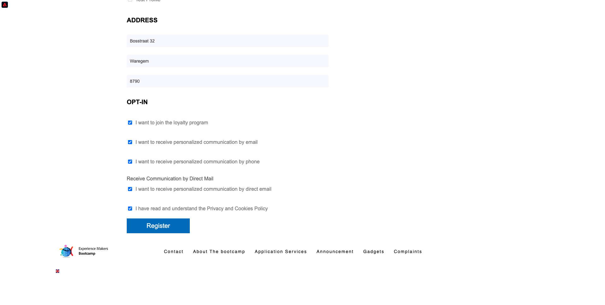

# 2.1 웹 사이트를 방문하여 계정을 만드십시오

## 컨텍스트

알 수 없음에서 알려진 대로 여정은 고객 여정에서 획득까지 유지되는 것 같이 최근 브랜드들 중에서 가장 중요한 항목 중 하나입니다.

Adobe Experience Platform은 이 여정에서 큰 역할을 합니다. 플랫폼이 의사소통의 뇌이고 **기록 경험 시스템**.

플랫폼은 고객이 알려진 고객보다 더 광범위한 환경입니다. 웹 사이트의 알 수 없는 방문자도 플랫폼의 관점에서 고객의 경우 알 수 없는 방문자와 같은 모든 동작이 Platform으로 전송됩니다. 이러한 접근 방식 덕분에 이 방문자가 결국 알려진 고객이 되면 브랜드는 그 순간 이전에 발생한 상황을 시각화할 수 있습니다. 이것은 속성 및 경험 최적화 관점에서 도움이 됩니다.

## 고객 여정 흐름

이동 [https://bootcamp.aepdemo.net](https://bootcamp.aepdemo.net). 클릭 **모두 허용**. 이전 사용자 흐름의 탐색 행동에 따라 웹 사이트의 홈 페이지에서 개인화가 발생하는 것을 확인할 수 있습니다.

화면 왼쪽 상단 모서리에서 Adobe 로고 아이콘을 클릭하여 프로필 뷰어를 엽니다. 를 사용하여 프로필 뷰어 패널 및 실시간 고객 프로필을 봅니다. **Experience Cloud ID** 을 현재 알 수 없는 이 고객에 대한 기본 식별자로 사용하십시오.

고객의 행동을 기반으로 수집된 모든 경험 이벤트를 볼 수도 있습니다.

을(를) 클릭합니다. **프로필** 화면 오른쪽 상단 모서리에 있는 아이콘.

클릭 **계정 만들기**.

양식의 모든 필드를 채웁니다. 이메일 및 SMS 전달을 위해 나중에 연습에서 사용할 것이므로 이메일 주소 및 전화 번호에 실제 값을 사용하십시오.

아래로 스크롤하여 클릭 **등록**.

그러면 이게 보입니다.

다음 이메일도 받게 됩니다.

그리고 몇 분 후에 이 이메일도 받게 됩니다.

다음은 이 온보딩 여정이 어떻게 구성되었는지 살펴보겠습니다.

다음 단계: [2.2 이벤트 만들기](./ex2.md)

[사용자 흐름 2로 돌아가기](./uc2.md)

[모든 모듈로 돌아가기](../../overview.md)
