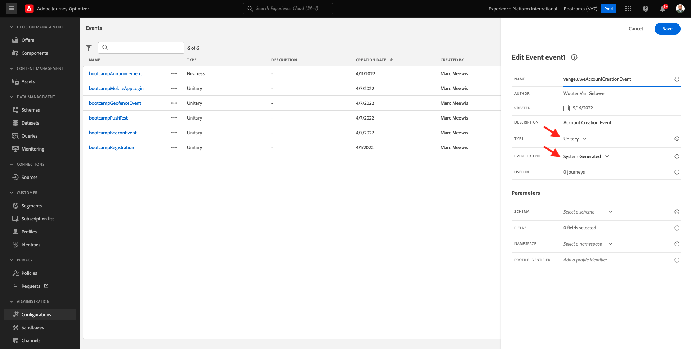

# 2.2 이벤트 만들기

[Adobe Journey Optimizer](https://experience.adobe.com)(으)로 이동하여 Adobe Experience Cloud에 로그인합니다. **Journey Optimizer**&#x200B;을(를) 클릭합니다.

Journey Optimizer의 **Home** 보기로 리디렉션됩니다. 먼저 올바른 샌드박스를 사용하고 있는지 확인하십시오. 사용할 샌드박스를 `Bootcamp`이라고 합니다. 한 샌드박스에서 다른 샌드박스로 변경하려면 **Prod**&#x200B;를 클릭하고 목록에서 샌드박스를 선택합니다. 이 예제에서는 샌드박스 이름이 **Bootcamp**&#x200B;입니다. 그러면 샌드박스 `Bootcamp`의 **홈** 보기에 있게 됩니다.

왼쪽 메뉴에서 아래로 스크롤하여 **구성**&#x200B;을 클릭합니다. 그런 다음 **이벤트**&#x200B;에서 **관리** 단추를 클릭합니다.

그러면 사용 가능한 모든 이벤트의 개요가 표시됩니다. 나만의 이벤트를 만들려면 **이벤트 만들기**&#x200B;를 클릭하세요.

그러면 비어 있는 새 이벤트 창이 나타납니다.

먼저 이벤트에 다음과 같은 이름(`yourLastNameAccountCreationEvent`)을 지정하고 이 `Account Creation Event`과 같은 설명을 추가하십시오.

그런 다음 **Type**&#x200B;이(가) **Unitary**(으)로 설정되어 있는지 확인하고, **이벤트 ID 유형** 선택에 대해 **시스템 생성**&#x200B;을 선택하십시오.

다음은 스키마 선택 사항입니다. 이 연습을 위해 스키마가 준비되었습니다. 스키마 `Demo System - Event Schema for Website (Global v1.1) v.1`을(를) 사용하십시오.

스키마를 선택하면 **필드** 섹션에서 여러 필드를 선택할 수 있습니다. 이제 **필드** 섹션 위로 마우스를 가져가면 3개의 아이콘 팝업이 표시됩니다. **편집** 아이콘을 클릭합니다.

**필드** 창 팝업이 나타나며, 여기에서 전자 메일을 개인화하는 데 필요한 일부 필드를 선택해야 합니다.  나중에 Adobe Experience Platform에 이미 있는 데이터를 사용하여 다른 프로필 속성을 선택합니다.

`_experienceplatform.demoEnvironment` 개체에서 **brandLogo** 및 **brandName** 필드를 선택하십시오.

개체 `_experienceplatform.identification.core`에서 필드 **전자 메일**&#x200B;을(를) 선택하십시오.

변경 내용을 저장하려면 **확인**&#x200B;을 클릭하세요.

그럼 이걸 보셔야죠 변경 내용을 저장하려면 **저장**&#x200B;을 다시 클릭하세요.

이제 이벤트가 구성 및 저장되었습니다.

이벤트를 다시 클릭하여 **이벤트 편집** 화면을 다시 엽니다. **필드** 위로 마우스를 다시 가져가면 3개의 아이콘이 다시 표시됩니다. **페이로드 보기** 아이콘을 클릭합니다.

이제 예상 페이로드의 예를 볼 수 있습니다.
이벤트에는 고유한 오케스트레이션 eventID가 있으며 `_experience.campaign.orchestration.eventID`이(가) 표시될 때까지 해당 페이로드에서 아래로 스크롤하여 찾을 수 있습니다.

이벤트 ID는 다음 연습 중 하나에서 빌드할 여정을 트리거하기 위해 Adobe Experience Platform에 전송해야 하는 ID입니다. 이 eventID는 나중에 필요할 수 있으므로 기억하십시오.
`"eventID": "19cab7852cdef99d25b6d5f1b6503da39d1f486b1d585743f97ed2d1e6b6c74f"`

**확인**&#x200B;을 클릭한 다음 **취소**&#x200B;을 클릭합니다.

이제 이 연습을 완료했습니다.

다음 단계: [2.3 전자 메일 메시지 만들기](./ex3.md)

[사용자 흐름 2로 돌아가기](./uc2.md)

[모든 모듈로 돌아가기](../../overview.md)
