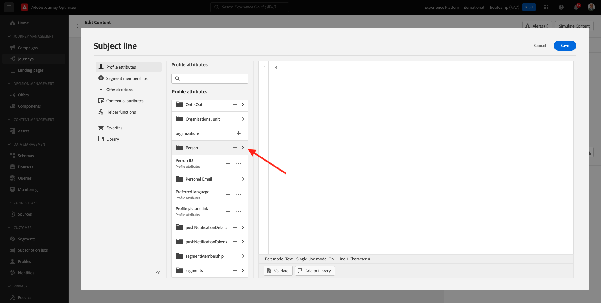

# 2.3 여정 및 이메일 메시지 만들기

이 연습에서는 누군가 데모 웹 사이트에서 여정을 만들 때 트리거해야 하는 계정을 구성합니다.

다음으로 이동하여 Adobe Journey Optimizer에 로그인 [Adobe Experience Cloud](https://experience.adobe.com). 클릭 **Journey Optimizer**.

다음 페이지로 리디렉션됩니다. **홈**  Journey Optimizer에서 봅니다. 먼저 올바른 샌드박스를 사용하고 있는지 확인하십시오. 사용할 샌드박스는 이라고 합니다. `Bootcamp`. 한 샌드박스에서 다른 샌드박스로 변경하려면 를 클릭합니다. **Prod** 목록에서 샌드박스를 선택합니다. 이 예에서 샌드박스는 다음과 같이 이름이 지정됩니다. **부트캠프**. 그러면 다음 위치에 있게 됩니다. **홈** 샌드박스 보기 `Bootcamp`.

## 2.3.1 여정 만들기

왼쪽 메뉴에서 **여정**. 그런 다음 을 클릭합니다. **여정 만들기** 새 여정 만들기

그러면 빈 여정 화면이 표시됩니다.

이전 연습에서는 새 를 만들었습니다 **이벤트**. 이렇게 이름을 지으셨군요 `yourLastNameAccountCreationEvent` 및 대체됨 `yourLastName` 성을 입력합니다. 이는 이벤트 생성의 결과였습니다.

이제 이 이벤트를 이 여정의 시작으로 간주해야 합니다. 이렇게 하려면 화면 왼쪽으로 이동하여 이벤트 목록에서 이벤트를 검색할 수 있습니다.

이벤트를 선택하고 여정 캔버스에 끌어서 놓습니다. 이제 여정은 다음과 같습니다.

여정의 두 번째 단계로 요약을 추가해야 합니다. **대기** 단계. 화면 왼쪽으로 이동하여 **오케스트레이션** 섹션을 참조하십시오. 프로필 속성을 사용하게 되며 이러한 속성이 실시간 고객 프로필에 채워져 있는지 확인해야 합니다.

이제 여정은 다음과 같습니다. 화면 오른쪽에서 대기 시간을 구성해야 합니다. 1분으로 설정합니다. 이렇게 하면 이벤트가 실행된 후에 프로필 속성을 사용할 수 있는 충분한 시간이 제공됩니다.

클릭 **확인** 변경 사항을 저장합니다.

여정의 세 번째 단계로 **이메일** 작업. 화면 왼쪽으로 이동한 다음 **작업**&#x200B;를 선택하고 **이메일** 작업을 수행한 다음 여정의 두 번째 노드로 끌어서 놓습니다. 이제 이 항목을 볼 수 있습니다.

설정 **범주** 끝 **마케팅** 그리고 이메일을 보낼 수 있는 이메일 표면을 선택합니다. 이 경우 선택할 이메일 표면은 입니다. **이메일**. 의 확인란이 **이메일 클릭 수** 및 **이메일 열람수** 둘 다 활성화되어 있습니다.

다음 단계는 메시지를 만드는 것입니다. 이렇게 하려면 다음을 클릭하십시오. **콘텐츠 편집**.

## 2.3.2 메시지 만들기

메시지를 만들려면 다음을 클릭하십시오. **콘텐츠 편집**.

이제 이 항목을 볼 수 있습니다.

다음을 클릭합니다. **제목 줄** 텍스트 필드.

텍스트 영역에서 작성을 시작합니다. **안녕하세요.**

제목란은 아직 완성되지 않았습니다. 다음으로 필드에 대한 개인화 토큰을 가져와야 합니다 **이름** 아래에 저장됨 `profile.person.name.firstName`. 왼쪽 메뉴에서 아래로 스크롤하여 **개인** 요소를 마우스로 가리키고 화살표를 클릭하면 더 깊은 레벨로 이동합니다.

이제 다음 항목을 찾습니다. **전체 이름** 요소를 마우스로 가리키고 화살표를 클릭하면 더 깊은 레벨로 이동합니다.

마지막으로 **이름** 필드를 클릭하고 **+** 그 옆에 사인해 주세요. 그러면 개인화 토큰이 텍스트 필드에 표시되는 것을 볼 수 있습니다.

그런 다음 텍스트를 추가합니다 **등록해 주셔서 감사합니다!** 질문에 답합니다. **저장**&#x200B;을 클릭합니다.

그럼 다시 여기로 오십시오. 클릭 **이메일 디자이너** 이메일 콘텐츠를 만듭니다.

다음 화면에서는 전자 메일 콘텐츠를 제공하는 3가지 방법이 표시됩니다.

- **처음부터 디자인**: 빈 캔버스로 시작하고 WYSIWYG 편집기를 사용하여 구조 및 콘텐츠 구성 요소를 드래그하여 놓아 이메일 콘텐츠를 시각적으로 빌드합니다.
- **나만의 코드 작성**: HTML을 사용하여 코딩하여 고유한 이메일 템플릿을 만듭니다
- **가져오기 HTML**: 편집할 수 있는 기존 HTML 템플릿을 가져옵니다.

클릭 **가져오기 HTML**. 또는 를 클릭할 수 있습니다 **저장된 템플릿** 템플릿 선택 **Bootcamp - 이메일 템플릿**.

선택한 경우 **가져오기 HTML**&#x200B;이제 파일을 끌어서 놓을 수 있습니다 **mailtemplatebootcamp.html**, 다운로드 가능 [여기](../../assets/html/mailtemplatebootcamp.html.zip). 가져오기를 클릭합니다.

그러면 이 기본 이메일 템플릿이 표시됩니다.

이메일을 개인화하겠습니다. 텍스트 옆에 있는 을 클릭합니다 **안녕하세요.** 을(를) 클릭하고 **개인화 추가** 아이콘.

다음으로, 다음을 가져오십시오. **이름** 다음에 저장된 개인화 토큰 `profile.person.name.firstName`. 메뉴에서 다음을 찾습니다. **개인** 요소, 드릴다운하여 **전체 이름** 요소를 클릭한 다음 **+** 표현식 편집기에 이름 필드를 추가하는 아이콘.

**저장**&#x200B;을 클릭합니다.

이제 개인화 필드가 텍스트에 추가된 방식을 알 수 있습니다.

클릭 **저장** 메시지를 저장합니다.

다음을 클릭하여 메시지 대시보드로 돌아갑니다. **화살표** 왼쪽 상단 모서리의 제목 줄 텍스트 옆에 있습니다.

이제 등록 이메일 작성을 완료했습니다. 왼쪽 상단 모서리의 화살표를 클릭하여 여정으로 돌아갑니다.

클릭 **확인**.

## 2.3.3 여정 게시

여정 이름을 계속 지정해야 합니다. 다음을 클릭하면 됩니다. **속성** 아이콘 을 클릭하여 표시할 수 있습니다.

그런 다음 여기에 여정 이름을 입력할 수 있습니다. 다음을 사용하십시오. `yourLastName - Account Creation Journey`. 클릭 **확인** 변경 사항을 저장합니다.

이제 을(를) 클릭하여 여정을 게시할 수 있습니다. **게시**.

클릭 **게시** 다시.

그러면 이제 여정이 게시되었다는 녹색 확인 표시줄이 표시됩니다.

이제 이 연습을 완료했습니다.

다음 단계: [2.4 여정 테스트](./ex4.md)

[사용자 흐름 2로 돌아가기](./uc2.md)

[모든 모듈로 돌아가기](../../overview.md)