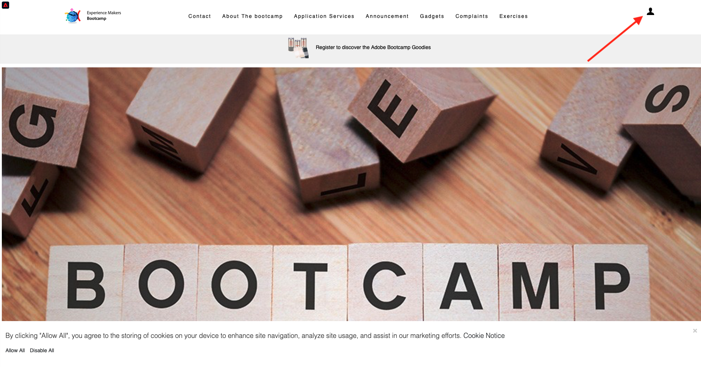
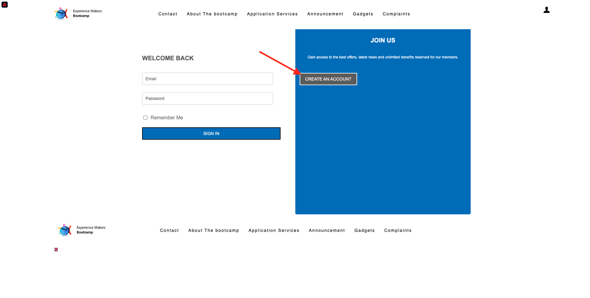

# 2.4 여정 테스트

## 고객 여정 흐름

새롭고 깔끔한 시크릿 브라우저 창을 열고 [https://bootcamp.aepdemo.net](https://bootcamp.aepdemo.net)(으)로 이동합니다. **모두 허용**&#x200B;을 클릭합니다. 이전 사용자 흐름의 탐색 동작을 기반으로 웹 사이트의 홈페이지에서 개인화가 발생하는 것을 볼 수 있습니다.

화면 오른쪽 상단의 **프로필** 아이콘을 클릭합니다.

**계정 만들기**&#x200B;를 클릭합니다.

양식의 모든 필드를 채웁니다. 이메일 및 SMS 게재를 위한 이후 연습에서 사용되므로 이메일 주소 및 전화번호 값은 실제 값을 사용합니다.

아래로 스크롤합니다. 이제 연습 2.2에서 만든 사용자 지정 이벤트의 eventID를 입력해야 합니다. 여기에서 찾을 수 있습니다.

여정 ID는 빌드한 이벤트를 트리거하기 위해 Adobe Experience Platform으로 전송해야 하는 ID입니다. 이 예제의 eventID는 `19cab7852cdef99d25b6d5f1b6503da39d1f486b1d585743f97ed2d1e6b6c74f`입니다.

**계정 만들기 이벤트 ID** 필드에 eventID를 입력하고 **등록**&#x200B;을 클릭합니다.

그러면 이걸 보게 될 거야.

또한 이 연습의 일부로 직접 만든 이메일인 이 이메일을 받게 됩니다.

이제 이 연습을 완료했습니다.

다음 단계: [2.5 모바일 앱 설치 및 사용](./ex5.md)

[사용자 흐름 2로 돌아가기](./uc2.md)

[모든 모듈로 돌아가기](../../overview.md)
