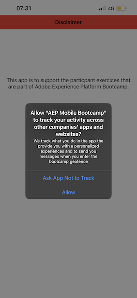

# 2.5 모바일 앱 설치 및 사용

## 모바일 앱 설치

앱을 설치하기 전에 를 활성화해야 합니다 **추적** iOS 디바이스에서. 이렇게 하려면 다음으로 이동합니다. **설정** > **개인 정보 및 보안** > **추적** 및 옵션을 확인합니다. **앱에서 추적 요청 허용**.

Apple App Store으로 이동하여 `aepmobile-bootcamp`. 클릭 **설치** 또는 **다운로드**.

앱이 설치되면 **열기**.

**확인**&#x200B;을 클릭합니다.

클릭 **허용**.

클릭 **동의함**.

클릭 **앱을 사용하는 동안 허용**.

클릭 **허용**.

이제 앱과 홈 페이지에서 고객 여정을 진행할 준비가 되었습니다.

## 고객 여정 흐름

우선 로그인해야 합니다. **로그인**&#x200B;을 클릭합니다.

이전 연습에서 계정을 만든 후 웹 사이트에서 이를 확인했습니다. 이제 로그인하려면 앱에서 만든 계정의 이메일 주소를 다시 사용해야 합니다.

여기에 웹 사이트에서 사용한 이메일 주소를 입력하고 클릭 **로그인**.

그러면 로그인되었다는 확인 메시지가 나타나고 푸시 알림이 전송됩니다.

앱의 홈페이지로 돌아가면 추가 기능이 표시됩니다.

다음으로 이동 **제품**. 이 예에서 원하는 제품을 클릭합니다. **테이크아웃 커피**.

다음을 볼 수 있습니다. **테이크아웃 커피** 앱의 제품 페이지. 클릭 **구매**.

이제 이 연습을 완료하고 다음 연습을 수행할 준비가 되었습니다.

다음 단계: [2.6 콜 센터의 개인화](./ex6.md)

[사용자 흐름 2로 돌아가기](./uc2.md)

[모든 모듈로 돌아가기](../../overview.md)
