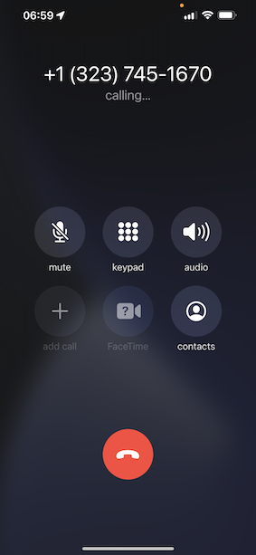
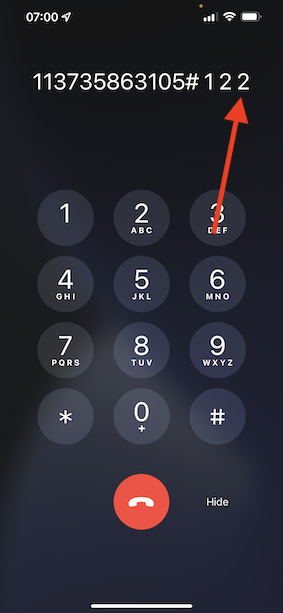

# 2.6 콜 센터의 개인화

이미 부트캠프 동안 여러 번 논의했듯이 고객 경험을 개인화하는 것은 옴니채널 방식으로 이루어져야 하는 일입니다. 콜센터는 다른 고객 여정과 상당히 떨어져 있어서 고객 경험이 좌절되는 경우가 많지만 그럴 필요는 없습니다. 콜센터를 Adobe Experience Platform에 쉽게 연결할 수 있는 방법을 실시간으로 보여 드리겠습니다.

## 고객 여정 흐름

이전 연습에서는 모바일 애플리케이션을 사용하여 **구매** 단추를 클릭합니다.

주문 현황에 대해 질문이 있다고 가정해 보겠습니다, 어떻게 하시겠습니까? 일반적으로 콜센터에 전화해야 합니다.

콜센터에 전화하기 전에 다음을 알아야 합니다. **고객 충성도 ID**. 충성도 ID는 웹 사이트의 프로필 뷰어에서 찾을 수 있습니다.

이 경우 **고객 충성도 ID** 은(는) **5863105**. 데모 환경에서 콜 센터 기능의 사용자 지정 구현의 일환으로, **고객 충성도 ID**. 접두사는 입니다. **11373**, 따라서 이 예제에 사용할 충성도 ID는 입니다. **11373 5863105**.

이제 그렇게 합시다. 전화 쓰시고 전화번호로 연락하세요 **+1 (323) 745-1670**.

충성도 ID를 입력하라는 메시지가 표시된 후 다음을 수행합니다 **#**. 충성도 ID를 입력합니다.

그러면 들을 수 있을 겁니다 **안녕하세요, 이름**. Adobe Experience Platform의 실시간 고객 프로필에서 가져온 이름입니다. 그러면 3가지 옵션이 있습니다. 누르기 번호 **1**, **주문 상태**.

주문 현황을 듣고 나면 다음을 누를 수 있는 선택 사항이 제공됩니다. **1** 메인 메뉴로 돌아가려면 2번을 누르십시오. 누르기 **2**.

그런 다음 1에서 5 사이의 숫자를 선택하여 콜센터 환경을 평가하라는 메시지가 표시됩니다. 1은 낮고 5는 높습니다. 선택을 하세요.

이제 콜센터에 대한 통화가 종료됩니다.

다음으로 이동 [Adobe Experience Platform](https://experience.adobe.com/platform). 로그인하면 Adobe Experience Platform 홈페이지에 접속하게 됩니다.

계속하기 전에 **샌드박스**. 선택할 샌드박스 이름이 로 지정됩니다. ``Bootcamp``. 텍스트를 클릭하여 이 작업을 수행할 수 있습니다 **[!UICONTROL 프로덕션 프로덕션]** 화면 상단의 파란색 선. 적절한 을(를) 선택한 후 [!UICONTROL 샌드박스], 화면 변경 사항이 표시되며 이제 전용 모드로 전환됩니다. [!UICONTROL 샌드박스].

왼쪽 메뉴에서 **프로필** 및 종료 **찾아보기**.

다음 항목 선택 **ID 네임스페이스** **이메일** 고객 프로필의 이메일 주소를 입력합니다. 클릭 **보기**. 을(를) 클릭하여 프로필을 엽니다.

고객 프로필이 다시 표시됩니다. 다음으로 이동 **이벤트**.

events 아래에 eventType 이 인 이벤트가 2개 표시됩니다. **콜 센터**. 첫 번째 이벤트는 질문에 대한 답변의 결과입니다 **통화 만족도 평가**.

아래로 조금 스크롤하면 옵션을 선택하여 을(를) 확인했을 때 기록된 이벤트가 표시됩니다. **주문 상태**.

다음으로 이동 **세그먼트 멤버십**. 이제 두 개의 세그먼트가 콜센터를 통해 수행한 상호 작용을 기반으로 실시간으로 프로필에 자격을 부여함을 알 수 있습니다. 이러한 세그먼트 멤버십은 다른 채널에서 발생하는 의사 소통 및 개인화에 영향을 주는 데 사용할 수 있으며 사용해야 합니다.

이제 이 연습을 완료했습니다.

[사용자 흐름 2로 돌아가기](./uc2.md)

[모든 모듈로 돌아가기](../../overview.md)
