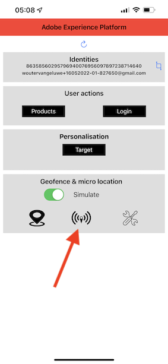
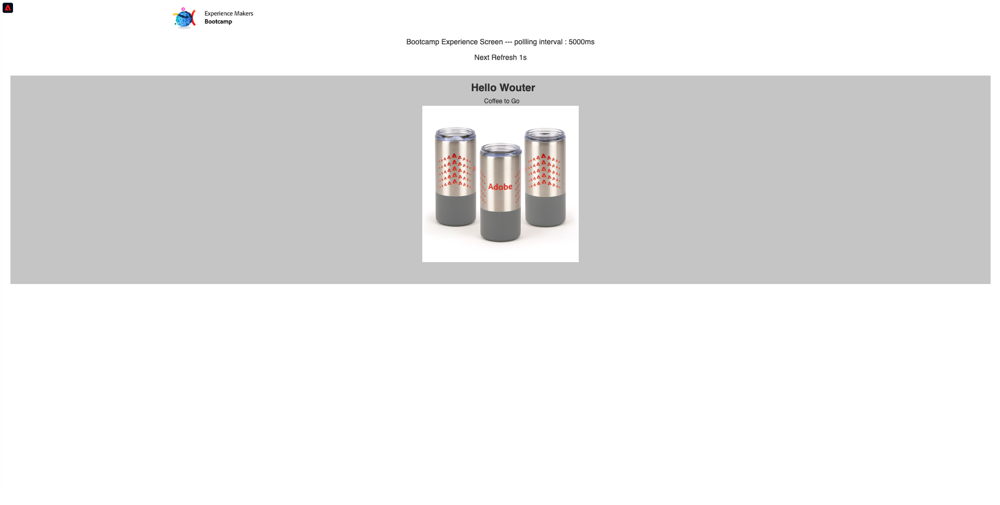

# 3.1 모바일 앱 사용 및 비콘 항목 트리거

## 모바일 앱 설치

앱을 설치하기 전에 iOS 장치에서 **추적**&#x200B;을 사용하도록 설정해야 합니다. 이렇게 하려면 **설정** > **개인 정보 및 보안** > **추적**&#x200B;으로 이동하여 **앱에서 추적을 요청하도록 허용** 옵션을 확인하십시오.

Apple App Store으로 이동하여 `aepmobile-bootcamp`을(를) 검색합니다. **설치** 또는 **다운로드**&#x200B;를 클릭합니다.

앱이 설치되면 **열기**&#x200B;를 클릭합니다.

**확인**&#x200B;을 클릭합니다.

**허용**&#x200B;을 클릭합니다.

**동의함**&#x200B;을 클릭하세요.

**앱을 사용하는 동안 허용**&#x200B;을 클릭합니다.

**허용**&#x200B;을 클릭합니다.

이제 앱과 홈 페이지에서 고객 여정을 진행할 준비가 되었습니다.

## 고객 여정 흐름

우선 로그인해야 합니다. **로그인**&#x200B;을 클릭합니다.

이전 연습에서 계정을 만든 후 웹 사이트에서 이를 확인했습니다. 이제 로그인하려면 앱에서 만든 계정의 이메일 주소를 다시 사용해야 합니다.

웹 사이트에서 사용한 전자 메일 주소를 여기에 입력하고 **로그인**&#x200B;을 클릭합니다.

그러면 로그인되었다는 확인 메시지가 나타나고 푸시 알림이 전송됩니다.

앱의 홈페이지로 돌아가면 추가 기능이 표시됩니다.

먼저 **제품**(으)로 이동합니다. 제품을 클릭합니다(이 예제에서는 **테이크아웃 커피하기**).

앱에서 **테이크아웃 커피** 제품 페이지가 표시됩니다.

이제 오프라인 스토어 위치에서 비콘 항목 이벤트를 시뮬레이션합니다. 이를 시뮬레이션하는 목표는 매장 내 화면에서 고객 경험을 개인화하는 것입니다. 매장 경험을 시각화하기 위해 방금 매장에 들어온 고객과 관련된 정보를 동적으로 표시하는 페이지가 생성되었습니다.

계속하기 전에 컴퓨터에서 이 웹 페이지를 여십시오. [https://bootcamp.aepdemo.net/content/aep-bootcamp-experience/language-masters/en/screen.html](https://bootcamp.aepdemo.net/content/aep-bootcamp-experience/language-masters/en/screen.html)

그러면 다음과 같은 결과가 표시됩니다.

다음으로 홈 페이지로 돌아갑니다. **beacon** 아이콘을 클릭합니다.

그러면 이걸 보게 될 거야. 먼저 **Bootcamp 화면 비콘**&#x200B;을 선택한 다음 **시작** 단추를 클릭합니다. 이렇게 하면 비콘 항목을 시뮬레이션할 수 있습니다.

이제 매장 화면을 살펴보세요. 5초 이내에 마지막으로 본 제품이 표시됩니다.

그런 다음 **제품**(으)로 돌아갑니다. 제품을 클릭합니다. 이 예제에서는 **해변 담요 Tan**.

다음으로 홈 페이지로 돌아갑니다. **beacon** 아이콘을 클릭합니다.

그러면 이걸 보게 될 거야. 먼저 **Bootcamp 화면 비콘**&#x200B;을 선택한 다음 **시작** 단추를 다시 클릭합니다. 이렇게 하면 비콘 항목을 시뮬레이션할 수 있습니다.

이제 매장 내 화면을 다시 한번 살펴보세요. 5초 이내에 마지막으로 본 제품이 표시됩니다.

이제 웹 사이트에서 프로필 뷰어도 살펴보겠습니다. 고객과의 모든 상호 작용이 Adobe Experience Platform에서 수집되고 저장된다는 것을 보여주기 위해 여기에 추가된 많은 이벤트를 볼 수 있습니다.

다음 연습에서는 고유한 비콘 항목 여정을 구성하고 테스트합니다.

다음 단계: [3.2 이벤트 만들기](./ex2.md)

[사용자 흐름으로 돌아가기 3](./uc3.md)

[모든 모듈로 돌아가기](../../overview.md)
