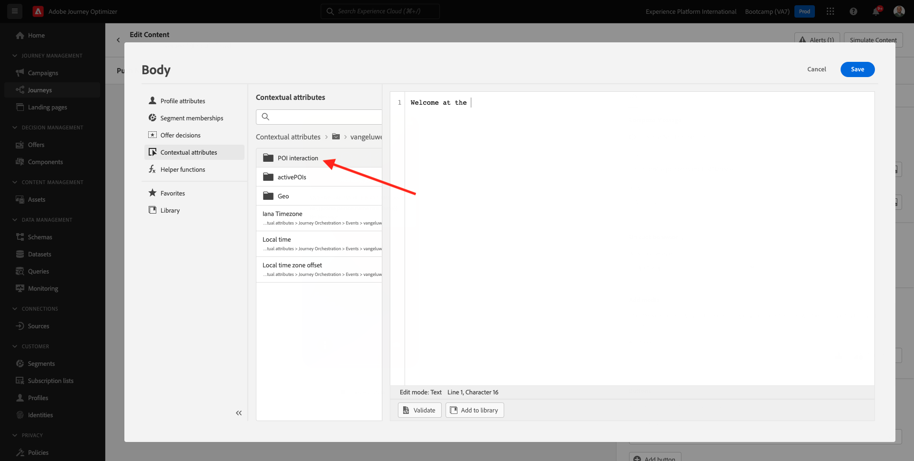

# 3.3 여정 및 푸시 알림 만들기

이 연습에서는 모바일 앱을 사용하여 다른 사람이 비콘에 들어갈 때 트리거해야 하는 여정 및 메시지를 구성합니다.

[Adobe Journey Optimizer](https://experience.adobe.com)(으)로 이동하여 Adobe Experience Cloud에 로그인합니다. **Journey Optimizer**&#x200B;을(를) 클릭합니다.

Journey Optimizer의 **Home** 보기로 리디렉션됩니다. 먼저 올바른 샌드박스를 사용하고 있는지 확인하십시오. 사용할 샌드박스를 `Bootcamp`이라고 합니다. 한 샌드박스에서 다른 샌드박스로 변경하려면 **Prod**&#x200B;를 클릭하고 목록에서 샌드박스를 선택합니다. 이 예제에서는 샌드박스 이름이 **Bootcamp**&#x200B;입니다. 그러면 샌드박스 `Bootcamp`의 **홈** 보기에 있게 됩니다.

## 3.3.1 여정 만들기

왼쪽 메뉴에서 **여정**&#x200B;을 클릭합니다. 그런 다음 **여정 만들기**&#x200B;를 클릭하여 새 여정을 만듭니다.

그러면 빈 여정 화면이 표시됩니다.

이전 연습에서는 새 **이벤트**&#x200B;를 만들었습니다. 이 `yourLastNameBeaconEntryEvent`과(와) 같이 이름을 지정하고 `yourLastName`을(를) 성으로 바꾸었습니다. 이는 이벤트 생성의 결과였습니다.

이제 이 이벤트를 이 여정의 시작으로 간주해야 합니다. 이렇게 하려면 화면 왼쪽으로 이동하여 이벤트 목록에서 이벤트를 검색할 수 있습니다.

이벤트를 선택하고 여정 캔버스에 끌어서 놓습니다. 이제 여정은 다음과 같습니다. 변경 내용을 저장하려면 **확인**&#x200B;을 클릭하세요.

여정의 두 번째 단계로 **푸시** 작업을 추가해야 합니다. 화면의 왼쪽으로 이동하여 **작업**&#x200B;을(를) 선택하고 **푸시** 작업을 선택한 다음 여정의 두 번째 노드에 끌어다 놓습니다.

이제 화면 오른쪽에서 푸시 알림을 만들어야 합니다.

**카테고리**&#x200B;을(를) **마케팅**(으)로 설정하고 푸시 알림을 보낼 수 있는 푸시 표면을 선택하십시오. 이 경우 선택할 푸시 표면은 **meeewis-app-mobile-bootcamp**&#x200B;입니다.

## 3.3.2 메시지 만들기

**콘텐츠 편집**&#x200B;을 클릭합니다.

그러면 다음과 같은 결과가 표시됩니다.

푸시 알림의 콘텐츠를 정의하겠습니다.

**제목** 텍스트 필드를 클릭합니다.

텍스트 영역에서 **안녕하세요** 쓰기를 시작합니다. 개인화 아이콘을 클릭합니다.

이제 `profile.person.name.firstName`에 저장된 필드 **이름**&#x200B;에 대한 개인화 토큰을 가져와야 합니다. 왼쪽 메뉴에서 **프로필 특성**&#x200B;을 선택하고 아래로 스크롤/이동하여 **개인** 요소를 찾은 다음 화살표를 클릭하여 필드 `profile.person.name.firstName`에 도달할 때까지 더 깊은 수준으로 이동합니다. **+** 아이콘을 클릭하여 필드를 캔버스에 추가합니다. **저장**&#x200B;을 클릭합니다.

그럼 다시 여기로 오십시오. 필드 **본문** 옆에 있는 개인화 아이콘을 클릭합니다.

텍스트 영역에 `Welcome at the `을(를) 씁니다.

그런 다음 **컨텍스트 특성**&#x200B;을 클릭한 다음 **Journey Orchestration**&#x200B;을 클릭합니다.

**이벤트**&#x200B;를 클릭합니다.

이벤트의 이름을 클릭합니다. 이름은 다음과 같습니다. **yourLastNameBeaconEntryEvent**.

**컨텍스트 배치**&#x200B;를 클릭합니다.

**POI 인터랙션**&#x200B;을 클릭합니다.

**POI 세부 정보**&#x200B;를 클릭합니다.

**POI 이름**&#x200B;에서 **+** 아이콘을 클릭합니다.
그러면 이걸 보게 될 거야. **저장**&#x200B;을 클릭합니다.

이제 메시지가 준비되었습니다. 왼쪽 상단 모서리의 화살표를 클릭하여 여정으로 돌아갑니다.

**확인**&#x200B;을 클릭합니다.

## 3.3.2 화면으로 메시지 보내기

여정의 세 번째 단계로 **sendMessageToScreen** 액션을 추가해야 합니다. 화면의 왼쪽으로 이동하여 **Actions**&#x200B;을(를) 클릭하고 **sendMessageToScreen** 작업을 선택한 다음 여정의 세 번째 노드로 끌어서 놓습니다. 그러면 이걸 보게 될 거야.

**sendMessageToScreen** 작업은 매장 디스플레이에서 사용하는 끝점에 메시지를 게시하는 사용자 지정 작업입니다. **sendMessageToScreen** 작업에는 여러 변수가 정의되어야 합니다. **작업 매개 변수**&#x200B;가 표시될 때까지 아래로 스크롤하여 해당 변수를 볼 수 있습니다.

이제 모든 작업 매개 변수에 대한 값을 설정해야 합니다. 이 표를 따라 필요한 위치에 대한 값을 이해합니다.

| 매개변수 | 값 |
|:-------------:| :---------------:|
| 게재 | `'image'` |
| ECID | `@{yourLastNameBeaconEntryEvent._experienceplatform.identification.core.ecid}` |
| 이름 | `#{ExperiencePlatform.ProfileFieldGroup.profile.person.name.firstName}` |
| 이벤트 주제 | `#{ExperiencePlatform.ProductListItems.experienceevent.first(currentDataPackField.eventType == "commerce.productViews").productListItems.first().name}` |
| EVENTSUBJECT | `#{ExperiencePlatform.ProductListItems.experienceevent.first(currentDataPackField.eventType == "commerce.productViews").productListItems.first()._experienceplatform.core.imageURL}` |
| 샌드박스 | `'bootcamp'` |
| CONTAINERID | `''` |
| 활동 ID | `''` |
| PLACEMENTID | `''` |

{style="table-layout:auto"}

이러한 값을 설정하려면 **편집** 아이콘을 클릭하십시오.

그런 다음 **고급 모드**&#x200B;를 선택합니다.

그런 다음 위의 표를 기준으로 값을 붙여넣습니다. **확인**&#x200B;을 클릭합니다.

각 필드에 값을 추가하려면 이 프로세스를 반복합니다.

>[!IMPORTANT]
>
>필드 ECID에 이벤트 `yourLastNameBeaconEntryEvent`에 대한 참조가 있습니다. `yourLastName`을(를) 성으로 바꾸십시오.

최종 결과는 다음과 같아야 합니다.

위로 스크롤하여 **확인**&#x200B;을 클릭합니다.

여정 이름을 계속 지정해야 합니다. 화면 왼쪽 상단의 **연필** 아이콘을 클릭하면 됩니다.

그런 다음 여기에 여정 이름을 입력할 수 있습니다. `yourLastName - Beacon Entry Journey`을(를) 사용하십시오. 변경 내용을 저장하려면 **확인**&#x200B;을 클릭하세요.

이제 **Publish**&#x200B;을(를) 클릭하여 여정을 게시할 수 있습니다.

**Publish**&#x200B;을 다시 클릭합니다.

그러면 이제 여정이 게시되었다는 녹색 확인 표시줄이 표시됩니다.

이제 여정이 라이브되며 트리거될 수 있습니다.

이제 이 연습을 완료했습니다.

다음 단계: [3.4 여정 테스트](./ex4.md)

[사용자 흐름으로 돌아가기 3](./uc3.md)

[모든 모듈로 돌아가기](../../overview.md)
