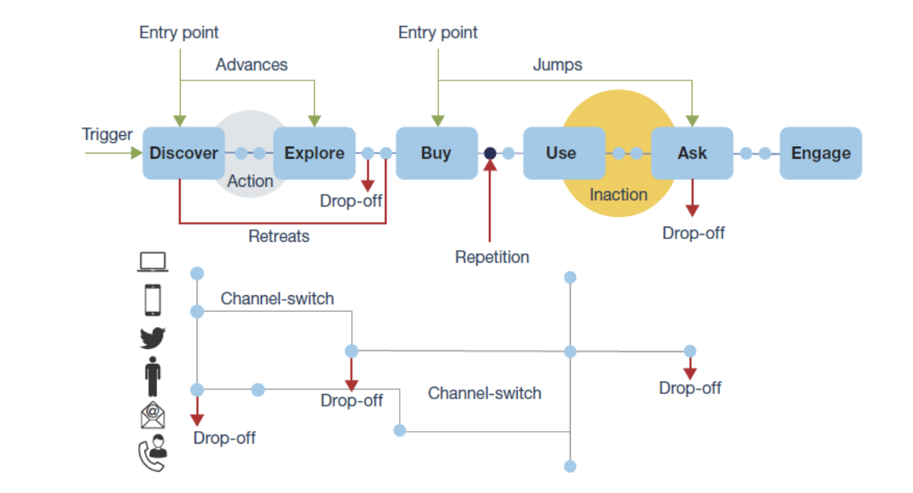
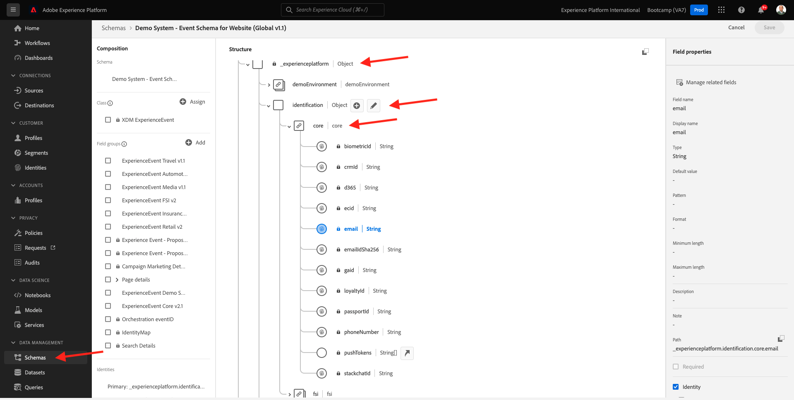

# 4.1 Customer Journey Analytics 101

## 목표

- CJA 애플리케이션 서비스 이해
- CJA를 포지셔닝하는 방법을 알아봅니다
- CJA 워크플로우를 이해합니다. 데이터 연결에서 인사이트로

## 4.1.1 Customer Journey Analytics 소개

Customer Journey Analytics(CJA)는 크로스 채널 데이터(온라인 및 오프라인)를 결합 및 분석하는 비즈니스 인텔리전스 및 데이터 과학 팀에 툴킷을 제공합니다. CJA 내의 기능은 컨텍스트와 명확성을 복잡한 다중 채널 고객 여정에 제공합니다. 제공된 컨텍스트를 통해 고객 전환 프로세스의 불만 사항을 제거하고 가장 중요한 순간에 뛰어난 경험을 디자인하고 전달하는 데 필요한 실용적인 통찰력을 얻을 수 있습니다.

CJA에서는 Analysis Workspace을 Adobe Experience Platform에 올립니다. Adobe Experience Platform은 커뮤니케이션 및 오케스트레이션 및 CJA의 뇌입니다. 이제 브랜드는 해당 데이터를 모두 컨텍스트에 맞게 구성하고 시각화할 수 있으므로 비즈니스 및 인사이트 팀이 온라인을 통해 오프라인 고객 여정을 분석하여 이를 통해 얻을 수 있습니다.

비즈니스 및 Insight 팀은 Analysis Workspace의 드래그 앤 드롭, 포인트 앤 클릭 및 사용자에게 친숙한 UI를 사용하여 CJA와 대화하고, 질문을 하고, 즉석에서 답변을 얻을 수 있습니다.

## 4.1.2 주요 이점

고객을 위한 세 가지 주요 이점은 다음과 같습니다.

- 모든 사람이 이용할 수 있는 통찰력을 제공하는 기능(예: 데이터 액세스 대중화)
- 상황별 여정에서 고객을 보는 기능(즉, 데이터는 온라인과 오프라인을 막론하고 여러 채널에 걸쳐 순차적으로 시각화할 수 있음)
- 필요할 필요 없이 데이터 기능을 활용할 수 있는 기능(즉, 일반적인 사람이 데이터를 사용하여 심도 있는 인사이트와 분석을 통해 마케팅 활성화를 도모할 수 있음)

## 4.1.3 Customer Journey Analytics을 선택해야 하는 이유

CJA는 Power BI, 마이크로전략, Locker 또는 Tableau와 같은 현재 BI 애플리케이션을 대체하기 위한 것이 아닙니다. 이러한 BI 응용 프로그램은 데이터를 시각화하여 회사 대시보드를 만들어 조직의 모든 사람이 중요한 지표를 빠르게 볼 수 있도록 하는 것입니다.\
CJA의 목표는 그러한 고객을 위해 &#39;반드시 있어야 하는&#39; 분석 도구로 만드는 마케팅 및 비즈니스 팀에 분석 능력을 가져오는 것입니다.

일반적으로 BI 애플리케이션은 진정한 고객 인텔리전스를 구현할 수 없었습니다.

- 속성을 수행할 수 없고 고객 여정 분석을 수행하지 않습니다.
- BI 응용 프로그램은 미리 그 질문을 알아야 합니다
- 대화형 쿼리는 데이터베이스의 구조에 의해 제한됩니다
- SQL 기술이 필요합니다.
- BI 응용 프로그램은 왜 어떤 일이 일어났는지 묻는 기능을 제공하지 않습니다.
- BI 응용 프로그램은 고객 터치 포인트에 직접 연결되지 않습니다.

위의 사항 때문에 비즈니스 사용자와 분석가는 거의 즉각적으로 급사하여 분석 비용이 많이 들고, 속도가 느리고, 유연하며, 작업 시스템과의 연결이 끊어집니다.

CJA를 사용하면 오프라인 및 온라인 데이터를 사용하여 고객 여정에 대한 360개의 보기를 통찰력 시간을 단축하고 비즈니스 사용자를 독립적으로 만들어 발생한 이유를 파악하고 이에 응답하는 방법을 이해할 수 있습니다.

## 4.1.4 Customer Journey Analytics 워크플로우 이해

다음 연습을 시작하기 전에 데이터를 시각화하고 심층적인 통찰력을 얻기 위해 Adobe Experience Platform에서 CJA로 가져오는 데 필요한 단계를 이해하는 것이 중요합니다. CJA Workflow라고 합니다. 어디 한 번 보자.

위의 단계를 시작하기 전에 Adobe Experience Platform에서 사용할 수 있는 데이터를 이해하는 0단계를 잊지 마십시오.

**쓰레기통, 쓰레기통** 기억해? 사용 가능한 데이터와 Adobe Experience Platform의 스키마가 구성되는 방식을 명확히 알고 있어야 합니다. Adobe Experience Platform에 있는 데이터를 이해하면 데이터 연결 부분뿐만 아니라 시각화를 만들고 분석을 수행할 때에도 보다 쉽게 작업할 수 있습니다.

## 4.1.5단계 0: Adobe Experience Platform 스키마 및 데이터 세트 이해

다음 URL로 이동하여 Adobe Experience Platform에 로그인합니다. [https://experience.adobe.com/platform](https://experience.adobe.com/platform).

로그인하면 Adobe Experience Platform 홈 페이지가 표시됩니다.

계속하기 전에 **샌드박스**. 선택할 샌드박스의 이름은 다음과 같습니다 ``Bootcamp``. 이 작업은 텍스트를 클릭하여 수행할 수 있습니다 **[!UICONTROL Prod]** 화면 오른쪽 상단 모서리에서 을(를) 클릭합니다. 적절한 샌드박스를 선택하면 화면 변경 사항이 표시되고 이제 전용 샌드박스에 있습니다.

Adobe Experience Platform에서 이러한 스키마 및 데이터 세트를 살펴보십시오.

| 데이터 세트 | 스키마 |
| ----------------- |-------------| 
| 데모 시스템 - 웹 사이트의 이벤트 데이터 세트(글로벌 v1.1) | 데모 시스템 - 웹 사이트용 이벤트 스키마(글로벌 v1.1) |
| 데모 시스템 - 콜 센터의 이벤트 데이터 세트(글로벌 v1.1) | 데모 시스템 - 콜 센터용 이벤트 스키마(글로벌 v1.1) |
| 데모 시스템 - 음성 도우미에 대한 이벤트 데이터 세트(글로벌 v1.1) | 데모 시스템 - Voice Assistants용 이벤트 스키마(글로벌 v1.1) |

다음과 같은 항목을 적어도 확인해야 합니다.

- ID: CRMID, phoneNumber, ECID, 이메일. 보조 식별자인 기본 식별자는 무엇입니까?
스키마를 열고 개체를 보면 식별자를 찾을 수 있습니다 `_experienceplatform.identification.core`. 스키마 보기 [데모 시스템 - 웹 사이트용 이벤트 스키마(글로벌 v1.1)](https://experience.adobe.com/platform/schema).

- 스키마 내에서 상거래 개체 살펴보기 [데모 시스템 - 웹 사이트용 이벤트 스키마(글로벌 v1.1)](https://experience.adobe.com/platform/schema).

- 모두 미리 보기 [데이터 세트](https://experience.adobe.com/platform/dataset/browse?limit=50&amp;page=1&amp;sortDescending=1&amp;sortField=created) 데이터를 보고

이제 Customer Journey Analytics UI 사용을 시작할 준비가 되었습니다.

다음 단계: [4.2 Customer Journey Analytics에서 Adobe Experience Platform 데이터 세트 연결](./ex2.md)

[사용자 흐름 4로 돌아가기](./uc4.md)

[모든 모듈로 돌아가기](../../overview.md)
