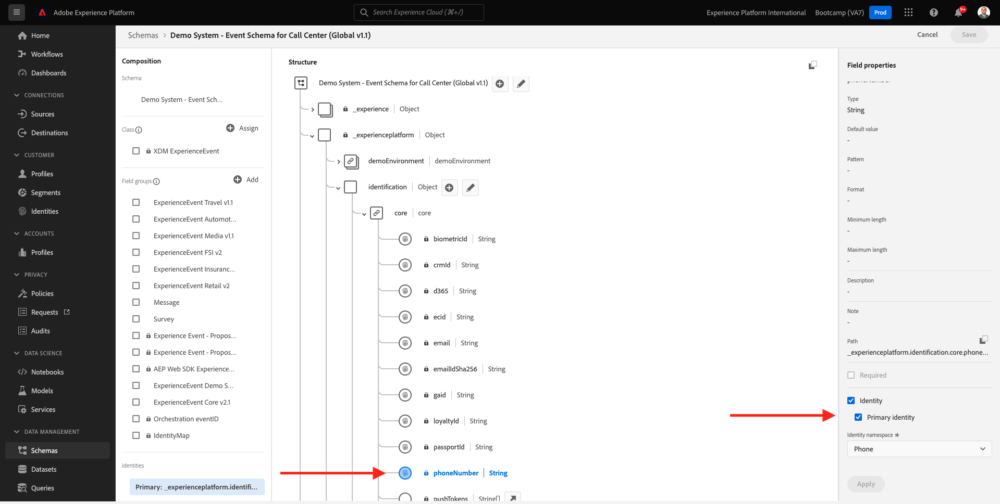

# 4.2 Customer Journey Analytics에서 Adobe Experience Platform 데이터 세트 연결

## 목표

- 데이터 연결 UI 이해
- Adobe Experience Platform 데이터를 CJA로 가져오기
- 개인 ID 및 데이터 결합 이해
- Customer Journey Analytics에서의 데이터 스트리밍에 대한 개념 알아보기

## 4.2.1 연결

Customer Journey Analytics에 액세스하려면 [analytics.adobe.com](https://analytics.adobe.com)(으)로 이동하십시오.

Customer Journey Analytics 홈페이지에서 **연결**(으)로 이동합니다.

여기에서 CJA와 Platform 간에 이루어진 다양한 연결을 모두 볼 수 있습니다. 이러한 연결은 Adobe Analytics의 보고서 세트와 동일한 목표를 가집니다. 그러나 데이터 수집은 완전히 다릅니다. 모든 데이터는 Adobe Experience Platform 데이터 세트에서 가져옵니다.

첫 번째 연결을 만들어 보겠습니다. **새 연결 만들기**&#x200B;를 클릭합니다.

그러면 **연결 만들기** UI가 표시됩니다.

이제 연결에 이름을 지정할 수 있습니다.

명명 규칙 `yourLastName – Omnichannel Data Connection`을(를) 사용하십시오.

예: `vangeluw - Omnichannel Data Connection`

사용할 올바른 샌드박스를 선택해야 합니다. 샌드박스 메뉴에서 샌드박스를 선택합니다. 샌드박스는 `Bootcamp`이어야 합니다. 이 예제에서 사용할 샌드박스는 **Bootcamp**&#x200B;입니다. 또한 **일일 평균 이벤트 수**&#x200B;를 **백만 개 미만**&#x200B;으로 설정해야 합니다.

샌드박스를 선택한 후 이 연결에 데이터 세트를 추가할 수 있습니다. **데이터 세트 추가**&#x200B;를 클릭합니다.

## 4.2.2 Adobe Experience Platform 데이터 세트 선택

데이터 집합 `Demo System - Event Dataset for Website (Global v1.1)`을(를) 검색합니다. 이 연결에 데이터 집합을 추가하려면 **+**&#x200B;을(를) 클릭하십시오.

이제 `Demo System - Profile Dataset for Loyalty (Global v1.1)` 및 `Demo System - Event Dataset for Call Center (Global v1.1)`의 확인란을 검색하여 선택하십시오.

그럼 이걸로 드셔보세요 **다음**&#x200B;을 클릭합니다.

## 4.2.3 개인 ID 및 데이터 결합

### 개인 ID

이제 이러한 데이터 세트에 결합하는 것이 목표입니다. 선택한 모든 데이터 세트에 대해 **개인 ID**&#x200B;라는 필드가 표시됩니다. 각 데이터 세트에는 고유한 개인 ID 필드가 있습니다.

보시는 것처럼 대부분 개인 ID가 자동으로 선택됩니다. Adobe Experience Platform의 모든 스키마에서 기본 식별자가 선택되기 때문입니다. 예를 들어 `Demo System - Event Schema for Call Center (Global v1.1)`에 대한 스키마가 있는데, 여기에서 기본 식별자가 `phoneNumber`(으)로 설정되어 있음을 확인할 수 있습니다.

그러나 연결을 위해 데이터 세트를 결합하는 데 사용할 식별자에 영향을 줄 수 있습니다. 데이터 세트에 연결된 스키마에 구성된 모든 식별자를 사용할 수 있습니다. 드롭다운을 클릭하여 각 데이터 세트에서 사용할 수 있는 ID를 탐색합니다.

위에서 언급했듯이 각 데이터 세트에 대해 서로 다른 개인 ID를 설정할 수 있습니다. 이를 통해 여러 출처의 다양한 데이터 세트를 CJA에 함께 가져올 수 있습니다. 컨텍스트와 어떤 일이 왜 일어났는지 이해하는 데 매우 흥미롭고 도움이 될 수 있는 NPS 또는 설문 조사 데이터를 가져온다고 상상해 보십시오.

개인 ID 필드의 값이 일치하는 경우 개인 ID 필드의 이름은 중요하지 않습니다. 예를 들어 개인 ID가 한 데이터 세트의 `email`이고 다른 데이터 세트의 `emailAddress`이고 `dnb-bootcamp@adobe.com`이(가) 두 데이터 세트의 개인 ID 필드에 대해 동일한 값인 경우 CJA가 데이터를 연결할 수 있습니다.

현재 익명 동작을 알려짐 과 같은 몇 가지 다른 제한 사항이 있습니다. 여기에서 FAQ를 검토하십시오. [FAQ](https://experienceleague.adobe.com/docs/analytics-platform/using/cja-overview/cja-faq.html?lang=ko).

### 개인 ID를 사용하여 데이터 결합

개인 ID를 사용하여 데이터 세트를 결합하는 개념을 이해했으므로 각 데이터 세트의 개인 ID로 `email`을(를) 선택해 보겠습니다.

각 데이터 세트로 이동하여 개인 ID를 업데이트합니다.

이제 드롭다운 목록에서 `email`을(를) 선택하는 필드 개인 ID를 채웁니다.

세 개의 데이터 세트를 결합했으면 계속 진행할 준비가 되었습니다.

| 데이터 세트 | 개인 ID |
| ----------------- |-------------| 
| 데모 시스템 - 웹 사이트에 대한 이벤트 데이터 세트(전역 v1.1) | 이메일 |
| 데모 시스템 - 충성도에 대한 프로필 데이터 세트(글로벌 v1.1) | 이메일 |
| 데모 시스템 - 콜 센터용 이벤트 데이터 세트(글로벌 v1.1) | 이메일 |

또한 모든 데이터 세트에 대해 다음 옵션이 활성화되어 있는지 확인해야 합니다.

- 새 데이터 모두 가져오기
- 기존 데이터 모두 채우기

**데이터 세트 추가**&#x200B;를 클릭합니다.

**저장**&#x200B;을 클릭하고 다음 연습으로 이동하세요.
**연결**&#x200B;을 만든 후 CJA에서 데이터를 사용하려면 몇 시간이 걸릴 수 있습니다.

다음 단계: [4.3 데이터 보기 만들기](./ex3.md)

[사용자 흐름으로 돌아가기 4](./uc4.md)

[모든 모듈로 돌아가기](./../../overview.md)
