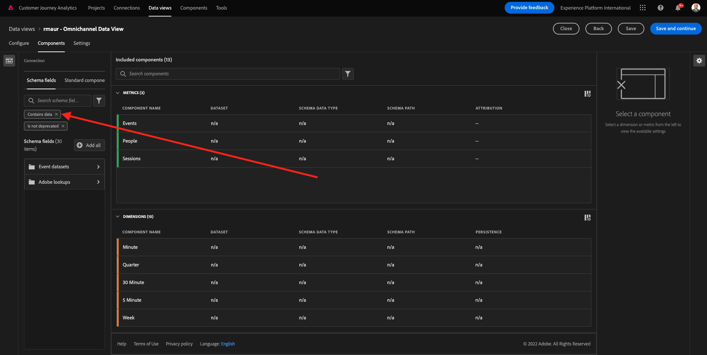
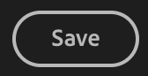
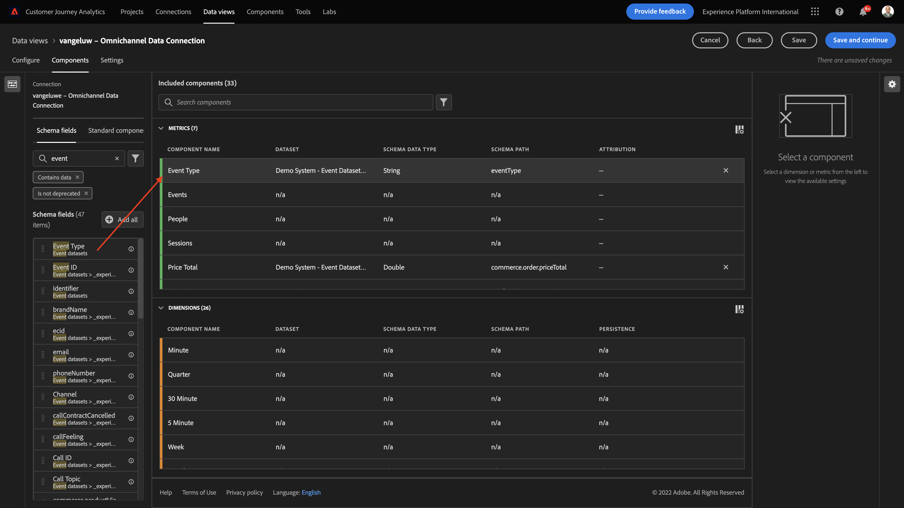

# 4.3 데이터 보기 만들기

## 목표

- 데이터 보기 UI 이해
- 방문 정의의 기본 설정 이해
- 데이터 보기 내의 속성 및 지속성 이해

## 4.3.1 데이터 보기

이제 연결이 완료되면 시각화에 영향을 주는 단계로 진행할 수 있습니다. Adobe Analytics과 CJA의 차이점은 CJA에는 시각화 전에 데이터를 정리하고 준비하기 위해 데이터 보기가 필요하다는 것입니다.

데이터 보기 는 컨텍스트 인식 방문 정의, 필터링 및 구성 요소 호출 방법을 정의하는 Adobe Analytics의 가상 보고서 세트 개념과 유사합니다.

연결당 최소 하나의 데이터 보기가 필요합니다. 그러나 일부 사용 사례의 경우 서로 다른 팀에 다양한 통찰력을 제공한다는 목표를 가지고 동일한 연결에 대해 여러 데이터 보기를 사용하는 것이 좋습니다.
회사가 데이터 중심이 되도록 하려면 각 팀에서 데이터를 보는 방식을 조정해야 합니다. 몇 가지 예:

- UX 디자인 팀에만 사용되는 UX 지표
- 디지털 분석 팀이 1개 언어만 구사할 수 있도록 Customer Journey Analytics에 대해 KPI와 Google Analytics 지표에 대해 동일한 이름을 사용합니다.
- 시장만 하나, 브랜드 하나 또는 모바일 디바이스에 대한 데이터만 표시하도록 필터링된 데이터 보기.

다음에서 **연결** 화면에서 방금 만든 연결 앞의 확인란을 선택합니다. 클릭 **데이터 보기 만들기**.

다음 페이지로 리디렉션됩니다. **데이터 보기 만들기** 워크플로입니다.

## 4.3.2 데이터 보기 정의

이제 데이터 보기에 대한 기본 정의를 구성할 수 있습니다.

다음 **연결** 이전 연습에서 만든 이(가) 이미 선택되었습니다. 연결의 이름은 입니다. `yourLastName – Omnichannel Data Connection`.

그런 다음 데이터 보기에 이 명명 규칙에 따라 이름을 지정합니다. `yourLastName – Omnichannel Data View`.

설명에 동일한 값을 입력합니다. `yourLastName – Omnichannel Data View`.

| 이름 | 설명 |
| ----------------- |-------------| 
| `yourLastName – Omnichannel Data View` | `yourLastName – Omnichannel Data View` |

의 경우 **시간대**, 시간대 선택 **베를린, 스톡홀름, 로마, 베른, 브뤼셀, 빈, 암스테르담 GMT+01:00**. 이것은 몇몇 회사들이 다른 나라와 다른 지역에서 활동하기 때문에 정말 흥미로운 설정이다. 국가별로 올바른 시간대를 할당하면, 예를 들어 페루의 경우 대다수가 오전 4시에 티셔츠를 구매한다고 믿는 등의 일반적인 데이터 오류를 피할 수 있습니다.

기본 지표 이름 지정(개인, 세션 및 이벤트)을 수정할 수도 있습니다. 필수는 아니지만, 일부 고객은 개인, 세션 및 이벤트(Customer Journey Analytics의 기본 이름 지정 전환) 대신 사람, 방문 횟수 및 히트 수를 사용하기를 원합니다.

이제 다음 설정이 구성되어야 합니다.

클릭 **저장 및 계속**.

## 4.3.3 데이터 보기 구성 요소

이 연습에서는 Analysis Workspace을 사용하여 데이터를 분석하고 시각화하는 데 필요한 구성 요소를 구성합니다. 이 UI에는 세 가지 주요 영역이 있습니다.

- 왼쪽: 선택한 데이터 세트에서 사용 가능한 구성 요소
- 가운데: 데이터 보기에 구성 요소를 추가했습니다.
- 오른쪽: 구성 요소 설정

>[!IMPORTANT]
>
>특정 지표나 차원을 찾을 수 없는 경우 필드를 확인하십시오 `Contains data` 가 데이터 보기에서 제거됩니다. 그렇지 않은 경우 해당 필드를 삭제하십시오.
>
>

분석에 필요한 구성 요소를 **구성 요소 추가됨**. 이렇게 하려면 왼쪽 메뉴에서 구성 요소를 선택하고 중간에 있는 캔버스로 드래그 앤 드롭해야 합니다.

첫 번째 구성 요소로 시작하겠습니다. **이름(web.webPageDetails.name)**. 이 구성 요소를 검색한 다음 캔버스로 드래그하여 놓습니다.

이 구성 요소는 스키마 필드 읽기에서 파생될 수 있는 페이지 이름입니다 `(web.webPageDetails.name)`.

단, 사용 **이름** 이름이 비즈니스 사용자가 이 차원을 빠르게 이해할 수 있는 가장 좋은 이름 지정 규칙이 아니기 때문입니다.

이름을 다음과 같이 변경하겠습니다. **페이지 이름**. 구성 요소를 클릭하고 **구성 요소 설정** 영역입니다.

정말 중요한 것은 **지속성 설정**. evar 및 prop의 개념이 CJA에 존재하지 않지만 지속성 설정을 사용하면 유사한 비헤이비어가 가능합니다.

이러한 설정을 변경하지 않으면 CJA는 차원을 로 해석합니다. **Prop** (히트 수준). 또한 지속성 을 변경하여 차원을 다음과 같이 만들 수 있습니다 **eVar** (여정 전체에 걸쳐 값을 유지합니다.)

eVar 및 속성에 익숙하지 않은 경우 다음을 수행할 수 있습니다. [설명서에서 자세히 읽어보십시오](https://experienceleague.adobe.com/docs/analytics/landing/an-key-concepts.html).

페이지 이름을 Prop으로 남겨 두겠습니다. 따라서 변경할 필요가 없습니다. **지속성 설정**.

| 검색할 구성 요소 이름 | 새 이름 | 지속성 설정 |
| ----------------- |-------------| --------------------| 
| 이름(web.webPageDetails.name) | 페이지 이름 |          |

그런 다음 차원을 선택합니다 **전화번호** 캔버스에 떨어뜨려 새 이름은 다음과 같아야 합니다 **전화 번호**.

마지막으로 모바일 번호 가 사용자 수준에서 지속되어야 하므로 지속성 설정을 변경하겠습니다.

지속성을 변경하려면 오른쪽 메뉴에서 아래로 스크롤하여 **지속성** 탭:

지속성 설정을 수정하려면 확인란을 선택합니다. 선택 **가장 최근** 및 **개인(보고 기간)** 범위, 해당 사용자의 마지막 휴대폰 번호에만 관심이 있습니다. 고객이 향후 방문 시 모바일을 채우지 않는 경우 이 값이 채워지는 것을 볼 수 있습니다.

| 검색할 구성 요소 이름 | 새 이름 | 지속성 설정 |
| ----------------- |-------------| --------------------| 
| 전화번호 | 전화 번호 | 가장 최근, 개인(보고 기간) |

다음 구성 요소는 입니다. `web.webPageDetails.pageViews.value`.

왼쪽 메뉴에서 다음을 검색합니다. `web.webPageDetails.pageViews.value`. 이 지표를 캔버스로 드래그하여 놓습니다.

이름을 다음으로 변경 **페이지 보기 수** 다음 아래에 **구성 요소 설정**.

| 검색할 구성 요소 이름 | 새 이름 | 속성 설정 |
| ----------------- |-------------| --------------------| 
| web.webPageDetails.pageViews.value | 페이지 보기 횟수 |         |

속성 설정의 경우 이를 비워 둡니다.

참고: 지표에 대한 지속성 설정은 Analysis Workspace에서도 변경할 수 있습니다. 경우에 따라 비즈니스 사용자가 어느 것이 최상의 지속성 모델인지 고려하지 않도록 여기서 설정할 수 있습니다.

그런 다음 아래 표에 표시된 대로 많은 Dimension 및 지표를 구성해야 합니다.

### DIMENSION

| 검색할 구성 요소 이름 | 새 이름 | 지속성 설정 |
| ----------------- |-------------| --------------------| 
| brandName | 브랜드 이름 | 가장 최근, 세션 |
| 냉정감 | 콜감 |          |
| 호출 ID | 호출 상호 작용 유형 |          |
| callTopic | 통화 주제 | 가장 최근, 세션 |
| ecid | ECID | 가장 최근, 개인(보고 기간) |
| 이메일 | 이메일 ID | 가장 최근, 개인(보고 기간) |
| 결제 유형 | 결제 유형 |          |
| 제품 추가 메서드 | 제품 추가 메서드 | 가장 최근, 세션 |
| 이벤트 유형 | 이벤트 유형 |         |
| 이름(productListItems.name) | 제품 이름 |         |
| SKU | SKU(세션) | 가장 최근, 세션 |
| 거래 ID | 거래 ID |         |
| URL (web.webPageDetails.URL) | URL |         |
| 사용자 에이전트 | 사용자 에이전트 | 가장 최근, 세션 |
| 않습니다 | 충성도 수준 |          |
| 포인트 | 고객 생애 가치 |          |

### 지표

| 검색할 구성 요소 이름 | 새 이름 | 속성 설정 |
| ----------------- |-------------| --------------------| 
| 수량 | 수량 |          |
| commerce.order.priceTotal | 매출  |         |

그러면 구성은 다음과 같이 표시됩니다.

잊지 말고 **저장** 데이터 보기. So click **저장** 지금.

## 4.3.4 계산된 지표

데이터 보기에서 모든 구성 요소를 구성했지만 비즈니스 사용자가 분석을 시작할 수 있도록 일부 구성 요소를 조정해야 합니다.

기억나는 사실이지만 장바구니에 추가, 제품 보기 또는 구매와 같은 지표를 데이터 보기에 특별히 가져오지 않았습니다.
하지만 다음과 같은 차원이 있습니다. **이벤트 유형**. 이제 3개의 계산된 지표를 만들어 이러한 상호 작용 유형을 유도해 보겠습니다.

첫 번째 지표로 시작하겠습니다. **제품 보기**.

왼쪽에서 검색해 주세요 **이벤트 유형** 차원을 선택합니다. 그런 다음 을(를) (으)로 끌어서 놓습니다. **포함된 구성 요소** 캔버스.

새 지표를 선택하려면 클릭 **이벤트 유형**.

이제 구성 요소 이름 및 설명을 다음 값으로 변경합니다.

| 구성 요소 이름 | 구성 요소 설명 |
| ----------------- |-------------| 
| 제품 보기 | 제품 보기 |

이제 카운트만 할 수 있음 **제품 보기** 이벤트. 이렇게 하려면 **구성 요소 설정** 보기 전까지 **포함/제외 값**. 옵션을 활성화해야 합니다. **포함/제외 값 설정**.

우리가 세고 싶기 때문에 **제품 보기**, 다음을 지정하십시오. **commerce.productViews** 을 참조하십시오.

이제 계산된 지표가 준비되었습니다!

그런 다음 동일한 프로세스를 반복합니다. **장바구니에 추가** 및 **구매** 이벤트.

### 장바구니에 추가

먼저 동일한 차원을 끌어서 놓습니다. **이벤트 유형**.

동일한 변수를 사용하고 있으므로 복제된 필드에 대한 경고 팝업이 표시됩니다. 다음을 클릭하십시오. **그대로 추가**:

이제 제품 보기 지표에 대해 수행한 것과 동일한 프로세스를 따릅니다.
- 먼저 이름과 설명을 변경합니다.
- 마지막으로 추가 **commerce.productListAdds** 장바구니에 추가만 카운트하는 기준으로

| 이름 | 설명 | 기준 |
| ----------------- |-------------| -------------|
| 장바구니에 추가 | 장바구니에 추가 | commerce.productListAdds |

### 구매

먼저 동일한 차원을 끌어서 놓습니다. **이벤트 유형** 이전 두 지표 모두에서 그랬듯이.

동일한 변수를 사용하고 있으므로 복제된 필드에 대한 경고 팝업이 표시됩니다. 다음을 클릭하십시오. **그대로 추가**:

이제 제품 보기 및 장바구니에 추가 지표에 대해 수행한 것과 동일한 프로세스를 따릅니다.
- 먼저 이름과 설명을 변경합니다.
- 마지막으로 추가 **commerce.purchase** 구매만 카운트하는 기준으로 사용

| 이름 | 설명 | 기준 |
| ----------------- |-------------| -------------|
| 구매 | 구매 | commerce.purchases |

그러면 최종 구성은 다음과 유사합니다. 클릭 **저장 및 계속**.

## 4.3.5 데이터 보기 설정

다음 화면으로 리디렉션해야 합니다.

이 탭에서는 몇 가지 중요한 설정을 수정하여 데이터 처리 방법을 변경할 수 있습니다. 을(를) 설정하는 것부터 시작하겠습니다. **세션 시간 초과** 30분. 모든 경험 이벤트의 타임스탬프 덕분에 모든 채널에서 세션 개념을 확장할 수 있습니다. 예를 들어 고객이 웹 사이트를 방문한 후 콜센터에 전화하면 어떻게 됩니까? 사용자 정의 세션 시간 제한을 사용하면 세션 정의와 해당 세션이 데이터를 병합하는 방법을 유연하게 결정할 수 있습니다.

이 탭에서는 세그먼트/필터를 사용하여 데이터 필터링과 같은 다른 항목을 수정할 수 있습니다. 이 연습에서는 그렇게 할 필요가 없습니다.

완료되면 을(를) 클릭하십시오. **저장 및 마침**.

>[!NOTE]
>
>나중에 이 데이터 보기로 돌아와 언제든지 설정 및 구성 요소를 변경할 수 있습니다. 변경 사항은 이전 데이터가 표시되는 방식에 영향을 줍니다.

이제 시각화 및 분석 부분을 계속할 수 있습니다!

다음 단계: [4.4 Customer Journey Analytics의 데이터 준비](./ex4.md)

[사용자 흐름으로 돌아가기 4](./uc4.md)

[모든 모듈로 돌아가기](./../../overview.md)
