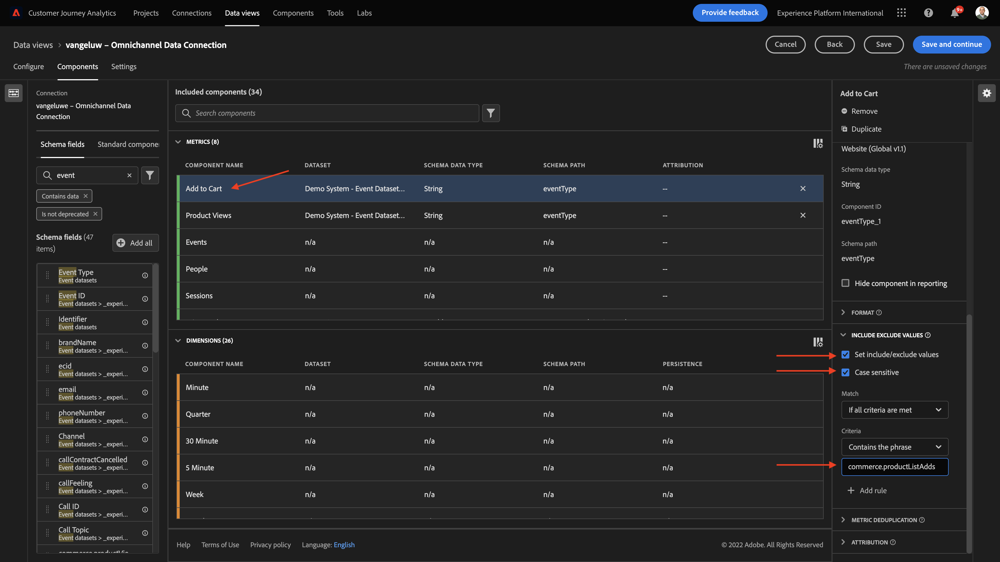
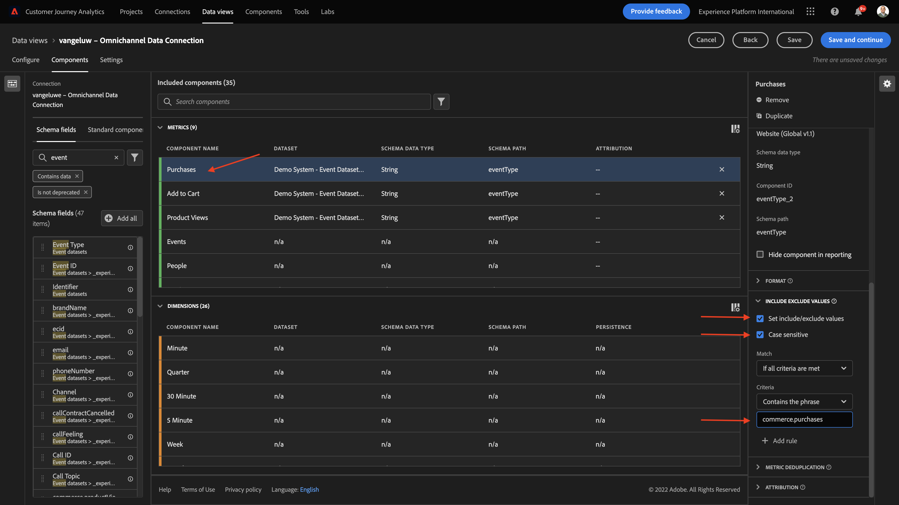

# 4.3 데이터 보기 만들기

## 목표

- 데이터 보기 UI 이해
- 방문 정의의 기본 설정 이해
- 데이터 보기 내의 속성 및 지속성 이해

## 4.3.1 데이터 보기

연결이 완료되면 이제 시각화에 영향을 주는 것으로 진행할 수 있습니다. Adobe Analytics과 CJA의 차이점은 시각화 전에 데이터를 정리하고 준비하려면 CJA에 데이터 보기가 필요하다는 것입니다.

데이터 보기는 컨텍스트 인식 방문 정의, 필터링 및 구성 요소를 호출하는 방법을 정의하는 Adobe Analytics의 가상 보고서 세트 개념과 유사합니다.

연결당 최소 1개의 데이터 보기가 필요합니다. 그러나 일부 사용 사례의 경우 다른 팀에 다른 통찰력을 주기 위해 동일한 연결에 대해 여러 데이터 보기를 갖는 것이 좋습니다.
회사가 데이터 중심적이 되도록 하려면 각 팀에서 데이터를 보는 방식을 조정해야 합니다. 예:

- UX 디자인 팀을 위한 UX 지표만
- Digital Analytics 팀이 1개의 언어만 사용할 수 있도록 Google Analytics에 대해 KPI 및 지표와 동일한 이름을 Customer Journey Analytics에 사용합니다.
- 데이터 보기는 한 시장 또는 하나의 브랜드에 대한 인스턴스 데이터 또는 모바일 장치에 대해서만 표시하도록 필터링되었습니다.

설정 **연결** 화면에서 방금 만든 연결 앞에 있는 확인란을 선택합니다. 클릭 **데이터 보기 만들기**.

으로 리디렉션됩니다. **데이터 보기 만들기** 워크플로우.

## 4.3.2 데이터 보기 정의

이제 데이터 보기에 대한 기본 정의를 구성할 수 있습니다.

다음 **연결** 이전 연습에서 생성한 이 이미 선택되어 있습니다. 연결 이름이 `yourLastName – Omnichannel Data Connection`.

그런 다음 이 이름 지정 규칙에 따라 데이터 보기에 이름을 지정합니다. `yourLastName – Omnichannel Data View`.

설명에 동일한 값을 입력합니다. `yourLastName – Omnichannel Data View`.

| 이름 | 설명 |
| ----------------- |-------------| 
| `yourLastName – Omnichannel Data View` | `yourLastName – Omnichannel Data View` |

대상 **시간대**&#x200B;을 클릭하고 표준 시간대 를 선택합니다 **베를린, 스톡홀름, 로마, 베른, 브뤼셀, 비엔나, 암스테르담 GMT+01:00**. 일부 회사들이 다른 국가와 지역에서 운영함에 따라 이것은 매우 흥미로운 설정입니다. 각 국가에 맞는 시간대를 할당하면 페루에서는 대부분의 사람들이 오전 4시에 티셔츠를 구매한다는 등의 전형적인 데이터 실수를 피할 것이다.

기본 지표 이름 지정(개인, 세션 및 이벤트)을 수정할 수도 있습니다. 이 작업은 필수가 아니지만 일부 고객은 개인, 세션 및 이벤트 대신 사람, 방문 횟수 및 히트 수 (Customer Journey Analytics의 기본 이름 지정 전환)를 사용하려는 경우가 있습니다.

이제 다음 설정을 구성해야 합니다.

클릭 **저장 후 계속**.

## 4.3.3 데이터 보기 구성 요소

이 연습에서는 데이터를 분석하고 Analysis Workspace을 사용하여 시각화하는 데 필요한 구성 요소를 구성합니다. 이 UI에는 세 가지 주요 영역이 있습니다.

- 왼쪽: 선택한 데이터 세트에서 사용 가능한 구성 요소
- 중간: 데이터 보기에 구성 요소가 추가되었습니다
- 오른쪽: 구성 요소 설정

>[!IMPORTANT]
>
>특정 지표나 차원을 찾을 수 없는 경우, 해당 필드가 `Contains data` 가 dataview에서 제거됩니다. 없는 경우 해당 필드를 삭제하십시오.
>
>

이제 분석에 필요한 구성 요소를 **추가된 구성 요소**. 이렇게 하려면 왼쪽 메뉴에서 구성 요소를 선택하고 중간에 있는 캔버스에 드래그하여 놓아야 합니다.

첫 번째 구성 요소로 시작하겠습니다. **이름(web.webPageDetails.name)**. 이 구성 요소를 검색하고 캔버스에 끌어다 놓습니다.

이 구성 요소는 스키마 필드를 읽는 데 파생될 수 있는 페이지 이름입니다 `(web.webPageDetails.name)`.

그러나 사용 **이름** 이름은 비즈니스 사용자가 이 차원을 빠르게 이해할 수 있도록 해주는 최상의 이름 지정 규칙이 아닙니다.

이름을 다음으로 바꾸자 **페이지 이름**. 구성 요소를 클릭하고 **구성 요소 설정** 영역.

중요한 것은 **지속성 설정**. evar 및 prop의 개념은 CJA에 없지만 지속성 설정은 유사한 동작을 가능하게 합니다.

이러한 설정을 변경하지 않으면 CJA가 차원을 **Prop** (히트 수준). 또한 지속성을 변경하여 차원을 **eVar** (여정 전체에서 값을 유지합니다.)

eVar 및 Prop에 익숙하지 않다면 다음을 수행할 수 있습니다 [설명서에서 그들에 대해 자세히 알아보십시오](https://experienceleague.adobe.com/docs/analytics/landing/an-key-concepts.html).

페이지 이름 을 Prop으로 둡니다. 따라서 변경할 필요가 없습니다 **지속성 설정**.

| 검색할 구성 요소 이름 | 새 이름 | 지속성 설정 |
| ----------------- |-------------| --------------------| 
| 이름(web.webPageDetails.name) | 페이지 이름 |  |

그런 다음 차원을 선택합니다 **phoneNumber** 캔버스에 놓고 새 이름은 다음과 같습니다. **전화 번호**.

마지막으로, 모바일 번호가 사용자 수준에서 유지되므로 지속성 설정을 변경하겠습니다.

지속성을 변경하려면 오른쪽 메뉴에서 아래로 스크롤하여 **지속성** 탭:

지속성 설정을 수정하려면 확인란을 선택합니다. 선택 **가장 최근** 그리고 **개인(보고 기간)** 범위, 그 사람의 마지막 모바일 번호만 신경 쓸 수 있습니다. 고객이 향후 방문 시 모바일을 채우지 않는다면 이 값이 채워지는 것을 볼 수 있습니다.

| 검색할 구성 요소 이름 | 새 이름 | 지속성 설정 |
| ----------------- |-------------| --------------------| 
| phoneNumber | 전화 번호 | 가장 최근, 개인(보고 기간) |

다음 구성 요소는 다음과 같습니다 `web.webPageDetails.pageViews.value`.

왼쪽 메뉴에서 `web.webPageDetails.pageViews.value`. 이 지표를 캔버스에 끌어다 놓습니다.

이름을 (으)로 변경합니다. **페이지 보기 수** 아래에 **구성 요소 설정**.

| 검색할 구성 요소 이름 | 새 이름 | 속성 설정 |
| ----------------- |-------------| --------------------| 
| web.webPageDetails.pageViews.value | 페이지 보기 횟수 |  |

속성 설정에 대해 이 빈 공간을 둡니다.

참고: 지표에 대한 지속성 설정은 Analysis Workspace에서도 변경할 수 있습니다. 경우에 따라 비즈니스 사용자가 어떤 것이 가장 지속성 모델인지 생각할 필요가 없도록 하기 위해 여기에서 설정할 수도 있습니다.

다음으로, 아래 표에 표시된 대로 많은 Dimension 및 지표를 구성해야 합니다.

### Dimension

| 검색할 구성 요소 이름 | 새 이름 | 지속성 설정 |
| ----------------- |-------------| --------------------| 
| brandName | 브랜드 이름 | 가장 최근, 세션 |
| 냉소 | 통화 느낌 |  |
| 호출 ID | 호출 상호 작용 유형 |  |
| callTopic | 통화 항목 | 가장 최근, 세션 |
| ecid | ECID | 가장 최근, 개인(보고 기간) |
| 이메일 | 이메일 ID | 가장 최근, 개인(보고 기간) |
| 결제 유형 | 결제 유형 |  |
| 제품 추가 메서드 | 제품 추가 메서드 | 가장 최근, 세션 |
| 이벤트 유형 | 이벤트 유형 |  |
| 이름(productListItems.name) | 제품 이름 |  |
| SKU | SKU(세션) | 가장 최근, 세션 |
| 거래 ID | 거래 ID |  |
| URL(web.webPageDetails.URL) | URL |  |
| 사용자 에이전트 | 사용자 에이전트 | 가장 최근, 세션 |

### 지표

| 검색할 구성 요소 이름 | 새 이름 | 속성 설정 |
| ----------------- |-------------| --------------------| 
| 수량 | 수량 |  |
| commerce.order.priceTotal | 매출  |  |

그런 다음 구성이 다음과 같아야 합니다.

잊지 말고 **저장** 데이터 보기. 따라서 **저장** 지금

## 4.3.4 계산된 지표

데이터 보기에서 모든 구성 요소를 구성했지만 비즈니스 사용자가 분석을 시작할 준비가 되도록 일부 구성 요소를 조정해야 합니다.

기억나는 경우 장바구니에 추가, 제품 보기 또는 구매와 같은 지표를 데이터 보기로 특별히 가져오지 않았습니다.
하지만 다음과 같은 차원이 있습니다. **이벤트 유형**. 따라서 3개의 계산된 지표를 만들어 이러한 상호 작용 유형을 파생해 보겠습니다.

첫 번째 지표로 시작하겠습니다. **제품 보기**.

왼쪽에서 **이벤트 유형** 차원을 선택합니다. 그런 다음 을(를) 클릭하여 **포함된 구성 요소** 캔버스.

새 지표를 선택하려면 클릭하십시오 **이벤트 유형**.

이제 구성 요소 이름 및 설명을 다음 값으로 변경합니다.

| 구성 요소 이름 | 구성 요소 설명 |
| ----------------- |-------------| 
| 제품 보기 | 제품 보기 |

이제 만 카운트할 수 있습니다 **제품 보기** events. 이렇게 하려면 다음을 아래로 스크롤합니다. **구성 요소 설정** 우리가 **제외 값 포함**. 옵션을 활성화해야 합니다 **포함/제외 값 설정**.

우리는 단지 세기만 하고 싶기 때문에 **제품 보기**&#x200B;를 지정하십시오. **commerce.productViews** 를 클릭합니다.

이제 계산된 지표가 준비되었습니다!

다음으로, 동일한 프로세스를 **장바구니에 추가** 및 **구매** events.

### 장바구니에 추가

먼저 동일한 차원을 드래그하여 놓습니다 **이벤트 유형**.

동일한 변수를 사용할 때 중복 필드에 대한 팝업 경고가 표시됩니다. 을(를) 클릭합니다. **추가**:

이제 지표 제품 보기에 대해 했던 것과 동일한 프로세스를 따릅니다.
- 먼저 이름과 설명을 변경합니다.
- 마지막으로 추가 **commerce.productListAdds** 장바구니에 추가만 카운트하는 기준으로 사용

| 이름 | 설명 | 기준 |
| ----------------- |-------------| -------------|
| 장바구니에 추가 | 장바구니에 추가 | commerce.productListAdds |

### 구매

먼저 동일한 차원을 드래그하여 놓습니다 **이벤트 유형** 이전 지표 모두에 대해 수행한 대로,

동일한 변수를 사용할 때 중복 필드에 대한 팝업 경고가 표시됩니다. 을(를) 클릭합니다. **추가**:

이제 제품 보기 및 장바구니에 추가 지표와 동일한 프로세스를 따릅니다.
- 먼저 이름과 설명을 변경합니다.
- 마지막으로 추가 **commerce.purchases** 구매만 카운트하는 기준

| 이름 | 설명 | 기준 |
| ----------------- |-------------| -------------|
| 구매 | 구매 | commerce.purchases |

그런 다음 최종 구성이 다음과 유사해야 합니다. 클릭 **저장 후 계속**.

## 4.3.5 데이터 보기 설정

다음 화면으로 리디렉션해야 합니다.

이 탭에서 몇 가지 중요한 설정을 수정하여 데이터 처리 방법을 변경할 수 있습니다. 먼저 **세션 시간 초과** 30분까지 모든 경험 이벤트의 타임스탬프 덕분에 모든 채널에서 세션의 개념을 확장할 수 있습니다. 예를 들어 고객이 웹 사이트를 방문한 후 콜 센터에 전화하면 어떻게 됩니까? 사용자 지정 세션 시간 초과를 사용하면 세션 정의와 해당 세션이 데이터를 함께 병합하는 방법을 결정할 때 유연성이 부족합니다.

이 탭에서 세그먼트/필터를 사용하여 데이터 필터링과 같은 다른 사항을 수정할 수 있습니다. 이 연습에서는 그렇게 하지 않아도 됩니다.

완료되면 을(를) 클릭합니다. **저장 및 완료**.

>[!NOTE]
>
>나중에 이 데이터 보기로 돌아가서 언제든지 설정 및 구성 요소를 변경할 수 있습니다. 변경 사항은 이전 데이터가 표시되는 방식에 영향을 줍니다.

이제 시각화 및 분석 부분을 계속 진행할 수 있습니다!

다음 단계: [4.4 Customer Journey Analytics의 데이터 준비](./ex4.md)

[사용자 흐름 4로 돌아가기](./uc4.md)

[모든 모듈로 돌아가기](./../../overview.md)
