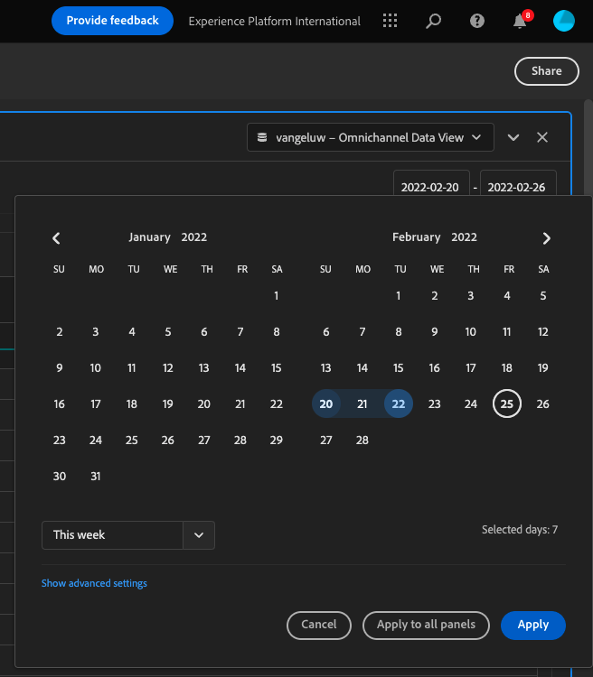
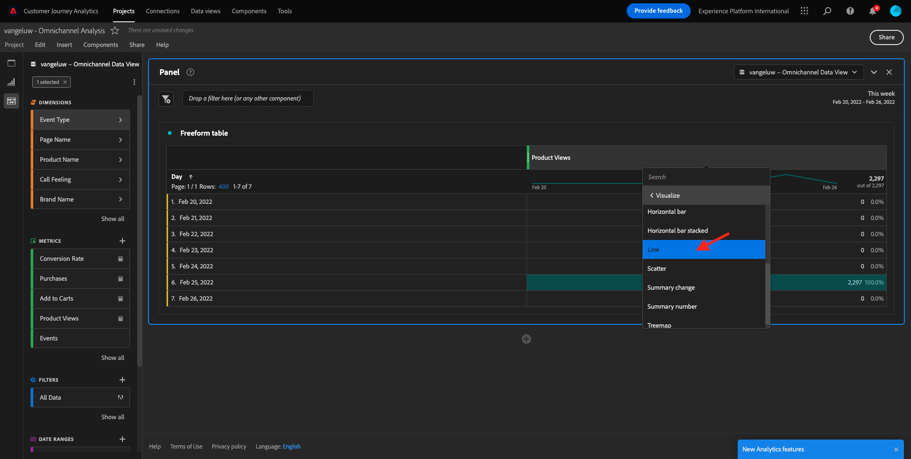
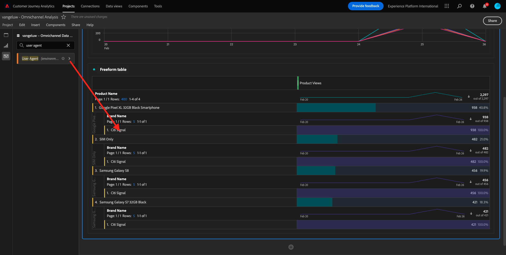
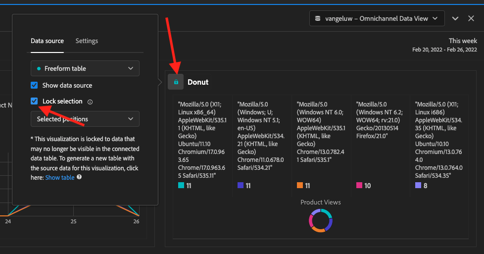
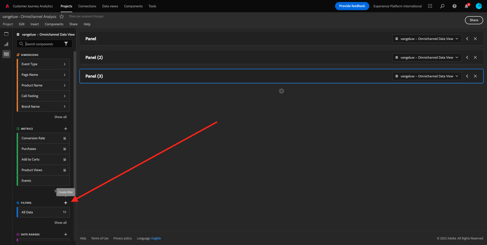
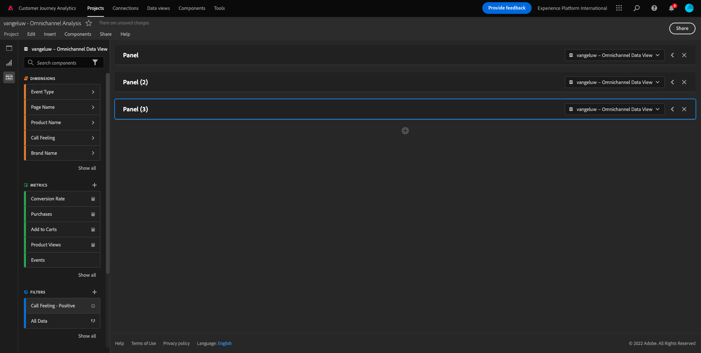

# 4.5 Customer Journey Analytics을 사용한 시각화

## 목표

- Analysis Workspace UI 이해
- Analysis Workspace을 매우 다르게 만드는 몇 가지 기능에 대해 알아봅니다.
- Analysis Workspace을 사용하여 CJA에서 분석하는 방법 알아보기

## 컨텍스트

이 연습에서는 CJA 내의 Analysis Workspace을 사용하여 제품 보기, 제품 단계, 이탈 등을 분석합니다.

만든 프로젝트를 사용합니다. [4.4 Analysis Workspace의 데이터 준비](./ex4.md), 이동 [https://analytics.adobe.com](https://analytics.adobe.com).

프로젝트 열기 `yourLastName - Omnichannel Analysis`.

프로젝트를 열고 데이터 보기를 사용하여 `CJA Bootcamp - Omnichannel Data View` 이 옵션을 선택하면 첫 번째 시각화 빌드를 시작할 준비가 되었습니다.

## 하루에 몇 개의 제품 보기가 있습니까

우선 데이터를 분석하기에 적합한 날짜를 선택해야 합니다. 캔버스 오른쪽에 있는 달력 드롭다운으로 이동합니다. 해당 날짜 범위를 클릭하고 선택합니다.

>[!IMPORTANT]
>
>가장 최근에 사용 가능한 데이터가 2022/19/09에 수집되었습니다. 이 날짜가 포함된 날짜 범위를 선택하십시오.

왼쪽 메뉴(구성 요소 영역)에서 계산된 지표를 찾습니다 **제품 보기**. 선택하고 자유 형식 테이블 내의 오른쪽 상단에 있는 캔버스로 드래그하여 놓습니다.

자동으로 차원 **일** 가 추가되어 첫 번째 테이블을 만듭니다. 이제 즉석에서 질문에 대한 답변을 볼 수 있습니다.

그런 다음 지표 요약을 마우스 오른쪽 버튼으로 클릭합니다.

클릭 **시각화** 다음을 선택합니다. **라인** 시각화.

일별 제품 보기를 확인할 수 있습니다.

을(를) 클릭하여 시간 범위를 일로 변경할 수 있습니다. **설정** 시각화 내에서 참조할 수 있습니다.

옆에 있는 점을 클릭합니다 **라인** 끝 **데이터 소스 관리**.

그런 다음 을 클릭합니다. **선택 사항 잠금** 및 선택 **선택한 항목** 이 시각화를 잠가서 항상 제품 보기의 타임라인을 표시하도록 합니다.

## 상위 4개 제품 조회함

가장 많이 본 4개 제품은 무엇입니까?

가끔씩 프로젝트를 저장하는 것을 잊지 마십시오.

| OS | 지름길 |
| ----------------- |-------------| 
| Windows | Control + S |
| Mac | Command+S |

가장 많이 본 4개 제품을 살펴보겠습니다. 왼쪽 메뉴에서 **제품 이름** - Dimension.

이제 끌어서 놓기 **제품 이름** 을(를) 대체하려면 **일** 차원:

이 결과가 됩니다.

그런 다음 제품 중 하나를 브랜드 이름으로 분류해 보십시오. 검색 대상 **brandName** 첫 번째 제품 이름으로 드래그합니다.

다음으로, 충성도 수준을 사용하여 분류를 수행합니다. 검색 대상 **충성도 수준** 브랜드 이름으로 드래그하시면 됩니다.

그러면 다음과 같은 결과가 표시됩니다.

마지막으로 더 많은 시각화를 추가할 수 있습니다. 왼쪽의 시각화에서 을 검색합니다. `Donut`. 테이크 `Donut`, 캔버스 아래의 캔버스에 드래그 앤 드롭 **라인** 시각화.

그런 다음 표에서 3을 선택합니다 **충성도 수준**  아래에 수행한 분류의 행 **Google 픽셀 XL 32GB 블랙 스마트폰** > **Citi 신호**. 3개 행을 선택할 때 **CTRL** 단추(Windows) 또는 **명령** 버튼(Mac).

다음과 같이 도넛 차트가 변경됩니다.

두 옵션을 모두 만들어 디자인을 보다 읽기 쉽게 조정할 수도 있습니다. **라인** 그래프 및 **도넛** 서로 맞춰지도록 약간 더 작게 그래프로 표시합니다.

옆에 있는 점을 클릭합니다 **도넛** 끝 **데이터 소스 관리**.
그런 다음 을 클릭합니다. **선택 사항 잠금** 이 시각화를 잠가서 항상 제품 보기의 타임라인을 표시하도록 합니다.

Analysis Workspace을 사용한 시각화에 대해 자세히 알아보려면 여기를 클릭하십시오.

- [https://experienceleague.adobe.com/docs/analytics/analyze/analysis-workspace/visualizations/freeform-analysis-visualizations.html](https://experienceleague.adobe.com/docs/analytics/analyze/analysis-workspace/visualizations/freeform-analysis-visualizations.html)
- [https://experienceleague.adobe.com/docs/analytics/analyze/analysis-workspace/visualizations/t-sync-visualization.html](https://experienceleague.adobe.com/docs/analytics/analyze/analysis-workspace/visualizations/t-sync-visualization.html)

## 제품 상호 작용 단계, 보기에서 구매에 이르기까지

이 문제를 해결하는 방법에는 여러 가지가 있습니다. 그중 하나는 제품 상호 작용 유형을 사용하여 자유 형식 테이블에서 사용하는 것입니다. 다른 방법은 를 사용하는 것입니다 **폴아웃 시각화**. 마지막 하나를 시각화와 분석을 동시에 하고자 하는 데 활용하자.

여기를 클릭하여 현재 패널을 닫습니다.

이제 을(를) 클릭하여 새 빈 패널을 추가합니다. **+ 빈 패널 추가**.

시각화 클릭 **폴아웃**.

이전 연습과 동일한 날짜 범위를 선택합니다.

그러면 이걸 보게 될 거야.

차원 찾기 **이벤트 유형** 왼쪽의 구성 요소 아래에서

화살표를 클릭하여 차원을 엽니다.

사용 가능한 모든 이벤트 유형이 표시됩니다.

항목 선택 **commerce.productViews** 을(를) 끌어다 놓아 **터치포인트 추가** 필드 내부 **폴아웃 시각화**.

을 사용하여 동일한 작업 수행 **commerce.productListAdds** 및 **commerce.purchase** 다음 화면에 드롭합니다. **터치포인트 추가** 필드 내부 **폴아웃 시각화**. 이제 시각화는 다음과 같이 표시됩니다.

이곳에서 많은 일을 할 수 있습니다. 일부 예: 시간 경과에 따른 비교, 디바이스별 각 단계 비교 또는 충성도별 비교. 그러나 고객이 장바구니에 품목을 추가한 후 구입하지 않는 이유와 같은 흥미로운 사항을 분석하려는 경우, CJA에서 가장 적합한 도구인 마우스 오른쪽 버튼을 클릭할 수 있습니다.

터치포인트를 마우스 오른쪽 버튼으로 클릭 **commerce.productListAdds**. 그런 다음 을(를) 클릭합니다 **이 터치포인트에서 폴아웃 분류**.

사용자가 구매하지 않은 경우 수행한 작업을 분석하는 새 자유 형식 테이블이 만들어집니다.

변경 **이벤트 유형** 작성자: **페이지 이름**&#x200B;를 사용하여 새 자유 형식 테이블에서 구매 확인 페이지 대신 이동할 페이지를 확인합니다.

## 서비스 취소 페이지에 도달하기 전에 사이트에서 사람들이 수행하는 작업

이 분석을 수행하는 방법에는 여러 가지가 있다. 흐름 분석을 이용하여 탐색 부분을 시작해보자.

여기를 클릭하여 현재 패널을 닫습니다.

이제 을(를) 클릭하여 새 빈 패널을 추가합니다. **+ 빈 패널 추가**.

시각화 클릭 **플로우**.

그러면 다음과 같은 결과가 표시됩니다.

이전 연습과 동일한 날짜 범위를 선택합니다.

차원 찾기 **페이지 이름** 왼쪽의 구성 요소 아래에서

화살표를 클릭하여 차원을 엽니다.

모든 페이지가 보입니다. 페이지 이름 찾기: **서비스 취소**.
드래그 앤 드롭 **서비스 취소** 가운데 필드의 플로우 시각화:

그러면 다음과 같은 결과가 표시됩니다.

이제 를 방문한 고객이 있는지 분석해 보겠습니다. **서비스 취소** 웹사이트의 페이지는 콜센터라고도 불렸고, 결과는 무엇이었는가.

차원에서 뒤로 돌아가서 **호출 상호 작용 유형**.
드래그 앤 드롭 **호출 상호 작용 유형** 오른쪽의 첫 번째 상호 작용을 **플로우 시각화**.

지금 고객님들께서 콜센터에 다녀오신 후 콜센터에 전화하신 응원 티켓을 보고 계십니다 **서비스 취소** 페이지를 가리키도록 업데이트하는 중입니다.

그런 다음 차원에서 를 검색합니다. **콜감**.  드래그하여 놓아 내 오른쪽의 첫 번째 상호 작용을 바꿉니다. **플로우 시각화**.

그러면 다음과 같은 결과가 표시됩니다.

보시다시피 플로우 시각화를 사용하여 옴니채널 분석을 실행했습니다. 덕분에 서비스 취소를 고민하던 일부 고객들이 콜센터에 전화해 긍정적인 느낌을 받은 것으로 보인다. 우리가 승진으로 그들의 마음을 바꿨을까?

## 긍정적 콜센터 연락처가 있는 고객이 기본 KPI에 대해 어떤 성과를 보이고 있습니까?

먼저 데이터를 세그먼트화하여 다음과 같은 사용자만 얻을 수 있습니다. **양수** 호출. CJA에서 세그먼트를 필터라고 합니다. 구성 요소 영역 내(왼쪽)의 필터로 이동한 다음 **+**.

필터 빌더 내에서 필터에 이름을 지정합니다.

| 이름 | 설명 |
| ----------------- |-------------| 
| 통화 느낌 - 긍정적 | 통화 느낌 - 긍정적 |

구성 요소(필터 빌더 내)에서 다음을 찾습니다 **콜감** 필터 빌더 정의로 끌어서 놓습니다.

지금 선택 **양수** 필터 값으로 사용됩니다.

범위를 다음으로 변경 **개인** 레벨.

마치려면 **저장**.

그럼 다시 여기로 오십시오. 아직 완료하지 않은 경우 이전 패널을 닫습니다.

이제 을(를) 클릭하여 새 빈 패널을 추가합니다. **+ 빈 패널 추가**.

이전 연습과 동일한 날짜 범위를 선택합니다.

클릭 **자유 형식 테이블**.

이제 방금 만든 필터를 드래그 앤 드롭합니다.

일부 지표를 추가할 시간입니다. 다음으로 시작 **제품 보기**. 자유 형식 테이블로 끌어서 놓습니다. 다음을 삭제할 수도 있습니다. **이벤트** 지표.

을 사용하여 동일한 작업 수행 **사람**,  **장바구니에 추가** 및 **구매**. 이런 식탁 하나가 생기게 될 겁니다.

첫 번째 흐름 분석 덕분에 새로운 질문이 떠올랐다. 따라서 이 테이블을 만들고 세그먼트에 대한 일부 KPI를 확인하여 해당 질문에 답변하기로 했습니다. 보시는 것처럼 SQL이나 다른 BI 솔루션을 사용하는 것보다 통찰력에 걸리는 시간이 훨씬 빠릅니다.

## Customer Journey Analytics 및 Analysis Workspace 요약

이 실습에서 배웠듯이, Analysis Workspace은 모든 채널의 데이터를 함께 결합하여 전체 고객 여정을 분석합니다. 또한 여정에 연결되지 않은 동일한 작업 영역으로 데이터를 가져올 수 있습니다.
이렇게 하면 연결이 끊어진 데이터를 분석에 가져와 여정에 컨텍스트를 제공하는 데 매우 유용할 수 있습니다. 일부 예에는 NPS 데이터, 설문 조사, Facebook 광고 이벤트 또는 오프라인 상호 작용(식별되지 않음)과 같은 것이 포함됩니다.

다음 단계: [4.6 통찰력에서 작업까지](./ex6.md)

[사용자 흐름으로 돌아가기 4](./uc4.md)

[모든 모듈로 돌아가기](./../../overview.md)
