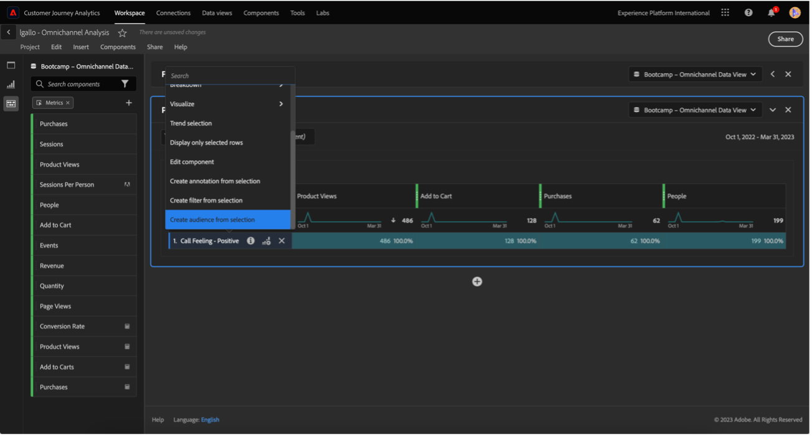

# 4.6 통찰력에서 작업까지

## 목표

- Customer Journey Analytics에서 수집된 보기를 기반으로 대상을 구축하는 방법을 이해합니다
- Real-Time CDP 및 Adobe Journey Optimizer에서 이 대상 사용

## 4.6.1 대상자 만들기 및 게시

프로젝트에서 이라는 필터를 생성했습니다. **감정 호출** 및 은 콜센터에 대한 통화가 다음으로 분류된 사용자 수를 볼 수 있었습니다. **양수**. 이제 이러한 사용자로 세그먼트를 만들고 여정 또는 통신 채널에서 활성화할 수 있습니다.

첫 번째 단계는 다음과 같습니다. 마지막 연습에서 만든 패널에서 줄을 선택합니다 **1. 통화 느낌 - 긍정적**, 마우스 오른쪽 단추 클릭 및 선택 **선택 항목에서 대상 만들기** 옵션:

그런 다음 모델을 따라 대상에 이름을 지정합니다 **yourLastName - 긍정적인 CJA 대상자 호출**:

대상자의 미리보기가 만들어지도록 할 수 있습니다.

마지막으로 **게시**.

## 4.6.2 대상자를 세그먼트의 일부로 사용

Adobe Experience Platform으로 돌아가서 **세그먼트 > 찾아보기** 그리고 CJA에서 만든 세그먼트를 준비하고 활성화 및 여정에서 사용할 수 있는 것을 볼 수 있습니다!

이제 Facebook 활성화 및 고객 여정에서 이 세그먼트를 사용하겠습니다!

## 4.6.3 Real-Time CDP에서 실시간으로 세그먼트 사용

Adobe Experience Platform에서 **세그먼트 > 찾아보기** 그리고 CJA에서 만든 대상자를 찾습니다.

세그먼트를 클릭한 다음 **대상에 활성화**:

이름이 인 대상 선택 **부트캠프-facebook**&#x200B;을 클릭한 다음 을 클릭합니다 **다음**.

클릭 **다음** 다시.

다음 항목 선택 **대상의 출처** 옵션 및 설정 **고객으로부터 직접**, 클릭 **다음**.

**마침을 클릭합니다**.

이제 세그먼트가 Facebook의 사용자 지정 대상자에 연결됩니다. 이제 Adobe Journey Optimizer에서 동일한 세그먼트를 사용하겠습니다.

## 4.6.4 Adobe Journey Optimizer에서 세그먼트 사용

Adobe Experience Platform에서 **Journey Optimizer**&#x200B;을 클릭한 다음 왼쪽 메뉴에서 **여정** 을(를) 클릭하고 다음을 클릭하여 여정 만들기를 시작합니다. **여정 만들기**.

그런 다음 왼쪽 메뉴에서 **이벤트**, 선택 **세그먼트 선별** 을(를) 여정으로 드래그합니다.

세그먼트 아래에서 **편집** 세그먼트를 선택하려면 다음을 수행하십시오.

CJA에서 이전에 만든 대상자를 선택하고  **저장**.

준비! 여기에서 이 세그먼트에 대한 자격이 있는 고객을 위한 여정을 만들 수 있습니다.

[사용자 흐름으로 돌아가기 4](./uc4.md)

[Voltar para todos 운영 체제](./../../overview.md)
