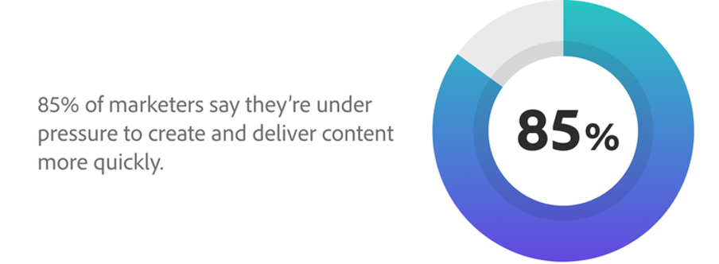

# 4단계 컨텐츠 공급망

세계는 이제 디지털로 바뀌었다. 이것은 사업체들이 합의를 하도록 강요되었다는 현실이며, 그것은 곧 없어지지 않습니다. 디지털 세계의 일부로, 우리는 직면하고 있습니다 [방대한 양의 콘텐츠](https://www.prnewswire.com/news-releases/content-marketing-market-size-to-grow-by-usd-487-24-billion--by-objective-platform-end-user-and-geography---forecast-and-analysis-2022-2026--301562808.html) 더 많은 사람들이 소셜 미디어를 탐색하고, 디지털 공간에서 시간을 보내고, 원격으로 일을 하면서 추진합니다.

즉, 컨텐츠를 제공할 채널, 시장 및 포맷이 더 많이 있으며 해당 컨텐츠가 동적이고 최적화되어야 할 필요가 더 있습니다.

_소스:_ [_Deloitte Digital_](https://www2.deloitte.com/content/dam/Deloitte/uk/Documents/consultancy/deloitte-uk-future-of-experience-time-to-market.pdf)

좋은 소식은 컨텐츠에 대한 수요를 따라잡기 어려운 만큼 컨텐츠를 보다 빠르고 쉽게 계획, 제작 및 전달할 수 있는 방법이 있다는 것입니다. 이건  **콘텐츠 공급 체인**. 또한 원활한 프로세스, 강력한 전략 및 Solid Practice를 통해 한 번의 실행으로 전체 컨텐츠 수명주기를 간소화할 수 있습니다.

## 원활한 컨텐츠 공급 체인의 핵심은 협업

컨텐츠 공급망 은 사람, 도구 및 워크플로우를 통합하여 컨텐츠를 효과적으로 계획, 생성, 관리 및 전달하는 프로세스입니다. 고객이 더 빠른 속도로 더 많은 경험을 더 요구하고 있으므로 콘텐츠를 바로 수집해야 합니다. 이렇게 하면 사일로를 분리하고 워크플로우를 통합함으로써 모든 팀에 부담을 주지 않습니다. 또한 기술 투자를 통해 더 많은 가치를 얻을 수 있으므로 효율성과 가치를 높일 수 있습니다.

이론적으로, 이것은 모든 사업체들이 그들의 컨텐츠를 더 빨리 밖으로 나오게 할 수 있도록 돕는 과정이다. 그러나 실제로 대부분의 공급 체인은 상호 기능 컨텐츠 주기가 자연스럽게 어떻게 생성되는지 때문에 중단됩니다. 안타깝게도 이러한 체인이 끊어지면 내부 정렬, 예산 절감, 직원 감금, 주요 메시지 전달 속도를 줄일 수 있습니다.

### 콘텐츠 공급 체인을 깨는 것은 무엇입니까?

- [**70%**](https://business.adobe.com/resources/reports/future-creative-experiences.html) 많은 시간이 비핵심 작업에 소비되며, 여러 역할에 걸쳐 서로 다른 시스템에서 수동 작업을 관리합니다.
- [**21%**](https://business.adobe.com/resources/reports/future-creative-experiences.html) 크리에이티브 팀은 컨텐츠 프로세스 전체의 병목 현상을 효과적인 경험을 구축하는 데 필요한 과제라고 식별했습니다.
- [**31%**](https://www.fotoware.com/blog/dam-industry-trends-by-fotoware) 크리에이티브 고객과 마케터는 가장 큰 문제는 여러 이해 관계자와 자산을 공유할 수 없는 점이라고 말합니다.

깨진 컨텐츠 공급 체인의 공통 범인을 보다 잘 살펴보려면 세 가지 상위 수준 단계를 각각 살펴보십시오.

1. 에서  **계획**  단계적, 자원을 추적하는 단일 프로젝트 프로세스 또는 중앙 방법이 부족하면 여러 수정 버전, 과도한 비용, 값비싼 지연, 작업 균형을 맞출 수 없게 됩니다. 또한 팀 구성원 간의 연결이 끊기면 불필요한 사이클과 낮은 우선 순위 변경이 발생합니다.
2. 다음 기간 동안  **production** , 분산된 시스템 및 연결 해제된 워크플로우는 실시간 공동 작업, 자산 검색, 지연 및 불완전 운영을 제한합니다. 그리고 크리에이티브는 수동으로 작업 및 자산을 추적해야 하고 반복 작업을 수동으로 수행해야 하기 때문에 더 많은 비용과 오류가 발생합니다.
3. 때가 되면  **게재** 는 중앙 자산 관리 시스템을 갖추고 있지 않고, 컨텐츠 크기 조정을 위한 제한된 자동화를 가지고 있지 않으므로 여러 채널에서 통합적이고 개인화된 경험을 시작할 수 있는 팀의 능력을 줄입니다. 그 외에 조각화된 게재 도구와 데이터는 자산 성능의 정확한 측정을 제한합니다.

## 콘텐츠 공급 체인을 전환할 차례입니다.

실수나 불통으로 고통 받는 어떤 것과도 마찬가지로, 그 과정을 개선할 수 있는 방법이 항상 있습니다. 이와 같은 세 가지 단계로 진행하여, 비즈니스 측면에서 뛰어난 컨텐츠 공급 체인이 어떤 모습일지 살펴보겠습니다.

### 능률적인 계획을 통해 운영 최적화

가장 좋은 방법은 교차 기능 공동 작업을 수행하고 프로젝트를 계획 중인 데이터 기반 결과에 연결하는 작업 관리 솔루션을 사용하는 것입니다. 또한 마케팅 팀이 업무의 우선 순위를 전략적으로 지정하고 그러한 우선 순위를 크리에이티브 팀에 알릴 수 있도록 해야 합니다. 여기에서 크리에이티브 개요, 콘텐츠 버전 및 피드백은 각 프로젝트 내에서 함께 묶어야 팀에서 찾고 있는 콘텐츠를 찾기 위해 이전 이메일을 검색할 필요가 없습니다.

크리에이티브 팀은 [뛰어난 디지털 자산 관리](https://business.adobe.com/products/experience-manager/assets/digital-asset-management.html)[(DAM)](https://business.adobe.com/products/experience-manager/assets/digital-asset-management.html)[ 시스템](https://business.adobe.com/products/experience-manager/assets/digital-asset-management.html) 크리에이티브 및 작업 관리 도구와 통합되어 있습니다. 이러한 방식으로 관련 자산을 쉽게 찾아 사용하거나 업데이트하거나 재사용할 수 있습니다. 이러한 모든 작업을 통해 시장 진출 속도를 향상시키고 내부 운영 및 프로세스를 간소화할 수 있습니다.

### 원활한 워크플로우로 운영 효율성 향상

계획 수립 시 훌륭한 프로덕션 단계에서 작업 관리 애플리케이션과 함께 모든 시스템에 메타데이터를 동기화하는 통합 자산 관리 솔루션을 중심으로 진행됩니다. 이렇게 하면 반복 서식 작업을 자동화할 수 있으므로 품질을 그대로 유지하면서 출력 속도를 높일 수 있습니다. 또한 작업 관리 솔루션과 크리에이티브 도구가 통합되면 크리에이티브 팀은 요청, 워크플로우 및 검토를 관리할 수 있을 뿐만 아니라 이미 작동하는 도구 내에서 컨텐츠를 모두 승인하고 마무리할 수 있습니다.

그런 다음 콘텐츠 워크플로우에 AI(인공 지능)를 추가하면 고객의 관심사에 맞게 자동으로 조정되는 개인화된 콘텐츠를 만들 수 있습니다. 즉, 팀에서는 모두 최선을 다해 작업을 수행할 수 있습니다. 크리에이티브는 매력적인 컨텐츠를 제작할 수 있으며 마케터는 통찰력을 사용하여 해당 컨텐츠를 사용자 지정할 수 있습니다. 놀라운 경험을 제공하기 시작합니다.

### 자산 제공 및 콘텐츠 효율성 측정

콘텐츠를 제공할 때는 관련된 모든 중요 사용자나 팀이 필요한 콘텐츠에 액세스할 수 있어야 합니다. DAM이 사용자의 요구 사항을 충족하도록 빌드되어 있고 팀이 유형이나 선택한 다른 태그별로 자산을 카탈로그 작성, 추적 및 찾을 수 있도록 해야 합니다. 고객은 빠르게 움직이고 있으므로 팀이 빠르게 이동해야 하며 비디오, 인포그래픽, 사진, 메시징 등을 신속하게 신속하게 찾을 수 있습니다.

뿐만 아니라, 매우 훌륭한 컨텐츠 제공 체인은 DAM을 사용하여 이미지 크기를 자동으로 조정하고 버전 제어를 관리하며 지리적 간에 중복을 방지할 수 있습니다. 또한 크리에이티브 도구, 작업 관리 솔루션, 컨텐츠 관리 시스템을 비롯하여 전체 기술 스택에 걸쳐 통합되어야 팀이 새로운 컨텐츠를 빠르고 쉽게 작성하고 모든 채널에 전달할 수 있습니다. 또한 AI를 통해 고객의 위치, 관심사 및 작업에 맞는 관련 컨텐츠를 자동으로 생성할 수 있습니다.

## Adobe에서 최상의 컨텐츠 공급 체인을 구축하고 있습니다

우리 자신 [Adobe Experience Cloud 비즈니스](https://business.adobe.com/) 은 캠페인을 활성화 및 지원하기 위해 이전에 요약된 단계에 따라 수행하는 데 중점을 둡니다. Adobe의 목표는 캠페인 프레임워크 및 메시징에 부합하는 매력적인 콘텐츠를 전 세계에 전달하는 것입니다.

종단 간 컨텐츠 작성 프로세스의 핵심은 와 [Adobe Workfront](https://business.adobe.com/products/workfront/main.html/) 및 [Adobe Experience Manager 자산](https://business.adobe.com/products/experience-manager/assets/aem-assets.html). 이 세 가지 높은 단계로 어떻게 접근했는지 살펴보겠습니다.

우리는 다음으로 시작합니다  **계획** , 비즈니스 전체에서 수백 개의 컨텐츠 요청을 수집한 다음 분기별 우선 순위에 따라 우선 순위를 매깁니다. 그런 다음 Workfront의 콘텐츠 제안 대시보드를 사용하여 이해 관계자와 협력하여 마케팅, 광고, 웹 및 영업 팀 간에 신속하게 로그오프할 수 있도록 투명도를 제공합니다. 이를 통해 분기별로 커밋되는 작업에 대한 기록을 작성하고, 크리에이티브 팀과 웹 팀이 전체 요청 볼륨에 대한 가시성을 부여하여 리소스를 계획할 수 있습니다. 또한 관리자는 팀을 위한 워크로드를 손쉽게 모니터링할 수 있습니다.

우리가  **production** , 승인된 요청은 크리에이티브 팬티, 웹 랜딩 위치, 프로모션 요구 사항 등과 같은 크리에이티브 팀에 보다 자세한 정보를 제공하는 프로젝트로 전환됩니다. 그러면 Adobe의 컨텐츠 전략가는 Workfront의 이해 관계자 및 크리에이티브와 협력하여 컨텐츠를 검토하고 기한을 충족합니다. Workfront에서 이러한 모든 작업을 수행하므로 중복적인 단계, 불필요한 이메일 및 여러 양식 채우기를 제거했으며 자산 유형별로 프로덕션 사이클을 추적하려고 합니다. 이를 통해 프로젝트 데이터를 심층적으로 검토하여 필요한 경우 직원 리소스의 균형을 맞추고 우선 순위를 변경할 수 있습니다.

그리고 콘텐츠가 준비되면  **게재** , we [오퍼, 자산 및 프로모션 컨텐츠 게시](https://business.adobe.com/customer-success-stories/adobe-content-hub-case-study.html) Experience Manager Assets에 연결할 수도 있습니다. 특히, 이 모든 것이 필요할 때 회사 내 누구나 필요한 정확한 컨텐츠를 신속하게 찾을 수 있는 내부 Marketing Hub로 이동합니다.

작업 컨텐츠 공급 체인을 구축함으로써 얻을 수 있는 몇 가지 큰 성과를 보았습니다. 특히 단일 작업 관리 시스템으로 마이그레이션하여 중복 데이터 입력을 절반으로 줄였습니다. 또한 항상 개선의 여지가 있지만, 우리는 고객 기대보다 한 단계 앞서 나갈 수 있도록 지원하는 프로세스를 진행하고 있습니다.

>[!NOTE]
>
> 이 기사는 원래 [_Adobe Experience Cloud 블로그_](https://business.adobe.com/blog/how-to/create-a-content-supply-chain-that-will-stand-the-test-of-time).

## 4단계: Insights

콘텐츠 공급 체인은 모든 문제를 해결하는 마법의 해결책이 아닙니다. 이를 통해 고객에게 전달할 모든 경험을 보다 효율적으로 관리하고 운영할 수 있습니다. 걸을 수 있고, 결국 뛰기 전에 기어가야 합니다.

그리고 최종 실행 후에는 종단 간 컨텐츠 공급 체인에서 벗어날 수 있는 추가 사항이 있습니다. 통찰력. 실제로, 잠시 후에 당신은 어떤 행동이 어떻게 시간, 예산, 그리고 ...에 영향을 주는지를 탐구하기 시작할 수 있습니다. 우리는 또한 이 사실을 부트캠프 끝에 다룰 것입니다.

다음 단계: [Creative Brief](./creative-brief.md)

[모든 모듈로 돌아가기](./overview.md)
