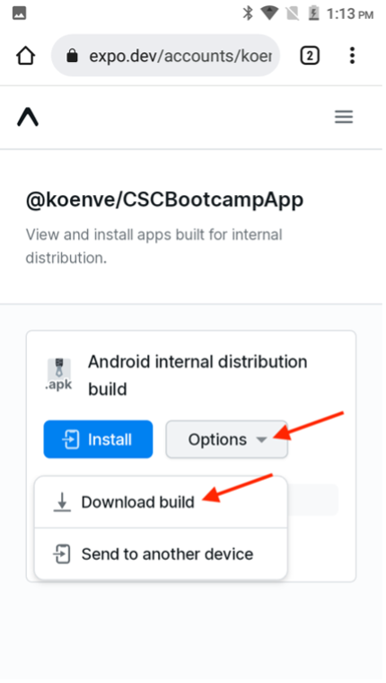
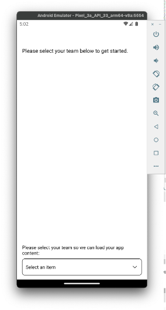

# 모바일 앱 확인

## Android

- Android 장치의 [여기](https://tinyurl.com/CSCBootcampApp)에서 모바일 앱을 다운로드합니다. [Android 에뮬레이터](https://developer.android.com/studio/run/emulator) 또는 실제 Android 장치에서 다운로드할 수 있습니다.

- 다운로드한 파일을 탭하여 엽니다.

- 팝업에서 설치 버튼을 클릭한 다음 &quot;아무튼 설치&quot;를 클릭하여 확인합니다.

- 앱이 성공적으로 설치되면 &quot;열기&quot; 버튼을 클릭하여 앱을 엽니다.

## iOS

>[!WARNING]
>
> Bootcamp Wi-Fi 네트워크에 연결되어 있는지 확인합니다. 앱은 동일한 Wi-Fi 네트워크에 있는 경우에만 작동하므로 이는 필수적입니다.

이는 공식적으로 배포되는 앱이 아니므로 iOS에 대한 설정은 이전에 사용한 설정과 다소 다릅니다.

- [App Store](https://itunes.apple.com/app/apple-store/id982107779)에서 Expo Go 앱을 다운로드합니다.

- iPhone 카메라 앱에서 Adobe 팀이 부트캠프에 투영할 QR 코드를 스캔합니다. 메시지가 표시되면 표시되는 버튼을 클릭합니다.

- iPhone에서 앱을 열 수 있는 웹 페이지가 로드됩니다. 방금 다운로드한 앱에서 &quot;엑스포 이동&quot; 버튼을 클릭하여 엽니다.

- 표시되는 대화 상자에서 &quot;열기&quot;를 선택하여 Expo Go App에 올바른 정보를 로드합니다.

- 엑스포 고 앱이 열리면 로컬 네트워크에서 장치를 찾도록 알려주는 메시지입니다. 앞서 언급했듯이 Adobe 장치에서 휴대폰으로 앱을 다운로드하려면 이 작업이 필요합니다. &quot;허용&quot;을 클릭하여 이 항목을 로드합니다.

- 처음에는 오류 페이지가 나타날 수 있습니다. &quot;다시 시도&quot; 버튼을 클릭하여 앱을 장치에 최종적으로 로드하면 됩니다. 엑스포 고 앱을 닫거나 Wi-Fi 네트워크에서 장치의 연결을 끊으면 앱이 더 이상 응답하지 않습니다.

## 앱 탐색

앱의 드롭다운에서 팀을 선택할 수 있습니다. 이렇게 하면 AEM에서 작성한 컨텐츠에 동적으로 로드됩니다. 콘텐츠가 마음에 들지 않으면 언제든지 이전에 작성한 콘텐츠 조각에서 업데이트한 다음 콘텐츠를 다시 게시할 수 있습니다. 그러면 앱에 반영된 변경 사항이 표시됩니다.

팀을 선택하기 전의 
팀을 선택한 후 

다음 단계: [3단계 - 게재: AEM에서 페이지 만들기](./page-in-aem.md)

[2단계 - 프로덕션으로 돌아가기: 모바일 앱 콘텐츠 만들기](../production/app.md)

[모든 모듈로 돌아가기](../../overview.md)
