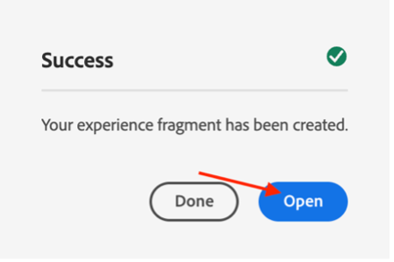
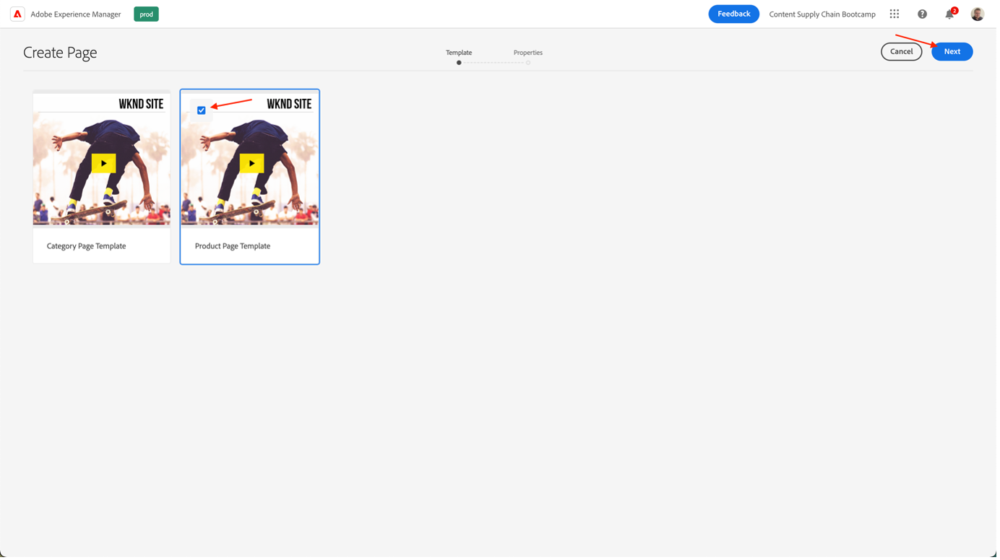

# AEM에서 페이지 만들기

AEM에서는 두 가지 환경을 제공합니다. 작성 환경 및 게시 환경 을 참조하십시오. 두 환경은 상호 작용하여 컨텐츠를 방문자가 경험할 수 있도록 웹 사이트에서 사용할 수 있게 만들어 줍니다.

작성 환경에서는 컨텐츠를 실제로 게시하기 전에 만들고, 업데이트하고 검토하는 메커니즘을 제공합니다.

- 작성자는 컨텐츠를 만들고, 검토합니다. (컨텐츠는 페이지, 자산, 발행물 등의 몇 가지 유형일 수 있습니다.)
- 이 컨텐츠는 어느 시점에서 웹 사이트에 게시됩니다.

작성자는 AEM 내에서 웹 사이트를 구성해야 합니다. 이 작업에는 콘텐츠 페이지 생성이 포함되며 이 페이지에 대한 이름 지정 작업도 포함되어 있어서

- 작성자가 작성 환경에서 페이지를 쉽게 찾을 수 있습니다.
- 사이트 방문자가 게시 환경에서 페이지를 쉽게 찾을 수 있습니다.

웹 사이트의 구조는 컨텐츠 페이지를 담는 트리 구조로 생각할 수 있습니다. 이 컨텐츠 페이지의 이름은 URL을 구성하는 데 사용됩니다. 반면에 제목은 페이지 컨텐츠가 표시될 때 표시됩니다. 아래 예에서 페이지에 대한 액세스 가능한 URL은 /content/adobike/language-masters/en.html입니다.

기존 웹 사이트에 새 페이지를 추가하는 방법과 일부 컨텐츠를 재사용하는 방법을 살펴보겠습니다.

## 홈 페이지 만들기

이전 섹션에 설명된 대로 AEM 페이지 계층은 트리 구조로 작동합니다. 즉, 가장 높은 수준의 페이지에서 시작합니다. 홈 페이지.

- 의 AEM 작성자에게 이동 [https://author-p71057-e991028.adobeaemcloud.com/](https://author-p71057-e991028.adobeaemcloud.com/) 제공한 자격 증명으로 로그인합니다.

- AEM 시작 메뉴에서 탐색 \> 사이트 를 선택합니다

- 먼저 기존 트리 구조를 홈 페이지를 만들 위치로 이동하겠습니다. 첫 번째 열에서 &quot;Adobike&quot;를 선택한 다음 두 번째 열에서 &quot;Bootcamp&quot;를 선택하여 트리 구조를 탐색합니다. 그런 다음 이 페이지 아래에 페이지를 만들려면 &quot;만들기&quot; 단추를 클릭하고 나타나는 메뉴에서 &quot;페이지&quot;를 선택합니다.

- 그러면 새 화면이 열리고 새 페이지가 구성됩니다. 먼저 페이지 템플릿을 선택합니다. AEM의 페이지 템플릿을 사용하면 페이지의 구조를 정의하고 이 페이지에서 사용할 수 있는 콘텐츠를 정의할 수 있습니다. 랜딩 페이지인 홈 페이지를 만들려면 랜딩 페이지 템플릿을 선택한 다음 &quot;다음&quot; 버튼을 클릭하여 계속합니다.

- 다음 화면에서는 몇 가지 초기 정보로 페이지를 채울 수 있습니다. 가장 중요한 정보는 제목(필수 속성, \* 로 표시됨)이며, 의미 있는 이름을 페이지에 지정할 수 있습니다. &quot;이름&quot;을 입력하지 않으면 AEM에서 SEO 우수 사례에 따라 페이지를 사용할 URL이 자동으로 생성됩니다. 이 경우 이 필드를 비워 둘 수 있습니다. 일부 다른 속성은 채울 수도 있고 다른 탭을 탐색할 수도 있지만 이 부트캠의 목적을 위해 아직 다른 속성은 채우지 않습니다. 페이지를 만들 준비가 되면 &quot;만들기&quot; 버튼을 클릭하면 됩니다.

- 이제 AEM에서 페이지를 만듭니다. 완료되면 &quot;열기&quot; 버튼을 클릭하여 새로 만든 페이지를 열 수 있는 팝업이 표시됩니다.

- 이제 AEM 편집기에 도착할 것입니다. 구성 요소를 페이지에 끌어다 놓아 페이지를 작성할 수 있는 &quot;표시되는 항목&quot;(또는 WYSIWYG) 편집기입니다. 탐색 기능을 살펴보겠습니다.
   
   - 왼쪽에는 페이지에서 사용할 수 있는 자산이 있는 사이드 패널, 이 페이지에서 사용할 수 있는 구성 요소(또는 빌딩 블록) 및 페이지 구성 방식을 보여주는 편리한 트리 보기가 있습니다. 이러한 아이콘을 클릭하여 보기를 엽니다.
   - 오른쪽에는 &quot;레이아웃 컨테이너&quot;가 표시됩니다. 원하는 구성 요소를 삭제할 수 있는 영역입니다.
   - 페이지를 일부 콘텐츠로 채우겠습니다. 필요에 따라 자유롭게 홈 페이지를 채울 수 있습니다. 아래 예에서는 제품 페이지에 연결된 이미지 구성 요소와 두 개의 티저 구성 요소를 사용했습니다.

## 경험 조각을 활용하여 경험 다시 사용

이제 Adobe Launch에 사용할 수 있는 홈 페이지를 작성했습니다. 그러나 여기에 있는 일부 콘텐츠(예: 자전거의 고유한 판매 지점)는 여러 페이지에서 다시 사용할 수 있습니다.

가장 좋은 방법은 이러한 고유한 영업 포인트 경험을 한 번만 만들어 중앙 집중식으로 관리하고 개인화되고 일관된 경험을 제공할 수 있는 것입니다. AEM에서는 &quot;경험 조각&quot;으로 이 작업을 수행할 수 있습니다. 경험 조각 은 페이지 내에서 참조할 수 있는 컨텐츠 및 레이아웃을 포함한 하나 이상의 구성 요소 그룹입니다. 모든 구성 요소를 포함할 수 있습니다.

이것을 바로 사용해 봅시다.

- 의 AEM 작성자에게 이동 [https://author-p71057-e991028.adobeaemcloud.com/](https://author-p71057-e991028.adobeaemcloud.com/) 제공한 자격 증명으로 로그인합니다.

- AEM 시작 메뉴에서 탐색 \> 경험 조각을 선택합니다

- 다음 화면에서 팀이 재사용 가능한 경험을 저장하는 데 사용할 수 있는 폴더를 만들겠습니다. 열 보기에서 Adobike \> Bootcamp로 이동한 다음, 만들기 \> 폴더 단추를 클릭합니다.

- 모달이 표시되면 폴더에 팀의 이름을 지정합니다. 이름 필드를 비워 둘 수 있습니다. AEM에서 자동으로 생성합니다. 폴더에 이름을 지정한 후 만들기 버튼을 클릭하여 폴더를 만듭니다.

- 이제 폴더 팝업이 표시됩니다. 을 클릭한 다음 만들기 \> 경험 조각 단추를 클릭합니다.

- 먼저 경험 조각 템플릿을 선택합니다. 페이지와 마찬가지로 경험 조각도 여러 템플릿을 기반으로 할 수 있으며 각각 사전 정의된 경험을 확인할 수 있습니다. 이 경우 웹 사이트에서 컨텐츠를 다시 사용하려는 경우 왼쪽 상단의 확인란을 선택하고 &quot;다음&quot; 단추를 클릭하여 &quot;경험 조각 웹 변형 템플릿&quot;을 선택합니다.

- 경험 조각에 의미 있는 제목을 지정합니다(예: ). &quot;USP를 선택한 다음 생성 버튼을 클릭합니다.

- 경험 조각이 만들어지면 모달에서 &quot;열기&quot; 버튼을 클릭하여 경험 조각에 일부 컨텐츠를 추가할 수 있습니다.

- 페이지를 편집할 때와 마찬가지로 컨텐츠를 추가할 수 있는 레이아웃 컨테이너를 볼 수 있습니다.

- 이제 홈 페이지의 구성 요소 위에 복사 작업을 수행합니다. 새 탭에서 이전 장에 설명된 대로 홈 페이지로 이동하여 복사할 구성 요소를 선택한 다음 복사 아이콘을 클릭합니다.

- 그런 다음 경험 조각에서 레이아웃 컨테이너를 클릭하고 붙여넣기 단추를 클릭합니다.

>[!NOTE]
>
> 팁: AEM에서는 모든 페이지 또는 경험 조각에서 &quot;레이아웃 모드&quot;를 사용할 수 있습니다. 이렇게 하면 구성 요소의 크기를 조정하고 모든 장치에 대한 경험을 최적화할 수 있습니다.

- 상단 메뉴에서 드롭다운을 열고 &quot;레이아웃&quot;을 선택하여 레이아웃 모드를 시작합니다.

- 그런 다음 구성 요소의 양쪽에 있는 핸들을 드래그하여 화면에 표시되는 열에 스냅하여 구성 요소를 선택하고 크기를 조정할 수 있습니다.

- 기본적으로 모든 중단점에 대해 편집됩니다. 그러나 특정 중단점에 대해 편집하려면, 페이지 상단의 도구 모음에서 일치하는 장치를 선택할 수 있습니다. 그런 다음 작성 중인 중단점이 강조 표시됩니다.

- 알 수 있듯이 모바일의 두 열 레이아웃은 잘 보이지 않습니다. 모바일에 대해 하나의 열 레이아웃을 만들겠습니다. 데스크탑에서 볼 수 있듯이 Adobe 경험은 동일하게 유지되지만 모바일에서는 이제 컨텐츠 열 하나만 더 나은 경험을 제공합니다.

- 마지막으로 홈페이지에서 이 환경을 다시 사용할 수 있습니다. 컨텐츠를 표시할 위치의 페이지에서 &quot;경험 조각&quot; 구성 요소를 드래그하여 놓습니다. 경험 조각에서 사용하게 되므로 복사한 컨텐츠를 삭제할 수 있습니다.

- 경험 조각 구성 요소에 대한 구성 대화 상자를 열고 경로 선택기를 사용하여 경험 조각을 만든 위치를 선택합니다.

- 마지막으로, 이제 페이지에서 재사용 가능한 경험을 사용할 수 있습니다.

## 제품 페이지 만들기

AEM과 통합된 Adobe Commerce을 사용하는 경우, 생성된 개요 페이지에서 사이트를 탐색할 때 사용되는 일반 제품 세부 사항 페이지가 있을 수 있습니다. 그러나 경우에 따라 제품별 컨텐츠를 영감을 주는 컨텐츠와 결합하는 영감을 주는 페이지를 예측할 수도 있습니다. 저희 가게로 미리 만든 것을 복사해서 영감을 주는 제품 페이지를 만들어 보겠습니다.

- 의 AEM 작성자에게 이동 [https://author-p71057-e991028.adobeaemcloud.com/](https://author-p71057-e991028.adobeaemcloud.com/) 제공한 자격 증명으로 로그인합니다.

- AEM 시작 메뉴에서 탐색 \> 사이트 를 선택합니다

- 열 개요에서 미리 만들어진 웹 사이트를 샵으로 이동합니다. Adobike \> Language Masters \> Adobike \> Shop. 그런 다음 확인란을 사용하여 Shop 페이지를 선택하고 \> Live Copy 만들기 를 클릭합니다. 너무 많은 세부 사항을 다루지 않고, AEM Multi Site Manager를 사용하여 이미 존재하는 페이지 및 컨텐츠를 다시 사용할 수 있도록 사이트에서 사용할 수 있는 페이지 사본을 만듭니다.

- 표시되는 화면에서 해당 이름 옆에 있는 확인란을 선택하여 팀 사이트를 대상으로 선택합니다. 그런 다음 Next 단추를 클릭합니다.

- Multi Site Manager로 이동하지 않으므로 이 구성을 인계할 수 있습니다.\
   제목: 상점\
   이름: 상점\
   롤아웃 구성: 표준 롤아웃 구성\
   Live Copy를 구성한 후 만들기 단추를 클릭합니다.

>[!NOTE]
>
> Live Copy에 대해 더 궁금하십니까? 체크 아웃 [&quot;Live Copy 생성 및 동기화&quot;.](https://experienceleague.adobe.com/docs/experience-manager-cloud-service/content/sites/administering/reusing-content/msm/creating-live-copies.html?lang=en)

- 완료되면 이제 웹 사이트에서 사용할 수 있는 스토어가 표시됩니다. 선택한 다음 만들기 \> 페이지 를 클릭하여 영감을 주는 제품 페이지를 만듭니다.

- 이제 페이지에 제품 정보를 표시하려고 하므로 제품 페이지 템플릿을 사용하여 페이지를 만들겠습니다. 해당 항목을 선택하고 다음 단추를 클릭합니다.

- 페이지 메타데이터를 입력한 다음 홈 페이지의 경우처럼 만들기 단추를 클릭합니다. 페이지가 만들어지면 열기 버튼을 클릭하여 페이지를 열 수 있습니다. 보시다시피 이미 제품 세부 사항 구성 요소로 채워집니다.

- 먼저 이전에 만든 경험 조각을 추가합니다. 그런 다음 페이지에서 원하는 콘텐츠를 추가할 수 있습니다. 마지막으로, 구성 대화 상자에서 제품 파인더를 선택한 다음, Adobe 카테고리를 선택하고 제품 옆에 있는 상자를 선택하여 제품 세부 사항 구성 요소를 구성하여 Adobe 제품을 표시합니다. 그런 다음 추가 단추를 클릭합니다.

- 이제 Adobe Commerce에서 제공하는 중앙 집중식 관리 컨텐츠 및 제품 정보를 비롯하여 영감을 주는 전체 페이지가 제공됩니다.

다음 단계: [3단계 - 제공: CAMPAIGN GO/NO-GO](./go-nogo.md)

[3단계로 돌아가기 - 전달: 모바일 앱 확인](./app.md)

[모든 모듈로 돌아가기](../../overview.md)
