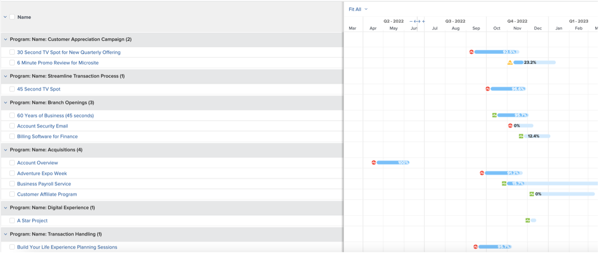

# 마케팅 관리자에 대한 인사이트

## 프로젝트 리더의 주간 보기

왼쪽 열에서 &#39;프로젝트 리더 주간 보기&#39;를 클릭합니다.

여기에는 다양한 보고 기능이 포함되며, 추가 세부 정보를 위해 항상 클릭/실행 가능합니다.

- **이번 주 기한의 작업**

- **프로젝트 관리의 예정된 마일스톤**:

- **우선 순위별 진행 중 문제**

우선 순위별 

- 부서별 **지연 작업**

- 개인별 **지연 작업**

## 스크럼 관련 인사이트

왼쪽 열에서 &#39;반복 상태&#39;를 클릭합니다.

팀이 SCRUM 방법론을 사용하는 경우 이는 흥미로운 보고서 관리 세트입니다.

- **반복별 속도**

- 팀별 **평균 속도**

- **피할당자의 현재 반복 완료 시간 합계**

- 팀별 **반복**

팀별 

## 효율성 보고

왼쪽 열에서 &#39;효율성&#39;을 클릭합니다.

- **계획된/계획되지 않은 비율**(완료된 작업)

- **주별 완료된 요청**

## 진행 중인 프로젝트 인사이트

왼쪽 열에서 &#39;마케팅 - 진행 중인 프로젝트&#39;를 클릭합니다.

- **진행 중인 프로젝트 상태**

- **월별 상태별 프로젝트**

상태별 

- **진행 중인 프로젝트**&#x200B;의 목록, 진행 상황 및 재무 세부 정보

## 종속성 시각화(프로젝트 간)

&#39;PIN&#39; 줄로 돌아가서 &#39;Gant 보기 Portfolio&#39;를 클릭하십시오.

프로젝트 간의 종속성(전임 작업)이 있는 **프로젝트 그룹에 대한** Gant 차트 보기가 있습니다.

## 타사 통합 인사이트

>[!NOTE]
>
> 타사 소프트웨어와의 통합 사례입니다. 이는 Adobe Campaign과의 통합을 예로 설명한 것입니다. Adobe Campaign에서 완료된 캠페인의 결과를 가져옵니다.

&#39;PIN&#39; 줄에서 &#39;캠페인 요약&#39;을 클릭합니다.

- **Adobe Campaign 요약**

- **열림으로 보낸 Adobe Campaign**

- **Adobe Campaign에서 클릭 수 열기**

다음 단계: [결론](../../conclusion.md)

[4단계 - 프로젝트 관리자를 위한 인사이트 로 돌아가기](./project-manager.md)

[모든 모듈로 돌아가기](../../overview.md)
