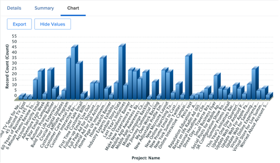
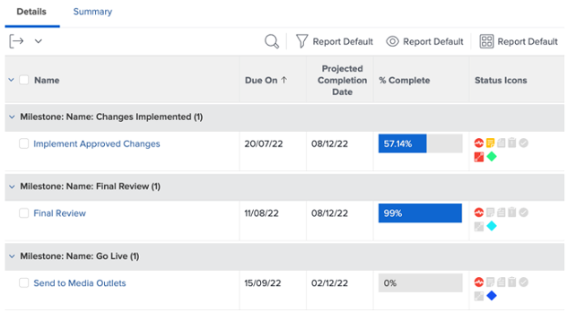

# 마케팅 관리자를 위한 통찰력

## 프로젝트 리더 주간 보기

왼쪽 열에서 &#39;프로젝트 리더&#39; 주별 보기를 클릭합니다.

여기에는 항상 클릭/실행 가능한 다양한 보고서 세트가 포함되며 자세한 내용은 다음 항목을 참조하십시오.

- 다음 **이번 주에 프로젝트 단위로 예정된 작업**

- 다음 **프로젝트 관리의 예정된 이정표** :

- 다음 **우선 순위별 열린 문제**

- 다음 **부서별 지연 태스크**

- 다음 **개인별 지연 작업**

## SCREM 관련 인사이트

왼쪽 열에서 &#39;반복 상태&#39;를 클릭합니다.

팀이 SCREM 방법론과 함께 작업하는 경우 이 보고서는 흥미로운 관리 보고서 세트입니다.

- **반복별 속도**

- **팀별 평균 속도**

- **할당자별 현재 반복 완료된 시간 합계**

- **팀별 반복**

## 효율성 보고

왼쪽 열에서 &#39;효율성&#39;을 클릭합니다.

- **계획/계획 취소 비율** (작업 중)

- **주별 완료된 요청**

## 비행 중 프로젝트 통찰력

왼쪽 열에서 &#39;마케팅 - 프로젝트 진행 중&#39;을 클릭합니다.

- **비행 중 프로젝트 상태**

- **월별 조건별 프로젝트**

- 목록, 진행 및 재무 세부 정보 **비행 중 프로젝트**

## 시각화(프로젝트 간) 종속성

&#39;PIN&#39; 줄로 돌아가서 &#39;Portfolio Gant 보기&#39;를 클릭합니다.

여기 있습니다 **프로젝트 그룹의 Gant 차트 보기** 프로젝트 간의 가능한 종속성(선행 작업)과 함께

## 타사 통합 통찰력

>[!NOTE]
>
> 타사 소프트웨어와의 통합의 예입니다. Adobe Campaign과의 통합입니다. Adobe Campaign에서 완료된 캠페인의 결과를 가져옵니다.

&#39;PIN&#39; 행에서 &#39;캠페인 요약&#39;을 클릭합니다.

- **Adobe Campaign 요약**

- **열기에 전송된 Adobe Campaign**

- **클릭으로 Adobe Campaign 열기**

다음 단계: [결론](../../conclusion.md)

[4단계로 이동 - 프로젝트 관리자에 대한 통찰력](./project-manager.md)

[모든 모듈로 돌아가기](../../overview.md)
