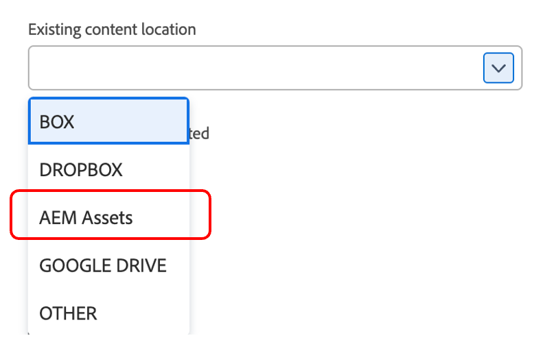
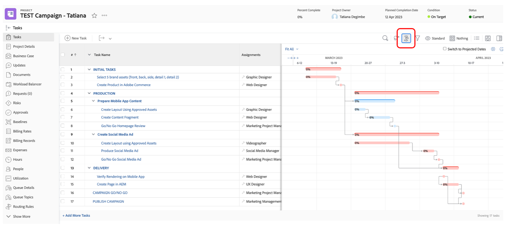

# 계획 수립

>[!NOTE]
>
> 부트캠프 중에는 요청자, 프로젝트 관리자, Designer, 상위 관리 등 여러 가지 역할을 맡게 됩니다. 이렇게 하면 각 프로필의 사용자 경험을 한눈에 볼 수 있습니다.

이제 작업 관리 플랫폼, Adobe Workfront을 살펴보겠습니다. Workfront을 사용하면 모든 사람이 전략적으로 작업의 우선 순위를 지정하고, 진행 상황을 추적하고, 결과를 측정할 수 있도록 목표를 조직 전체에 표시할 수 있습니다. 목표가 발전함에 따라 Workfront은 현장에서 작업을 수행하는 팀에 정보를 캐스케이드합니다. 결과는? 뛰어난 정렬, 포커스 및 속도 도달로 이어집니다.

[adobebootcampemea-02032301.testdrive.workfront.com](https://adobebootcampemea-02032301.testdrive.workfront.com)(으)로 이동한 다음 Adobe 팀이 제공한 자격 증명으로 로그인하여 Workfront 프로필에 로그인합니다.

그러면 이 로그인 페이지가 표시됩니다.  부트캠프를 사용자 이름으로 구독한 전문 이메일 주소로 로그인하십시오.

로그인에 성공하면 다음 홈페이지가 표시됩니다.

## 사용을 위한 Workfront 준비

이제 Workfront을 정기적으로 사용하는 것처럼 홈 페이지를 준비합니다.  즉, 나중에 워크플로우에 대한 관련 페이지를 가져와서 홈 페이지 상단에 &#39;고정&#39;합니다.

우선, 가서 우리 팀의 워크로드 페이지를 가져가자.  오른쪽 상단에 있는 와플을 클릭하고 &#39;팀&#39;을 선택합니다.

팀(마케팅 - 디지털)이 화면에 표시되면 맨 위 리본에 &#39;고정&#39;하면 됩니다.

이제 상단 리본은 다음과 같아야 합니다.

이제 나중에 더 면밀하게 분석할 프로젝트를 고정해 보겠습니다.  고정된 프로젝트 페이지를 클릭하고 검색 버튼을 클릭합니다.  &#39;모바일 앱 인식 캠페인&#39;을 입력하고 프로젝트 이름을 클릭합니다.

프로젝트가 화면에 표시되면 이전처럼 상단 리본에 고정합니다.

이제 상단 리본은 다음과 같아야 합니다.

마지막으로, 다시 한 번 오른쪽 상단 와플을 클릭하고 PORTFOLIO을 선택합니다.

검색 버튼을 클릭하고 &#39;TRANSFORM&#39;을 입력합니다.  &#39;고객 경험 변형&#39; Portfolio을 클릭하여 엽니다.

Portfolio이 열리면 상단 리본에 고정합니다.

이제 상단 리본은 다음과 같아야 합니다.

이제 정기적으로 필요한 것을 정확히 보여주는 인터페이스로 워크플로우를 시작할 준비가 되었습니다.

## 요청자

이제 요청자의 모자로 실제 작업 접수를 시작합니다. 제품 관리자와 같은 요청자는 새 Adobike 캠페인에 대한 요청을 공식화하고 마케팅 브리프의 정보를 제공하려고 합니다.

- 왼쪽 상단에서 요청 을 클릭합니다.

- 그런 다음 &#39;새 요청&#39;을 클릭합니다.

- 요청 유형으로 &quot;마케팅 요청&quot;을 선택한 다음 &quot;CSB - 캠페인 요청&quot;을 선택합니다.

- 제목을 입력합니다. &quot;Adobike Campaign - \*team\*&quot;(팀 번호 입력). 설명과 우선 순위를 자유롭게 추가할 수 있습니다.

- &quot;CSB - Marketing Campaign Brief&quot; 헤더 아래의 모든 항목은 사용자 정의가 가능합니다. 이 경우 이러한 필드는 모두 고유한 마케팅 개요 요구 사항에 맞게 조정할 수 있는 사용자 지정 필드입니다. 다음은 이 부트캠프에 대해 만든 요약 필드입니다.

- Brief 를 작성하겠습니다.

   - 시작 날짜를 01/06/2023으로 설정 - 종료 날짜를 30/06/2023으로 설정:

  

   - 이 캠페인에서 사용할 수 있는 자산이 몇 개 있으므로 AEM Assets을 선택하십시오.

  

   - &#39;새 컨텐츠&#39;에서 예를 클릭하면 추가(조건부) 필드에 타임라인 경고가 표시됩니다.

  

   - 마감일이 촉박하므로 선택을 &quot;아니요&quot;로 변경해 보겠습니다.

  

   - 채널에서는 기본적으로 일부를 사전 선택하는 선택을 했습니다. 그리고 다음 단계를 위해 필요한 기능이므로 여기에는 변화가 필요하지 않습니다.

  

   - Adobe Commerce에서 예를 선택합니다.

  

- 마지막으로 문서 섹션에서 요청에 대한 관련 설명서를 추가할 수 있습니다.  여기에서는 AEM 커넥터를 사용하여 AEM Assets 인스턴스에서 기존 콘텐츠를 가져오는 방법을 보여 줍니다.

   - &#39;파일 추가 또는 링크&#39;를 클릭하고 &#39;experience-manager&#39;에서 링크 를 선택합니다.

  

   - 이제 AEM Assets 폴더가 표시되므로 이를 검색(및/또는 검색 엔진 사용)하여 요청에 필요한 문서/에셋을 가져올 수 있습니다.

  

   - 이 프로젝트와 관련이 있다고 생각되는 AEM Assets의 모든 항목을 자유롭게 첨부할 수 있습니다. 완료되면 &quot;연결&quot;을 클릭하여 자산에 연결하거나, 폴더가 연결되지 않은 경우 &quot;닫기&quot;를 클릭하십시오.

  

- 이제 요청이 완료되었으며 제출할 준비가 되었습니다.

## 프로젝트 관리자

이제 요청자(예: 제품 관리자)로 요청을 제출했으므로 모자를 바꾸고 프로젝트 관리자 중 하나를 착용할 예정입니다.

- &#39;Adobe&#39; 로고를 클릭하면 &#39;새 마케팅 요청&#39; 페이지로 이동합니다(일반적인 &#39;프로젝트 관리자&#39; 홈 페이지임).

- &#39;마케팅 - 새 캠페인 요청&#39; 섹션에서 새로 만든 요청을 찾을 수 있습니다.

- 요청 이름을 클릭합니다.

- &#39;요청 세부 정보&#39;를 클릭합니다.

- 아래로 스크롤하여 &#39;CSB - 마케팅 캠페인 개요&#39; 섹션을 확장합니다.

- 요청자 개요의 모든 상세내역을 볼 수 있으며 이 정보로 템플릿을 기반으로 프로젝트 계획을 시작할 수 있습니다.
   - 상단의 요청 이름 옆에 있는 세 점을 클릭합니다.

  

   - &#39;템플릿에서 프로젝트로 전환&#39;을 클릭합니다.

  

   - &#39;CSB - 마케팅 캠페인&#39;을 선택한 다음 &#39;템플릿 사용&#39;을 클릭합니다.

  

   - 페이지 하단에 있는 &#39;프로젝트로 전환&#39;을 클릭합니다.

  

- 이제 템플릿을 기반으로 하는 Campaign 프로젝트 워크플로가 제공됩니다. 나중에 프로젝트를 고정 합시다. &#39;현재 페이지 고정&#39; 클릭:

- 일부 주의 영역:

1. 기간 개념 - 작업을 완료할 수 있는 기회의 창입니다.\
   계획된 시간 개념 - 작업을 완료하는 데 필요한 실제 시간입니다.

1. 전임 작업(예: 종속성) - 서로 간에 가질 수 있는 제한 작업입니다(일반적으로 이 작업이 완료되기 전에는 시작할 수 없음). 이를 통해 각 프로젝트에 대한 중요 경로가 포함된 명확한 갠트 차트를 만들 수 있습니다. Gant 차트를 보려면 아래 아이콘을 클릭하십시오.
   

1. 할당 개념 - 프로젝트를 만들 때 할당은 템플릿에서 가져오므로 여전히 일반적입니다. 망치 아이콘(즉, 이 특정 작업을 완료하는 기능을 가진 사람 그룹)으로 표시되는 작업 역할이나 사람 아이콘(즉, 사용자 회사의 사람 그룹으로 정의되는 팀)으로 표시됩니다. 이제 이러한 작업을 개인에게 할당할 때입니다.

- 오늘은 팀 사전 할당과 이를 개인에게 할당하는 방법에 중점을 둡니다.

- 보시다시피 작업 11 &quot;소셜 미디어 광고 제작&quot;이 &#39;마케팅 - 디지털&#39; 팀에 할당됩니다.
  

- 리소스 관리 페이지를 열어 이 내용이 팀의 계획에 어떻게 반영되는지 살펴보겠습니다. 페이지 상단의 &#39;마케팅 - 디지털&#39; PIN을 클릭합니다.
  

- 이제 다음과 같은 팀 계획 보기가 제공됩니다.

1. 상단 부분은 특정 팀의 미할당 작업을 다룹니다. 여기에는 팀에서 할당한 프로젝트가 나열되어 있으며 여기 화살표를 클릭하면 프로젝트에서 처리해야 하는 정확한 작업이 표시됩니다.
   

1. 아래 부분은 팀에서 개인에게 할당된 작업을 다루지만, 팀 구성원의 실제 작업량뿐만 아니라 일정(예: 월-금 또는 월-토), 휴일 등을 보여줍니다.
   

- 작업을 개인에게 할당하려면 작업을 맨 위 부분에서 맨 아래 부분에 있는 한 개인의 줄로 드래그하면 됩니다. Bea의 작업 로드가 어떻게 조정되었고 작업 할당에 대한 세부 정보가 추가되었는지 확인하십시오.
  

다음 단계: [1단계 - 계획 중: 기타 작업 전](./prework.md)

[Creative Brief로 돌아가기](../../creative-brief.md)

[모든 모듈로 돌아가기](../../overview.md)
