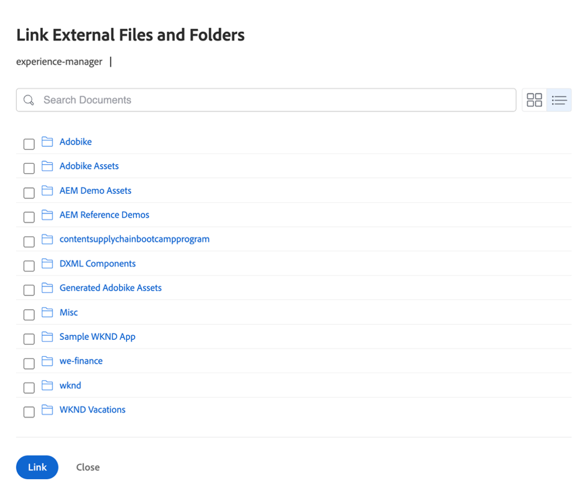
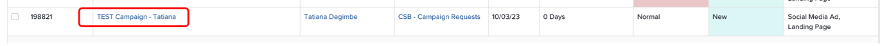
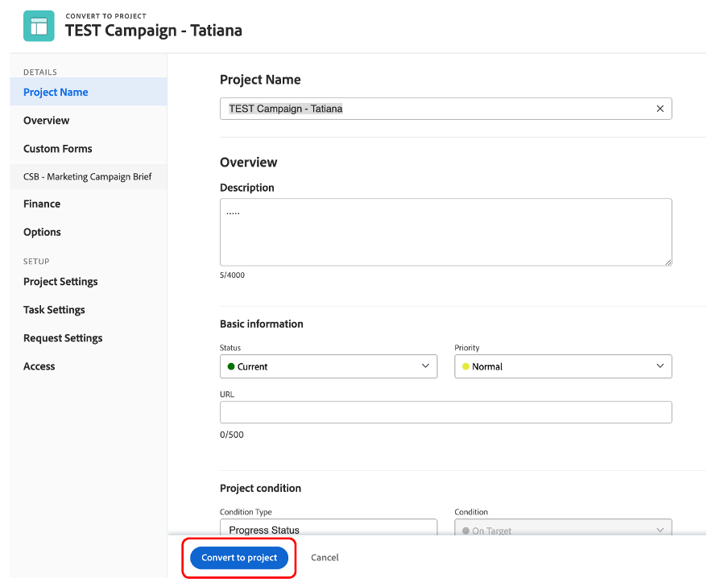
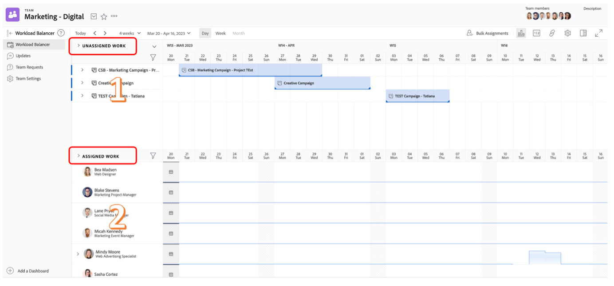

# 계획

>[!NOTE]
>
> 부트캠프에서는 다음과 같은 여러 가지 모자를 사용하게 됩니다. 요청자, 프로젝트 관리자, 디자이너 및 상위 관리 각 프로필의 사용자 경험을 한 눈에 볼 수 있습니다.

이제 Adobe Workfront의 작업 관리 플랫폼을 살펴보겠습니다. Workfront을 사용하면 전체 조직에서 목표를 볼 수 있으므로 모든 사람이 전략적으로 작업을 우선순위화하고, 진행 상황을 추적하고 결과를 측정할 수 있습니다. 목표가 발전함에 따라 Workfront은 지상에서 작업을 실행하는 팀에 정보를 캐스케이드합니다. 결과? 보다 뛰어난 정렬, 포커스 및 속도 구현으로 성공을 거둘 수 있습니다.

로 이동하여 Workfront 프로필에 로그인합니다. [adobebootcampemea-02032301.testdrive.workfront.com](https://adobebootcampemea-02032301.testdrive.workfront.com) Adobe 팀이 제공한 자격 증명으로 로그인합니다.

이 로그인 페이지가 표시됩니다.  사용자 이름으로 bootcamp에 가입한 전문 이메일 주소로 로그인합니다.

로그인하면 다음 홈 페이지가 표시됩니다.

## Workfront 사용 준비

이제 홈 페이지를 정기적으로 Workfront을 사용하는 것처럼 준비할 것입니다.  즉, 나중 워크플로우에 관련 페이지를 가져와서 홈 페이지의 맨 위에 &#39;고정&#39;합니다.

우선 TEAM의 작업 로드 페이지를 살펴보겠습니다.  오른쪽 상단에 있는 와플을 클릭하고 &#39;팀&#39;을 선택합니다

팀(마케팅 - 디지털)이 화면에 표시되면 맨 위 리본에 &#39;고정&#39;하면 됩니다.

이제 상단 리본은 다음과 같습니다.

이제 우리가 나중에 더 자세히 분석할 프로젝트를 고정합시다.  프로젝트 고정 페이지를 클릭하고 검색 단추를 클릭합니다.  &#39;모바일 앱 인식 캠페인&#39;을 입력하고 프로젝트 이름을 클릭합니다.

프로젝트가 화면에 표시되면 이전에 수행한 것처럼 맨 위 리본에 고정할 수 있습니다.

이제 상단 리본은 다음과 같습니다.

마지막으로 오른쪽 상단의 와플을 다시 클릭하고 PORTFOLIO을 선택합니다.

검색 단추를 클릭하고 &#39;변형&#39;을 입력합니다.  &#39;고객 경험 변형&#39; Portfolio을 클릭하여 엽니다.

Portfolio이 열리면 위쪽 리본에 고정:

이제 상단 리본은 다음과 같습니다.

이제 정기적으로 필요한 사항을 정확하게 보여주는 인터페이스를 통해 워크플로우를 시작할 준비가 되었습니다.

## 요청자

우리는 이제 요청자의 모자로 실제 취기를 시작할 것이다. 요청자(예: 제품 관리자)는 새로운 Adobe Campaign에 대한 요청을 공식화하고 마케팅 개요의 정보를 제공하려고 합니다.

- 왼쪽 상단에서 요청을 클릭합니다.

- 그런 다음 &#39;새 요청&#39;을 클릭합니다.

- 요청 유형으로 &quot;마케팅 요청&quot;을 선택한 다음 &quot;CSB - 캠페인 요청&quot;을 선택합니다.

- 제목을 입력합니다. &quot;Adobe Campaign - \*team\*&quot;(팀 번호 입력) 설명 및 우선 순위를 자유롭게 추가할 수 있습니다.

- &quot;CSB - 마케팅 캠페인 개요&quot; 헤더 아래의 모든 것은 완전히 사용자 지정할 수 있습니다. 이 경우 이들은 고유한 마케팅 개요 요구 사항에 맞게 조정할 수 있는 모든 사용자 지정 필드입니다. 다음은 이 Bootcamp에 대해 만든 Brief 필드입니다.

- Brief 작성을 시작하겠습니다.

   - 시작 날짜를 01/06/2023 - 종료 날짜를 30/06/2023:

   

   - AEM Assets을 선택하면 이 캠페인에서 사용할 수 있는 몇 가지 자산이 있습니다.

   

   - &#39;새 컨텐츠&#39;에서 예를 클릭하면 타임라인 경고와 함께 추가(조건부) 필드가 나타납니다.

   

   - 마감 시간이 촉박하기 때문에 &quot;아니오&quot;로 선택합시다.

   

   - 채널에서는 기본적으로 일부 사전 선택을 선택했습니다. 그리고 그것들은 우리가 다음 단계를 위해 필요로 할 그것들이며, 그래서 여기서 변화가 필요하지 않습니다.

   

   - Adobe Commerce, 예 선택:

   

- 마지막으로, 문서 섹션에서 요청에 대한 관련 설명서를 추가할 수 있습니다.  여기서는 AEM 커넥터를 사용하여 AEM Assets 인스턴스에서 기존 컨텐츠를 가져오는 방법을 보여 줍니다.

   - &#39;파일 추가 또는 링크&#39;를 클릭하고 &#39;experience-manager&#39;에서 링크를 선택합니다.

   

   - 이제 AEM Assets 폴더가 표시되고 검색 엔진을 통해(및/또는 검색 엔진) 요청에서 필요한 문서/자산을 가져올 수 있습니다.

   

   - 이 프로젝트와 관련이 있다고 생각되는 항목이 있을 경우 언제든지 AEM Assets의 항목을 첨부할 수 있습니다. 완료되면 &quot;링크&quot;를 클릭하여 자산에 연결하거나, 폴더를 연결하지 않으면 &#39;닫기&#39;를 클릭하십시오.

   

- 이제 요청을 완료하고 제출할 준비가 되었습니다.

## 프로젝트 관리자

이제 &#39;요청자&#39;(예: 제품 관리자)로 요청서를 제출했으므로, Adobe에서는 Project Manager 중 하나를 사용하여 모자를 변경하고,

- &#39;Adobe&#39; 로고를 클릭하면 &#39;새 마케팅 요청&#39; 페이지(일반적인 &#39;프로젝트 관리자&#39; 홈 페이지)에 표시됩니다.

- 마케팅 - 새 캠페인 요청 섹션에서 새로 만든 요청을 찾을 수 있습니다.

- 요청 이름을 클릭합니다.

- &#39;Request Details&#39;를 클릭합니다.

- &#39;CSB - 마케팅 캠페인 개요&#39; 섹션으로 스크롤하여 다음 내용을 확장합니다.

- 요청자 요약의 모든 세부 정보를 볼 수 있으며 이 정보를 사용하여 템플릿을 기반으로 프로젝트 계획을 시작할 수 있습니다.
   - 맨 위의 요청 이름 옆에 있는 세 점을 클릭합니다.

   

   - &#39;템플릿에서 프로젝트로 변환&#39;을 클릭합니다.

   

   - CSB - 마케팅 캠페인을 선택한 다음 &#39;템플릿 사용&#39;을 클릭합니다.

   

   - 페이지 하단에서 &#39;프로젝트로 변환&#39;을 클릭합니다.

   

- 이제 템플릿을 기반으로 한 Campaign 프로젝트 워크플로우가 있습니다. 우리 프로젝트를 나중에 고정하자. 현재 페이지 고정 을 클릭합니다.

- 주의 사항:

1. 기간 개념 - 작업을 완료할 수 있는 기회의 창입니다.\
   계획 시간 개념 - 작업을 완료하는 데 필요한 실제 시간입니다.

1. 선행 작업 개념(종속성 라고도 함) - 제한 작업은 서로 간에 수행할 수 있습니다(일반적으로 이 작업은 다른 작업이 완료되기 전에 시작할 수 없음). 이를 통해 각 프로젝트에 중요한 경로를 갖는 명확한 Gant 차트를 만들 수 있습니다. 아래 아이콘을 클릭하여 Gant 차트를 봅니다.
   

1. 지정 개념 - 프로젝트가 생성될 때 지정은 템플릿에서 가져오듯이 일반적입니다. 작업 역할 - 망치 아이콘(즉, 이 특정 작업을 완료할 수 있는 기술을 가진 사람 그룹)으로 표현되거나 팀 - 사람 아이콘(즉, 사용자 회사 그룹에 의해 정의됨)으로 표시됩니다. 이제 그 일들을 개인에게 할당해야 할 차례입니다.

- 오늘 우리는 팀 사전 할당과 이를 개인에게 할당하는 방법에 주력할 예정입니다.

- 보시다시피 작업 11개의 &quot;소셜 미디어 광고 만들기&quot;가 &#39;마케팅 - 디지털&#39; 팀에 할당됩니다.
   

- 리소스 관리 페이지를 열어 이 팀의 계획을 어떻게 반영하는지 살펴보겠습니다. 페이지 상단에 있는 &#39;마케팅 - 디지털&#39; PIN을 클릭합니다.
   

- 이제 이 팀 계획 보기가 있습니다.

1. 상단 부분이 해당 특정 팀에 대한 미지정 작업을 다룹니다. 이 목록에는 팀이 지정한 프로젝트가 표시되며, 여기에서 화살표를 클릭하면 프로젝트에 의해 처리해야 하는 정확한 작업의 가시성이 표시됩니다.
   

1. 아래 부분은 팀 내 개인 사용자에 대한 지정 작업을 다룹니다. 그것은 실제로 팀의 각 구성원들의 실제 업무량을 보여주지만 또한 그들의 일정(예: 월-금 또는 월-토), 그들의 휴일 등을 보여줍니다.
   

- 작업을 개인에게 할당하려면 작업을 맨 위 부분에서 맨 아래 부분에 있는 한 개인의 라인으로 드래그하면 됩니다. Bea의 작업 로드가 조정된 방법과 Bea의 작업 지정 세부 사항이 추가되었는지 확인합니다.
   

다음 단계: [1단계 - 계획: 기타 사전 작업](./prework.md)

[Creative Brief로 돌아가기](../../creative-brief.md)

[모든 모듈로 돌아가기](../../overview.md)
