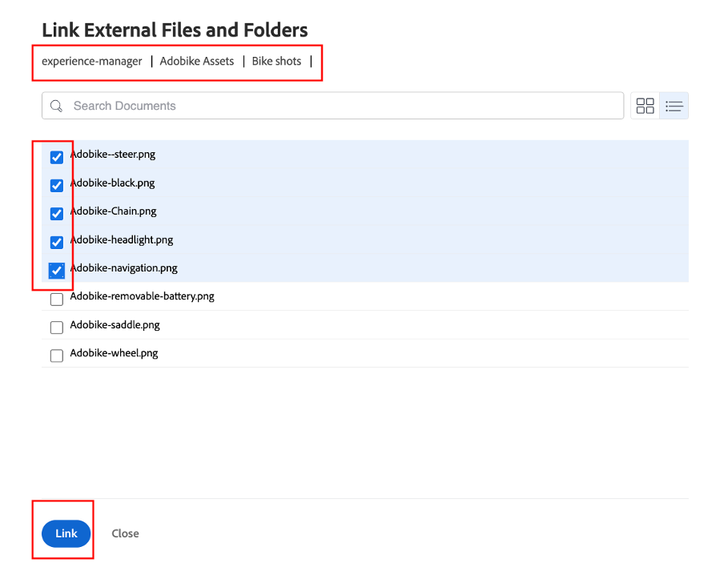
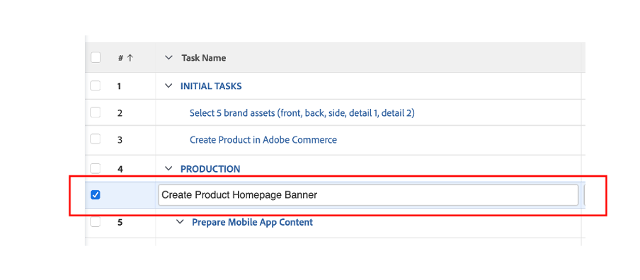
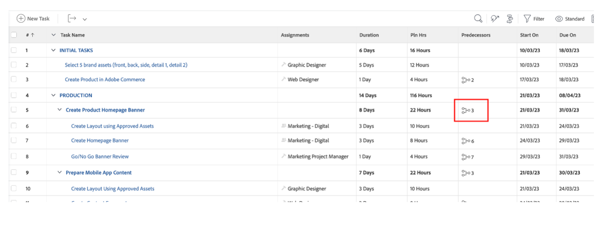

# 기타 사전 작업

## Brand Assets 선택

크리에이티브 보고서에 설명된 대로, 캠페인을 효과적으로 실행하기 위해 필요한 몇 가지 자산이 있습니다. 이러한 브랜드 자산은 Workfront의 캠페인에 추가되므로 중앙에서 캠페인에 액세스할 수 있습니다.

- 작업 1, &#39;초기 작업&#39;을 확장한 다음, &#39;5개의 브랜드 자산 선택(앞, 뒤,..)&#39; 작업을 클릭하여 엽니다.

- &#39;문서&#39;를 클릭하고 &#39;새로 추가:

- experience-manager에서 를 선택합니다. 이를 통해 AEM Assets에서 이미 사용 가능한 브랜드 자산을 선택할 수 있습니다.

- AEM 폴더 계층 구조가 표시되면 다음 경로로 이동합니다. experience-manager > Adobe Assets > Bike 샷 5개의 자산을 선택한 다음 &#39;링크&#39;를 클릭합니다.

- 이제 Brand Assets을 작업에 사용할 수 있습니다. 즉, 작업 2를 100% 완료로 설정할 수 있습니다.

## Adobe Commerce 데모

Adobe Commerce은 Adobe Experience Cloud에서 고객에게 최상의 디지털 경험을 제공하는 데 도움이 되는 많은 제품 중 하나입니다. 그러나, 주류 판매 기간 동안 모든 것을 함께 할 시간이 거의 없었다.

이 비디오에서는 Adobe Commerce을 잘 알고 있으며, 부팅 중에 사용하기 위해 만든 제품을 보여줍니다. 실제 시나리오에서는 이전에 선택한 브랜드 자산을 Adobe Commerce에 업로드하여 제품 구성에 업로드합니다.

>[!VIDEO](https://video.tv.adobe.com/v/3418945?quality=12&learn=on)

이 작업이 완료되면 Workfront에서 작업 3을 100% 완료로 표시할 수 있습니다.

## 유연한 캠페인은 필수 조건입니다

작업 계획을 검토하는 동안, 우리는 작은 문제를 발견했습니다. 제품 관리자(요청자)가 &#39;제품 홈페이지 배너&#39; 요청을 잊어버린 업데이트를 발표했습니다.  이것을 프로젝트 계획에 추가하겠습니다.

- 작업 목록으로 이동한 후 &#39;제품 홈페이지 배너 만들기&#39; 작업을 작업 4 &#39;프로덕션&#39; 바로 아래에 추가합니다. 이렇게 하려면 &#39;모바일 앱 콘텐츠 준비&#39; 작업을 선택하고 &#39;위에 작업 추가 아이콘&#39;을 클릭합니다.

- 추가된 작업에 &quot;제품 홈 페이지 배너 만들기&quot;와 같은 의미 있는 이름을 지정합니다.

- 이제 작업을 만들었으므로 컨텐츠를 추가하겠습니다. 프로젝트 제목 오른쪽에 있는 세 점을 클릭하고 &#39;템플릿 첨부&#39;를 선택합니다.

- 제품 홈 페이지 배너 만들기를 선택하고 &#39;사용자 지정 및 첨부&#39;를 클릭합니다.

- 사용자 지정 화면에서 &#39;제품 홈 페이지 배너 만들기&#39; 작업을 상위 항목으로 언급해야 합니다.

- 마지막으로, Adobe Commerce에서 제품을 만들 때까지 프로덕션을 시작할 수 없으므로 상위 작업 &#39;제품 홈 페이지 만들기&#39;를 작업 3의 전임자로 표시해야 합니다.

이제 캠페인이 완성되고 계획되었습니다. 즉, 이제 캠페인의 제작 및 배송부터 시작할 수 있습니다.

다음 단계: [2단계 - 프로덕션: 제품 홈페이지 배너 만들기](../production/banner.md)

[1단계로 돌아가기 - 계획: 계획](./planning.md)

[모든 모듈로 돌아가기](../../overview.md)