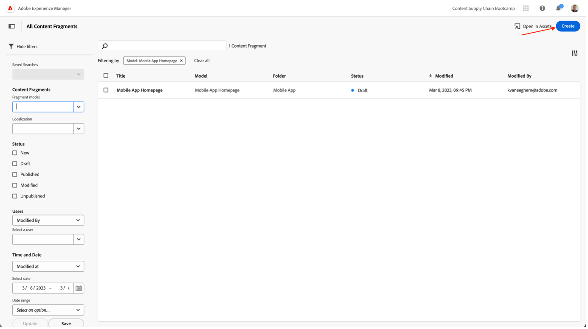

# 모바일 앱 콘텐츠 만들기

## Headless 콘텐츠 게재란 무엇입니까?

이제 Headless 콘텐츠 관리 시스템을 통해 백엔드와 프론트엔드가 분리됩니다. Headless CMS는 철저하게 콘텐츠 저장소로 디자인 및 구축된 백엔드 전용 콘텐츠 관리 시스템으로, API를 통해 콘텐츠에 액세스하여 이를 모든 디바이스에 표시할 수 있도록 하므로 Headless 부분은 콘텐츠 백엔드입니다.

독립적으로 개발 및 유지 관리되는 프론트엔드는 일반적으로 JSON 형식인 콘텐츠 배달 API를 사용하여 Headless 백엔드의 콘텐츠를 가져옵니다. 예를 들어 웹 앱으로 사용할 수 있고, 이 경우 모바일 애플리케이션으로 사용할 수 있습니다.

Headless CMS 백엔드는 일반적으로 모델 또는 스키마를 기반으로 콘텐츠를 구조화해야 합니다. 이를 통해 클라이언트 애플리케이션이 경험 렌더링에 적합한 콘텐츠를 용이하게 요청할 수 있습니다. AEM과 같은 일부 CMS는 구조화된 콘텐츠 및 구조화되지 않은 콘텐츠를 JSON 형식으로 노출할 수 있습니다.

이 구조의 주요 특징은 Headless CMS에서 JSON 형식으로 제공하는 콘텐츠가 디자인이나 레이아웃 정보가 없는 순수한 콘텐츠라는 것입니다. Headless CMS 구현에서는 모든 서식 및 레이아웃이 분리된 프론트엔드 애플리케이션에 의해 유지됩니다.

Headless CMS 구조의 주요 이점은 여러 채널에서 콘텐츠를 재사용할 수 있다는 점이며, 이를 통해 서로 다른 클라이언트측 프론트엔드 구현을 사용할 수 있습니다. 따라서 프론트엔드 개발 프로세스를 보다 효율적으로 수행할 수 있습니다. 그러나 이는 프론트엔드 경험 개발 프로세스가 매우 코드화되고 IT 중심적으로 변화할 수 있으며, 본질적으로 IT가 경험을 소유할 수 있음을 의미하기도 합니다.

## AEM에서 Headless 콘텐츠 게재는 어떻게 작동합니까?

AEM as a Cloud Service은 다음과 같은 세 가지 강력한 기능을 제공하는 headless 구현 모델을 위한 유연한 도구입니다.

1. 콘텐츠 모델
   - 콘텐츠 모델은 콘텐츠를 구조적으로 표시한 것입니다.
   - 콘텐츠 모델은 AEM 콘텐츠 조각 모델 편집기에서 정보 설계자가 정의합니다.
   - 콘텐츠 모델은 콘텐츠 조각의 기초 역할을 합니다.
1. 콘텐츠 조각
   - 콘텐츠 조각은 콘텐츠 모델을 기반으로 만들어집니다.
   - AEM 콘텐츠 조각 편집기를 사용하여 콘텐츠 작성자가 만듭니다.
   - 컨텐츠 조각은 AEM Assets에 저장되고 Assets Admin UI에서 관리됩니다.
1. 전달을 위한 콘텐츠 API
   - AEM GraphQL API는 콘텐츠 조각 전달을 지원합니다.
   - AEM Assets REST API는 콘텐츠 조각 CRUD 작업을 지원합니다.
   - 콘텐츠 조각 핵심 구성 요소의 [JSON 내보내기](https://experienceleague.adobe.com/docs/experience-manager-core-components/using/components/content-fragment-component.html?lang=en)를 통해 직접 콘텐츠 전달도 가능합니다.

## 운동

이 부트캠프는 결국 우리가 추구하는 콘텐츠 공급망인 &quot;콘텐츠&quot; 부분에 초점을 맞출 것입니다. 중요한 것에 집중할 수 있도록 필요한 게재 API와 콘텐츠 모델을 이미 예측했습니다.

먼저 콘텐츠 모델을 살펴보겠습니다. Headless CMS와 맺은 &quot;계약&quot;이기 때문에 어떤 콘텐츠가 어떤 형식으로 제공될 수 있는지 알 수 있습니다.

- [https://author-p105462-e991028.adobeaemcloud.com/](https://author-p105462-e991028.adobeaemcloud.com/)의 AEM 작성자로 이동하여 제공한 자격 증명으로 로그인합니다.

- AEM 시작 메뉴에서 도구 \> 일반 \> 콘텐츠 조각 모델 을 선택합니다

- 다음 화면에서는 headless 콘텐츠를 사용 중인 모든 사이트에 대한 개요를 제공합니다. 이렇게 하면 여러 Headless 사이트가 서로 충돌하지 않도록 하지 않고 해당 사이트에 대한 거버넌스를 유지할 수 있습니다. 이 예제에서는 Adobike 사이트를 사용하고 있으므로 해당 모델을 선택하십시오.

- 이 폴더에서는 Adobike 웹 사이트에서 사용 중인 몇 가지 기술 Headless 콘텐츠를 볼 수 있습니다. 더 알고 싶으신가요? 언제든지 연락하십시오. 지금으로서는 모바일 앱과 같은 사전 작업에 집중해 보겠습니다. 모바일 앱 홈 페이지 카드에 마우스를 가져다 대고 연필 아이콘을 클릭하여 콘텐츠 모델을 엽니다.

- 콘텐츠 조각 모델 편집기에서 특정 콘텐츠 모델의 세부 정보를 볼 수 있습니다. 이 예제에서는 모바일 앱의 홈 페이지에 Adobike 로고, 제목, 선택적 자유 텍스트 및 선택적 추천 제품이 있는 것을 볼 수 있습니다. 이러한 모든 항목은 구성 및 업데이트가 쉬우므로 콘텐츠 모델에 추가 요소가 필요한 경우 CMS측의 개발자 간섭 없이 이 작업을 수행할 수 있습니다.

>[!WARNING]
>
> **모바일 앱에서 올바른 요소를 표시하기 위해 특정 정보를 수신해야 하므로 콘텐츠 모델을 변경하면**&#x200B;에 영향을 미칩니다. 필드를 업데이트하거나 제거할 때 특히 주의하십시오. 필드를 추가해도 영향을 미치지 않습니다.

이제 콘텐츠가 무엇에 존재해야 하는지에 대한 아이디어가 있으므로 콘텐츠 조각을 만들 수 있습니다.

- 왼쪽 상단 모서리에서 AEM 로고를 클릭하여 탐색을 연 다음 탐색 \> 콘텐츠 조각으로 이동합니다.

- 다음 인터페이스에서 AEM 내의 모든 기존 콘텐츠에 대한 개요를 볼 수 있습니다. 특정 콘텐츠 조각을 검색하는 경우 왼쪽의 필터를 사용하여 범위를 좁힐 수 있습니다. 새 콘텐츠 조각을 만들려면 오른쪽 상단의 &quot;만들기&quot; 버튼을 클릭합니다.

- 모달이 열리면 일부 필드를 아직 편집할 수 없습니다. 논리적입니다. 조각을 만드는 위치에 따라 다른 모델을 사용할 수 있습니다.
  
   - 먼저 &quot;위치&quot; 필드 옆에 있는 폴더 아이콘을 클릭하여 조각을 만들 위치를 선택합니다. &quot;adobike&quot; \> &quot;en&quot; \> &quot;mobile-app&quot; 폴더를 클릭하여 콘텐츠 트리를 확장한 다음 &quot;Choose&quot; 단추를 클릭하여 선택 항목을 확인합니다.

     
   - 이제 &quot;콘텐츠 조각 모델&quot; 필드를 편집할 수 있습니다. 필드 옆에 있는 화살표를 클릭하여 드롭다운을 열고 이전에 보았던 콘텐츠 모델(&quot;모바일 앱 홈 페이지&quot;)을 선택합니다.
   - 다음으로 컨텐츠 조각에 의미 있는 제목을 지정합니다(팁: 컨텐츠를 쉽게 찾을 수 있도록 팀 번호 포함). &quot;이름&quot; 필드는 자동으로 채워집니다. 이는 사용자의 생활을 편리하게 하기 위한 것입니다. 이 필드는 시스템이 조각을 식별하는 데 사용하는 이름이며 터치해서는 안 됩니다.
   - 마지막으로 &quot;만들기 및 열기&quot; 버튼을 클릭합니다. 이 버튼은 이름이 콘텐츠 조각을 만들고 열어서 바로 편집할 수 있도록 합니다.

- 여기에서 팀은 모바일 앱에 표시할 콘텐츠를 결정할 수 있습니다. 
   - 나중에 모바일 앱에서 콘텐츠를 확인할 수 있도록 팀 nr을 선택하십시오.
   - 이미지 에셋을 선택하려면 폴더 아이콘을 클릭하여 AEM Assets에서 올바른 이미지를 찾습니다.
   - 주요 제품의 경우 제품 조회 아이콘을 클릭하면 &quot;Adobike 1&quot; Commerce 제품을 쉽게 선택할 수 있으므로 상거래 관련 세부 사항이 앱에 로드됩니다.
   - 작성된 모든 콘텐츠를 저장하고 변경 사항을 게시하려면 완료되면 &quot;저장&quot; 단추를 클릭하십시오.

     

이제 모바일 앱에 몇 가지 콘텐츠를 미리 확인했으므로 캠페인을 게재할 준비가 되었습니다.

다음 단계: [3단계 - 배달: 모바일 앱 확인](../delivery/app.md)

[2단계 - 프로덕션: 소셜 미디어 광고 만들기로 돌아가기](./social.md)

[모든 모듈로 돌아가기](../../overview.md)
