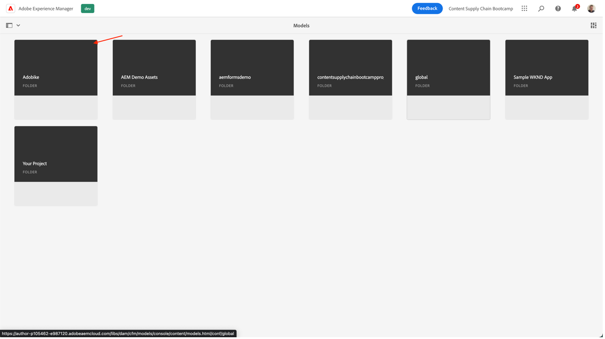
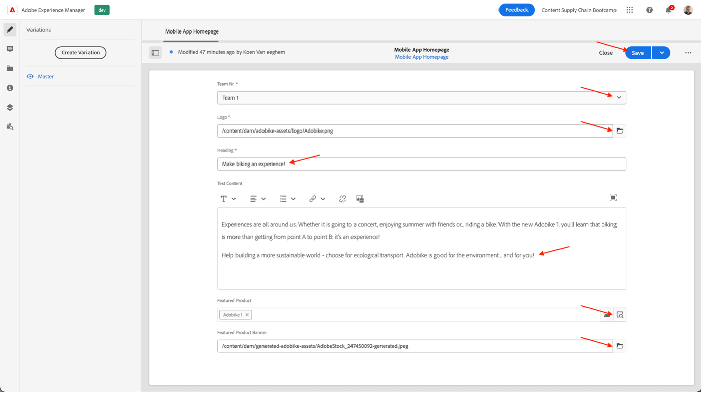

# 모바일 앱 콘텐츠 만들기

## 헤드리스 콘텐츠 전달이란 무엇입니까?

헤드리스 컨텐츠 관리 시스템을 사용하여 백엔드와 프론트런트가 이제 분리됩니다. 헤드리스 부분은 컨텐츠 백엔드입니다. 헤드리스 CMS는 백 엔드 전용 컨텐츠 관리 시스템으로, API를 통해 컨텐츠를 액세스할 수 있도록 하는 컨텐츠 저장소로서 명시적으로 설계되고 구축됩니다.

독립적으로 개발 및 유지 관리되는 프론트엔드는 일반적으로 JSON 형식인 콘텐츠 배달 API를 사용하여 Headless 백엔드의 콘텐츠를 가져옵니다. 예를 들어, 웹 앱이나 모바일 애플리케이션일 수 있습니다.

Headless CMS 백엔드는 일반적으로 모델 또는 스키마를 기반으로 콘텐츠를 구조화해야 합니다. 이렇게 하면 클라이언트 애플리케이션이 경험 렌더링에 필요한 올바른 콘텐츠를 용이하게 요청할 수 있습니다. AEM과 같은 일부 CMS는 구조화된 컨텐츠와 구조화되지 않은 컨텐츠를 JSON 형식으로 노출할 수 있습니다.

이 구조의 주요 특징은 Headless CMS에서 JSON 형식으로 제공하는 콘텐츠가 디자인이나 레이아웃 정보를 포함하지 않는 순수한 콘텐츠라는 점입니다. 헤드리스 CMS 구현에서는 분리된 프런트 엔드 애플리케이션에서 모든 서식과 레이아웃을 유지 관리합니다.

Headless CMS 구조의 주요 이점은 여러 채널에 걸쳐 콘텐츠를 재사용할 수 있다는 점이며, 이를 통해 서로 다른 클라이언트측 프론트엔드 구현을 사용할 수 있습니다. 따라서 프론트엔드 개발 프로세스를 보다 효율적으로 수행할 수 있습니다. 그러나 이는 프론트엔드 경험 개발 프로세스가 매우 코드화되고 IT 중심적으로 변화할 수 있으며, 본질적으로 IT가 경험을 지배하게 될 수 있음을 의미하기도 합니다.

## 헤드리스 콘텐츠 전달은 AEM에서 어떻게 작동합니까?

AEM as a Cloud Service는 다음과 같은 세 가지 강력한 기능을 제공하는 Headless 구현 모델을 위한 유연한 도구입니다.

1. 콘텐츠 모델
   - 콘텐츠 모델은 콘텐츠를 구조적으로 표시한 것입니다.
   - 콘텐츠 모델은 AEM 콘텐츠 조각 모델 편집기에서 정보 설계자가 정의합니다.
   - 콘텐츠 모델은 콘텐츠 조각의 기초 역할을 합니다.
1. Content Fragments
   - 콘텐츠 조각은 콘텐츠 모델을 기반으로 만들어집니다.
   - AEM 콘텐츠 조각 편집기를 사용하여 콘텐츠 작성자가 만듭니다.
   - 콘텐츠 조각은 AEM Assets에 저장되고 Assets Admin UI에서 관리됩니다.
1. 게재를 위한 콘텐츠 API
   - AEM GraphQL API는 콘텐츠 조각 게재를 지원합니다.
   - AEM Assets REST API는 콘텐츠 조각 CRUD 작업을 지원합니다.
   - [콘텐츠 조각 핵심 구성 요소의 JSON 내보내기](https://experienceleague.adobe.com/docs/experience-manager-core-components/using/components/content-fragment-component.html?lang=en)를 통해 직접 콘텐츠 게재도 가능합니다.

## 연습

이 부트캠프의 경우, &quot;컨텐츠&quot; 부분에 초점을 맞출 것입니다. 결국, 우리가 찾고 있는 컨텐츠 공급체인입니다. 이미 콘텐츠 모델과 필요한 배달 API를 예견하여 중요한 사항에 집중할 수 있습니다.

먼저 컨텐츠 모델을 살펴보겠습니다. 헤드리스 CMS와 함께 하는 &quot;계약&quot;입니다. 그래서 어떤 콘텐츠가 우리의 방식으로, 어떤 형식으로 제공될 수 있는지 알 수 있습니다.

- 의 AEM 작성자에게 이동 [https://author-p105462-e991028.adobeaemcloud.com/](https://author-p105462-e991028.adobeaemcloud.com/) 제공한 자격 증명으로 로그인합니다.

- AEM 시작 메뉴에서 도구 \> 일반 \> 컨텐츠 조각 모델 을 선택합니다

- 다음 화면에서는 헤드리스 콘텐츠를 사용하는 모든 사이트에 대한 개요를 알 수 있습니다. 이를 통해 헤드리스 여러 사이트에 대한 거버넌스를 유지할 수 있으므로 사이트 간 충돌을 염려하지 않아도 됩니다. 여기서는 Adobe Sites와 함께 작업하므로 해당 모델을 선택합니다.

- 이 폴더에서 Adobe에서는 Adobe 웹 사이트에서 사용하고 있는 일부 기술 헤드리스 컨텐츠를 볼 수 있습니다. 더 알고 싶으세요? 자유롭게 연락하세요. 지금으로서는 손 앞에 그 일에 집중합시다. 모바일 앱. 모바일 앱 홈 페이지 카드 위로 마우스를 가져간 다음 연필 아이콘을 클릭하여 컨텐츠 모델을 엽니다.

- 컨텐츠 조각 모델 편집기에서 특정 컨텐츠 모델의 세부 사항을 볼 수 있습니다. 이 경우 모바일 앱의 홈 페이지가 Adobe 로고, 제목, 일부 선택적 무료 텍스트 및 선택적 중요 제품으로 구성되어 있음을 확인할 수 있습니다. 이러한 모든 항목은 구성 및 업데이트하기 쉬우므로 컨텐츠 모델에 추가 요소가 필요한 경우 CMS 측에서 개발자 간섭 없이 이 작업을 수행할 수 있습니다.

>[!WARNING]
>
> **콘텐츠 모델을 변경하면 해당 줄이 더 줄어든다는 점에 유의하십시오**&#x200B;를 사용하면 됩니다. 모바일 앱은 올바른 요소를 표시할 수 있도록 특정 정보를 수신해야 합니다. 필드를 업데이트하거나 제거할 때 필드를 추가하는 것은 영향을 주지 않습니다.

이제 컨텐츠가 존재해야 하는 것에 대한 아이디어가 있기 때문에 컨텐츠 조각을 만들 수 있습니다.

- 왼쪽 상단 모서리에서 AEM 로고를 클릭하여 탐색을 연 다음 탐색 \> 컨텐츠 조각으로 이동합니다.

- 다음 인터페이스에서 AEM 내의 모든 기존 컨텐츠에 대한 개요를 알 수 있습니다. 특정 컨텐츠 조각을 검색하는 경우 왼쪽의 필터를 사용하여 범위를 좁힐 수 있습니다. 새 컨텐츠 조각을 만들려면 오른쪽 상단에 있는 &quot;만들기&quot; 버튼을 클릭합니다.

- 열리는 모달에서 일부 필드는 아직 편집할 수 없습니다. 이것은 논리적입니다. 조각을 만드는 위치에 따라 다른 모델을 사용할 수 있습니다.
   
   - 먼저 &quot;위치&quot; 필드 옆에 있는 폴더 아이콘을 클릭하여 조각을 만들 위치를 선택합니다. 폴더 &quot;adobeike&quot; \> &quot;en&quot; \> &quot;mobile-app&quot;을 클릭하여 컨텐츠 트리를 확장한 다음 &quot;선택&quot; 버튼을 클릭하여 선택 내용을 확인합니다.
      
   - 이제 &quot;컨텐츠 조각 모델&quot; 필드를 편집할 수 있습니다. 필드 옆에 있는 화살표를 클릭하여 드롭다운을 열고 앞에서 본 컨텐츠 모델을 선택합니다. &quot;모바일 앱 홈 페이지&quot;.
   - 다음으로, 컨텐츠 조각에 의미 있는 제목(팁: 콘텐츠를 쉽게 찾을 수 있도록 팀 번호 포함). 이름 필드가 자동으로 채워지는 것을 볼 수 있습니다. 이렇게 하면 보다 쉽게 작업할 수 있습니다. 시스템이 조각을 식별하는 데 사용하는 이름이며 터치하면 안 됩니다.
   - 마지막으로 &quot;만들기 및 열기&quot; 단추를 클릭합니다. 이 단추는 이름 시 컨텐츠 조각을 만들고 즉시 편집할 수 있도록 엽니다.

- 여기에서 팀은 모바일 앱에 표시할 콘텐츠를 결정할 수 있습니다. 
   - 나중에 모바일 앱에서 콘텐츠를 확인할 수 있도록 팀에서 선택해야 합니다.
   - 이미지 자산을 선택하려면 폴더 아이콘을 클릭하여 AEM Assets에서 올바른 이미지를 찾습니다.
   - 주요 제품의 경우 &quot;Adobe Mobile 1&quot; Commerce 제품을 쉽게 선택할 수 있도록 제품 조회 아이콘을 클릭하여 상거래 관련 세부 사항이 앱에 로드됩니다.
   - 작성된 모든 콘텐츠를 저장하고 변경 내용을 게시하려면 &quot;저장&quot; 단추를 클릭하십시오.
      

이제 일부 컨텐츠가 있는 모바일 앱을 예측했으므로 캠페인을 전달할 준비가 되었습니다.

다음 단계: [3단계 - 제공: 모바일 앱 확인](../delivery/app.md)

[2단계 - 프로덕션으로 돌아가기: 소셜 미디어 광고 만들기](./social.md)

[모든 모듈로 돌아가기](../../overview.md)
