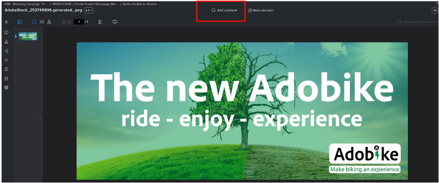

# 제품 홈페이지 배너 만들기

## 배너 프로덕션

컨텐츠 자동화는 Adobe Creative Cloud의 기능을 Experience Manager Assets에 제공하여 마케터가 규모에 맞게 에셋 제작을 자동화할 수 있도록 함으로써 변형의 생성 시간을 크게 단축합니다. 이러한 기능을 사용하여 홈페이지에서 사용할 배너를 생성해 보겠습니다!

- [https://author-p105462-e991028.adobeaemcloud.com/](https://author-p105462-e991028.adobeaemcloud.com/)의 AEM 작성자로 이동하여 제공한 자격 증명으로 로그인합니다.

- 홈 페이지에서 도구 \> Assets \> 처리 프로필 로 이동합니다.

- 인터페이스에서 기존의 모든 처리 프로필을 볼 수 있습니다. 특정 자동화를 활성화하기 위해 최대 사용할 수 있습니다.

- 귀하가 관심 있는 항목은 다음과 같습니다.
   - Adobike 배너 어둡게: 선택한 에셋을 기반으로 어두운 오버레이가 있는 Adobike 배너를 만듭니다.

     
   - Adobike 배너 조명: 선택한 에셋을 기반으로 조명 오버레이가 있는 Adobike 배너를 만듭니다

     
   - Adobike 배너 녹색: 선택한 에셋을 기반으로 녹색 오버레이가 있는 Adobike 배너를 만듭니다

     

- 만들려는 배너 유형을 선택한 후 해당 처리 프로필을 선택한 다음 &quot;폴더에 프로필 적용&quot;을 선택합니다.

- 다음 화면에서는 AEM Assets에서 팀 폴더를 찾습니다. 그런 다음 왼쪽 상단에서 &quot;만들기&quot; 버튼을 선택하여 새 폴더를 만들고 의미 있는 이름(예: &quot;어두운 배너 만들기&quot;)을 지정합니다.

- 폴더를 만든 후 이름 옆에 있는 상자를 선택한 다음 오른쪽 상단의 &quot;적용&quot; 버튼을 클릭합니다.

필요한 구성을 완료했으므로 배너를 생성해 보겠습니다.

- 왼쪽 상단 모서리에서 AEM 로고를 클릭하여 탐색을 연 다음 탐색 \> Assets \> 파일로 이동합니다.

- &quot;Generated Adobike Assets&quot; 폴더를 찾아 카드를 클릭하여 엽니다. 생성된 배너가 표시되는 위치입니다.

- 새 탭을 열고 다시 AEM Assets으로 이동합니다. 그런 다음 처리 프로필을 적용한 폴더로 이동합니다.

- 폴더에서 배너를 만들 이미지를 브라우저로 드래그 앤 드롭하거나 인터페이스 오른쪽 상단의 파일 만들기 \>를 클릭하여 업로드합니다.

- 자산이 처리될 때까지 잠시 기다린 후 화면을 다시 로드합니다. 에셋이 &quot;신규&quot; 상태로 표시되면 처리가 완료된 것입니다.

- 이전 탭으로 돌아가서 여기서도 화면을 다시 로드하십시오. 상태가 &quot;New&quot;인 새 에셋이 표시됩니다. 이는 DAM에서 모두 생성된 배너입니다! 아직 안 보였어? 잠시 기다린 후 화면을 다시 로드합니다.

>[!NOTE]
>
> 결과가 만족스럽지 않습니까? 다른 처리 프로필을 폴더에 적용하고 에셋을 다시 업로드하여 다른 배너를 생성하거나 다른 에셋을 업로드할 수도 있습니다. 다시 업로드하는 동안 시스템에서 기존 에셋으로 수행할 작업을 묻습니다. &quot;바꾸기&quot;를 선택합니다.
>  바꾸기

이제 캠페인 게재 중에 나중에 사용할 수 있는 생성된 배너가 있습니다. 배너를 선택한 다음 리본에서 &quot;빠른 Publish&quot; 버튼을 클릭하여 게시하십시오.

## Workfront의 후속 작업

Assets에 대한 공식적이고 감사 가능한 검토 및 승인 프로세스가 필요한 경우 Workfront을 사용하십시오.

>[!NOTE]
>
> 여기에서 명시적으로 언급하지만, 임무를 마친 후 Workfront에서 임무를 업데이트하기 위한 것입니다. 항상 만들기 > 검토 > 승인 흐름을 위해 노력해야 합니다.

- 프로젝트로 돌아가서 &#39;이동/이동 배너 검토 안 함&#39; 아코디언을 확장하여 해당 작업을 클릭하여 엽니다.

- 작업의 문서 섹션(왼쪽 열)을 클릭한 다음 AEM Assets 연결 폴더 &#39;Final&#39;을 클릭합니다. 해당 영역을 클릭하여 자산을 선택하고 &#39;증명 만들기&#39;를 클릭합니다. 증명은 그림, 텍스트, 비디오, 웹 사이트 등과 같은 콘텐츠를 체계적이고 공동 작업 방식으로 교정함으로써 관련 이해 당사자의 의견, 수정 사항, 수정 사항을 수집하고, 버전과 결과를 비교하여 한 번의 클릭으로 최종 승인할 수 있는 기능입니다.

- 정교한 승인 프로세스를 원하는 경우 &quot;고급 증명&quot;을 선택하십시오.

>[!NOTE]
>
> 이 부트캠프에서 증명을 검토 및/또는 승인할 사용자를 수동으로 결정할 예정입니다. 대부분의 실제 사용 사례에서는 각 증명 유형에 대해 이미 정의된 승인 흐름의 사전 설정 템플릿을 사용합니다.

- 기본적으로 워크플로우 유형은 &#39;기본&#39;이며 Workfront Bootcamp 전문가를 검토자 및 승인자로 선택합니다. Bootcamp Workfront 전문가의 이름을 입력하고 여기에 &#39;연락처 이름 또는 이메일 주소를 입력하여 수신자를 추가하십시오.

- &#39;검토자 및 승인자&#39;로 설정:

- &#39;증명 만들기&#39;를 클릭합니다. Workfront에서 증명을 생성하는 데 몇 분 정도 소요됩니다.

- 이제 Workfront 전문가에게 검토 및/또는 승인할 수 있는 증명이 있음을 알리는 새로운 알림이 전송되었습니다.

- 알림을 클릭하면 귀하가 증명을 볼 수 있고 댓글을 달거나 이 증명을 승인할 수 있습니다.

   - 의견이 있는 경우 화면 상단에 있는 &#39;댓글 추가&#39;를 클릭할 수 있습니다.

  

   - 그런 다음 주석을 추가할 수 있을 뿐만 아니라 작은 포인터 도구 모음을 사용하여 변경해야 하는 영역을 명확하게 정의할 수 있습니다.

  

   - 주석을 추가하면 새 증명 버전에 대한 추가 작업을 수행해야 함을 알 수 있습니다. Workfront 탭을 새로 고치면 이를 정확히 알 수 있는 새 알림이 표시됩니다. 변경해야 하는 사항을 알게 되면 AEM에서 변경한 후 이동하여 새 버전을 여기에서 업로드하십시오.

  

   - 업데이트된 에셋을 선택하고(부트 캠프 시나리오에서 변경 사항이 필요하지 않은 경우 동일한 에셋을 다시 업로드하면 됨) &#39;링크&#39;를 클릭합니다.

  

   - 그런 다음 오른쪽의 &#39;증명 만들기&#39;를 클릭합니다.

  

   - 증명이 생성되면(몇 분 정도 걸릴 수 있음) Workfront 전문가가 알림을 받고 이 새 버전을 검토하고 승인할 수 있습니다.  예를 들어 증명 비교 버튼을 사용하면 작성된 모든 댓글과 V1 및 V2를 나란히 비교할 수 있습니다.

  

  

  

우리는 이제 우리 배너의 사용에 대한 정식 승인을 받았다. 프로세스 내에서 현재 위치를 쉽게 추적할 수 있으며, 업데이트를 통해 자동으로 알림을 트리거하므로 가능한 한 효율적인 방식으로 작업할 수 있습니다.

다음 단계: [2단계 - 프로덕션: 소셜 미디어 광고 만들기](./social.md)

[1단계 - 계획: 기타 사전 작업으로 돌아가기](../planning/prework.md)

[모든 모듈로 돌아가기](../../overview.md)
