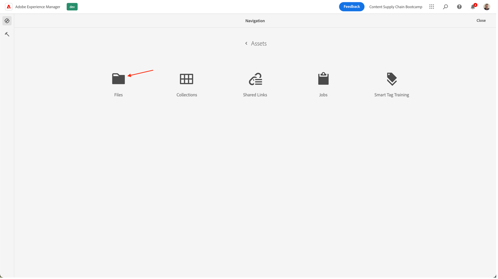

# 제품 홈페이지 배너 만들기

## 배너 제작

컨텐츠 자동화는 Adobe Creative Cloud의 강력한 기능을 Experience Manager Assets에 제공하여 마케터가 자산 생산을 규모에 맞게 자동화할 수 있고 변형 생성 속도를 획기적으로 높일 수 있습니다. 이러한 기능을 사용하여 홈 페이지에서 사용할 배너를 생성해 보겠습니다!

- 의 AEM 작성자에게 이동 [https://author-p105462-e991028.adobeaemcloud.com/](https://author-p105462-e991028.adobeaemcloud.com/) 제공한 자격 증명으로 로그인합니다.

- 홈 페이지에서 도구 \> 자산 \> 처리 프로필로 이동합니다.

- 인터페이스에서는 모든 기존 처리 프로필이 표시됩니다. 특정 자동화를 활성화하는 데 사용할 수 있습니다.

- 다음 사항이 마음에 듭니다.
   - Adobike 배너 다크: 선택한 자산을 기반으로 어두운 오버레이로 Adobe 배너를 만듭니다
      
   - Adobike 배너 표시등: 선택한 자산을 기반으로 조명 오버레이로 Adobe 배너를 만듭니다.
      
   - Adobike Banner Green: 선택한 자산을 기반으로 녹색 오버레이가 있는 Adobe 배너를 만듭니다
      

- 만들려는 배너 유형을 선택하고 해당 처리 프로필을 선택한 다음 &quot;폴더에 프로필 적용&quot;을 선택합니다.

- 다음 화면에서 AEM Assets에서 팀 폴더를 찾습니다. 그런 다음 왼쪽 상단에서 &quot;만들기&quot; 단추를 선택하여 새 폴더를 만들고 의미 있는 이름을 지정합니다(예: ). &quot;어두운 배너 만들기&quot;.

- 폴더를 만든 후 해당 이름 옆에 있는 상자를 선택한 다음 오른쪽 상단의 &quot;적용&quot; 단추를 클릭합니다.

이제 필요한 구성을 완료했으므로 배너를 생성하겠습니다.

- 왼쪽 상단 모서리에서 AEM 로고를 클릭하여 탐색을 연 다음 탐색 \> 자산 \> 파일로 이동합니다.

- 생성된 Adobe Assets 폴더를 찾아 카드를 클릭하여 엽니다. 생성된 배너가 표시되는 위치입니다.

- 새 탭을 열고 AEM Assets으로 다시 이동합니다. 그런 다음 처리 프로필을 적용한 폴더로 이동합니다.

- 폴더에서 배너를 만들 이미지를 브라우저로 끌어다 놓거나 인터페이스의 오른쪽 상단 모서리에서 \> 파일 만들기 를 클릭하여 업로드합니다.

- 자산이 처리될 때까지 잠시 기다렸다가 화면을 다시 로드합니다. 자산이 &quot;신규&quot; 상태로 표시되면 프로세스가 끝난 것입니다.

- 이전 탭으로 돌아가서 여기서도 화면을 다시 로드합니다. &quot;새로 만들기&quot; 상태의 새 자산이 표시됩니다. 이것은 DAM에서 생성된 배너입니다! 아직 안 보입니까? 잠시 기다렸다가 화면을 다시 로드합니다.

>[!NOTE]
>
> 결과가 만족스럽지 않습니까? 다른 처리 프로필을 폴더에 적용하고 자산을 다시 업로드하여 다른 배너를 생성하거나(또는 다른 자산을 물론 업로드하십시오). 다시 업로드하는 동안 시스템에서 기존 자산으로 수행할 작업을 묻습니다. &quot;바꾸기&quot;를 선택합니다.
> 

이제 캠페인 게재 중에 나중에 사용할 수 있는 생성된 배너가 있습니다. 배너를 선택한 다음 리본의 &quot;빠른 게시&quot; 단추를 클릭하여 게시해야 합니다.

## Workfront의 후속 작업

Assets의 공식 및 감사 가능한 검토 및 승인 프로세스가 필요한 경우 Workfront을 바로 활용할 수 있습니다.

>[!NOTE]
>
> 여기에서 명시적으로 언급했지만 Workfront에서 작업을 완료한 후에는 작업을 업데이트하는 것이 목표입니다. 항상 만들기 > 검토 > 승인 흐름을 위해 노력해야 합니다.

- 프로젝트로 돌아가서 &#39;Go/No Go Banner Review&#39; 아코디언을 확장하여 작업을 클릭하여 엽니다.

- 작업의 문서 섹션(왼쪽 열)을 클릭하고 AEM Assets 연결된 폴더 &#39;최종&#39;을 클릭합니다. 해당 영역을 클릭하여 자산을 선택하고 &#39;증명 만들기&#39;를 클릭합니다. 증명은 댓글, 수정, 관련 이해 관계자의 수정 사항을 수집하고 버전 및 결과를 비교하고 한 번의 클릭으로 최종 승인 받는 구조화된 공동 작업 방식으로 컨텐츠, 예를 들어 사진, 텍스트, 비디오, 웹 사이트 등을 교정할 수 있는 기능입니다.

- 정교한 승인 프로세스를 원하는 경우 &quot;고급 증명&quot;을 선택합니다.

>[!NOTE]
>
> 우리는 이 옵트인에서 누가 우리의 증거를 검토 및/또는 승인할 것인지 수동으로 결정할 것입니다. 대부분의 실제 사용 사례에서는 각 증명 유형에 대해 이미 정의된 사전 설정된 승인 흐름 템플릿을 사용합니다.

- 기본적으로 워크플로우 유형 &#39;기본&#39;에 있으며 Workfront Bootcamp 전문가를 검토자 및 승인자로 선택합니다. Bootcamp Workfront Specialist의 이름을 입력합니다. 여기서 &#39;Type contact name or email address to add a recipient:

- 이를 &#39;검토자 및 승인자&#39;로 설정합니다.

- &#39;증명 만들기&#39;를 클릭합니다. Workfront에서 증명을 생성하는 데 몇 분 정도 걸립니다.

- 이제 Workfront 전문가가 검토 및/또는 승인할 권한이 있음을 알리는 새 알림을 받게 됩니다.

- 알림을 클릭하면 해당 게시자는 증명을 받게 되고 일부 주석을 작성하고 이 증명을 승인할 수 있습니다.

   - 설명이 있는 경우 화면 상단에 있는 &#39;주석 추가&#39;를 클릭할 수 있습니다.

   

   - 따라서 주석을 추가할 수 있을 뿐만 아니라 작은 포인터 도구 모음을 사용하여 어떤 영역이 변화해야 하는지 명확하게 정의할 수 있습니다.

   

   - 주석을 추가하면 새로운 버전의 증명에 대해 추가 작업을 해야 한다는 것을 알 수 있습니다. Workfront 탭을 새로 고치면 임을 정확히 알 수 있는 새로운 알림이 표시됩니다. 변경 사항을 알고 있으면 AEM에서 변경한 다음 여기에 와서 새 버전을 업로드하십시오.

   

   - 업데이트된 자산을 선택합니다(bootcamp 시나리오에 변경 사항이 필요하지 않으면 동일한 자산을 다시 업로드하십시오.). &#39;링크&#39;를 클릭합니다.

   

   - 그런 다음 오른쪽의 &#39;증명 만들기&#39;를 클릭합니다.

   

   - 증명이 생성되면(몇 분 정도 걸릴 수 있음) Workfront 전문가가 알림을 받고 이 새 버전을 검토하고 승인할 수 있습니다.  예를 들어, 증명 비교 단추를 사용하면 V1 및 V2를 수행된 모든 주석과 나란히 비교할 수 있습니다.

   

   

   

우리는 이제 기어의 사용에 대한 공식적인 승인을 받았다. Adobe Campaign은 진행 중인 위치와 알림을 자동으로 트리거하는 업데이트를 따라 가능한 한 효율적인 방식으로 작업할 수 있습니다.

다음 단계: [2단계 - 프로덕션: 소셜 미디어 광고 만들기](./social.md)

[1단계로 돌아가기 - 계획: 기타 사전 작업](../planning/prework.md)

[모든 모듈로 돌아가기](../../overview.md)
