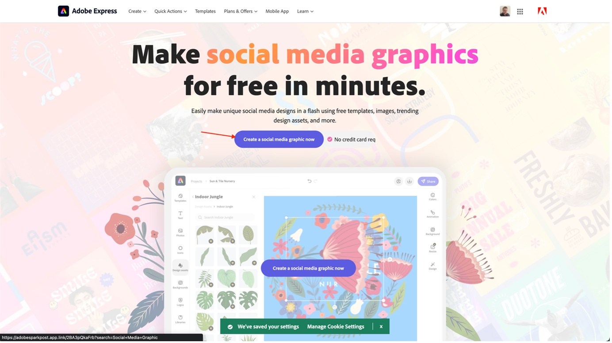

# 소셜 미디어 광고 만들기

여러분이 타겟 대상자와 접촉을 하려는 기업이든, 아니면 분위기를 공유하는 개인이든 간에 Adobe Express을 통해 모든 플랫폼에 맞는 멋진 소셜 미디어 이미지를 만들 수 있습니다. 아이디어에 익숙하지 않다면 템플릿 라이브러리를 탐색하여 창의력을 시작합니다. Adobe Express은 아래 예와 같이 전문적으로 디자인된 수천 개의 소셜 미디어 그래픽과 무료 이미지, 아이콘 및 그래픽을 포함하여 디자인 바로 드래그하여 놓을 수 있습니다.

- 다음으로 이동 [Adobe Express](https://www.adobe.com/express/create/social-media-graphic) 시작하려면 &quot;지금 소셜 미디어 그래픽 만들기&quot; 단추를 클릭하십시오.

- Adobe Express을 처음 사용하는 경우 시작할 모달에서 &quot;계속 동의&quot; 단추를 클릭합니다.

- 왼쪽의 사이드바에서 &quot;무료&quot; 상자를 선택하여 Adobe Express의 자유 템플릿에 대한 개요를 본 다음 팀에서 결정한 그래픽 유형을 선택합니다. 이 경우에는 Instagram 게시물을 만들겠습니다. 편집기에 로드할 템플릿을 클릭하면 됩니다.

- 게시물에 만족하면 오른쪽 상단에 있는 &quot;다운로드&quot; 단추를 클릭하여 소셜 미디어 게시물을 원하는 형식으로 다운로드합니다. 안전한 곳에 보관하세요, 나중에 필요할 거예요!

>[!NOTE]
>
>**알고 있었어?**\
>Adobe Express은 항상 발전하고 있으며, Adobe의 모든 제품이 그렇습니다. Adobe Express과 AEM Assets 간의 향후 통합을 발표하게 되어 매우 기쁘게 생각합니다. 이렇게 하면 Adobe Express에서 브랜드의 자산을 사용할 수 있을 뿐만 아니라 결과를 Adobe Express에 직접 저장할 수 있습니다.

다음 단계: [2단계 - 프로덕션: 모바일 앱 콘텐츠 만들기](./app.md)

[2단계 - 프로덕션으로 돌아가기: 제품 홈페이지 배너 만들기](./banner.md)

[모든 모듈로 돌아가기](../../overview.md)
