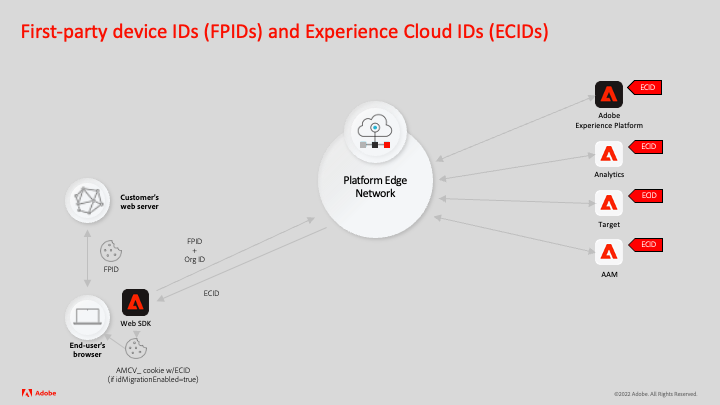

# 자사 디바이스 ID 생성

Adobe Experience Cloud 애플리케이션은 전통적으로 다음을 포함한 다양한 기술을 사용하여 디바이스 id를 저장하는 쿠키를 생성했습니다.

1. 서드파티 쿠키
1. 도메인 이름의 CNAME 구성을 사용하여 Adobe 서버에서 설정한 자사 쿠키
1. JavaScript에서 설정한 자사 쿠키

최근 브라우저 변경 사항은 이러한 유형의 쿠키의 기간을 제한합니다. 자사 쿠키는 DNS CNAME이 아닌 DNS A/AAAA 레코드를 사용하여 고객 소유 서버를 사용할 때 가장 효과적입니다. [자사 장치 ID(FPID) 기능](https://experienceleague.adobe.com/en/docs/experience-platform/web-sdk/identity/first-party-device-ids)을 통해 Adobe Experience Platform Web SDK을 구현하는 고객은 DNS A/AAAA 레코드를 사용하는 서버의 쿠키에 장치 ID를 사용할 수 있습니다. 그런 다음 이러한 ID를 Adobe으로 전송하여 Adobe Experience Cloud 애플리케이션에서 기본 식별자로 남아 있는 ECID(Experience Cloud ID)를 생성하기 위한 시드로 사용할 수 있습니다.

다음은 기능이 작동하는 방식에 대한 빠른 예입니다.



1. 최종 사용자의 브라우저는 고객의 웹 서버 또는 CDN에서 웹 페이지를 요청합니다.
1. 고객은 웹 서버 또는 CDN에서 장치 ID(FPID)를 생성합니다(웹 서버는 도메인 이름의 DNS A/AAAA-record에 연결되어야 함).
1. 고객은 최종 사용자의 브라우저에 FPID를 저장하도록 자사 쿠키를 설정합니다.
1. 고객의 Adobe Experience Platform 웹 SDK 구현은 Platform Edge Network에 요청하고 다음 중 하나를 수행합니다.
   1. ID 맵에 FPID를 포함합니다.
   1. 웹 SDK 요청에 대한 CNAME을 구성하고 해당 FPID 쿠키의 이름으로 데이터 스트림을 구성합니다.
1. Experience Platform Edge Network은 FPID를 수신하고 이를 사용하여 ECID(Experience Cloud ID)를 생성합니다.
1. Platform Web SDK 응답은 ECID를 최종 사용자의 브라우저로 다시 전송합니다.
1. `idMigrationEnabled=true`인 경우 Platform Web SDK은 JavaScript을 사용하여 ECID를 최종 사용자의 브라우저에 `AMCV_` 쿠키로 저장합니다.
1. `AMCV_` 쿠키가 만료되면 프로세스가 반복됩니다. 동일한 자사 장치 ID를 사용할 수 있는 한 이전과 동일한 ECID 값으로 새 `AMCV_` 쿠키가 만들어집니다.

>[!NOTE]
>
>FPID를 사용하려면 `idMigrationEnabled`을(를) `true`(으)로 설정할 필요가 없습니다. 그러나 `idMigrationEnabled=false`을(를) 사용하면 `AMCV_` 쿠키가 표시되지 않을 수 있으므로 네트워크 응답에서 ECID 값을 찾아야 합니다.


이 자습서에서는 PHP 스크립팅 언어를 사용하는 특정 예제를 사용하여 다음 방법을 보여줍니다.

* UUIDv4 생성
* 쿠키에 UUIDv4 값 쓰기
* ID 맵에 쿠키 값 포함
* ECID 생성 유효성 검사

자사 디바이스 ID와 관련된 추가 설명서는 제품 설명서에서 확인할 수 있습니다.

## UUIDv4 생성

PHP에는 UUID 생성을 위한 기본 라이브러리가 없으므로 이러한 코드 예는 다른 프로그래밍 언어를 사용한 경우 필요할 수 있는 것보다 광범위합니다. PHP는 널리 지원되는 서버측 언어이기 때문에 이 예제를 위해 선택되었습니다.


다음 함수가 호출되면 임의의 UUID 버전-4를 생성합니다.

```
<?php
    
    function guidv4($data)
    {
        $data = $data ?? random_bytes(16);

        $data[6] = chr(ord($data[6]) & 0x0f | 0x40); // set version to 0100
        $data[8] = chr(ord($data[8]) & 0x3f | 0x80); // set bits 6-7 to 10

        return vsprintf('%s%s-%s-%s-%s-%s%s%s', str_split(bin2hex($data), 4));
    }

?>
```

## 쿠키에 UUIDv4 값 쓰기

다음 코드는 위의 함수에 UUID를 생성하도록 요청합니다. 그런 다음 조직에서 결정한 쿠키 플래그를 설정합니다. 쿠키가 이미 생성된 경우 만료가 연장됩니다.

```
<?php

    if(!isset($_COOKIE['FPID'])) {
        $cookie_value = guidv4(openssl_random_pseudo_bytes(16));        
        $arr_cookie_options = array (
        'expires' => time() + 60*60*24*30*13,
        'path' => '/',
        'domain' => 'mysiteurl.com',
        'secure' => true,
        'httponly' => true,
        'samesite' => 'lax'
        );
        setcookie($cookie_name, $cookie_value, $arr_cookie_options);
        $_COOKIE[$cookie_name] = $cookie_value;
    }
    else {
        $cookie_value = $_COOKIE[$cookie_name];
        $arr_cookie_options = array (
        'expires' => time() + 60*60*24*30*13,
        'path' => '/',
        'domain' => 'mysiteurl.com',
        'secure' => true,
        'httponly' => true,
        'samesite' => 'lax'
        );
        setcookie($cookie_name, $cookie_value, $arr_cookie_options);
    }

?>
```

>[!NOTE]
>
>자사 디바이스 ID가 포함된 쿠키는 모든 이름을 가질 수 있습니다.

## ID 맵에 쿠키 값 포함

마지막 단계는 PHP를 사용하여 쿠키 값을 ID 맵으로 에코하는 것입니다.


```
{
    "identityMap": {
        "FPID": [
                    {
                        "id": "<? echo $_COOKIE[$cookie_name] ?>",
                        "authenticatedState": "ambiguous",
                        "primary": true
                    }
                ]
        }
}
```

>[!IMPORTANT]
>
>ID 맵에 사용된 ID 네임스페이스 기호는 `FPID`(으)로 호출해야 합니다.
>
> `FPID`은(는) id 네임스페이스의 인터페이스 목록에 표시되지 않는 예약된 id 네임스페이스입니다.


## ECID 생성 유효성 검사

동일한 ECID가 자사 디바이스 ID에서 생성되었는지 확인하여 구현의 유효성을 검사합니다.

1. FPID 쿠키를 생성합니다.
1. Platform Web SDK을 사용하여 Platform Edge Network에 요청을 보냅니다.
1. `AMCV_<IMSORGID@AdobeOrg>` 형식의 쿠키가 생성되었습니다. 이 쿠키에는 ECID가 포함되어 있습니다.
1. 생성된 쿠키 값을 메모한 다음 `FPID` 쿠키를 제외한 사이트의 모든 쿠키를 삭제합니다.
1. Platform Edge Network에 다른 요청을 보냅니다.
1. `AMCV_<IMSORGID@AdobeOrg>` 쿠키의 값이 삭제된 `ECID` 쿠키와 동일한 `AMCV_` 값인지 확인합니다. 쿠키 값이 주어진 FPID에 대해 동일한 경우 ECID에 대한 시드 프로세스가 성공했습니다.

이 기능에 대한 자세한 내용은 [설명서](https://experienceleague.adobe.com/docs/experience-platform/edge/identity/first-party-device-ids.html)를 참조하세요.
