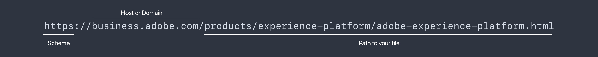

# API 101 - API에 대한 기본 소개

API는 Application Programming Interface를 의미합니다. 즉, 프로그램 간에 인터페이스가 있고 이러한 인터페이스는 프로그램이 통신할 수 있도록 합니다. 프로그래머들이 소프트웨어 응용 프로그램을 개발할 때, 그들은 종종 다른 소프트웨어나 하드웨어와 통신하기 위해 그들의 소프트웨어가 필요하다. API는 이러한 통신 및 상호 작용에 대한 내용, 방법, 시기, 장소 및 이유를 정의합니다.

API는 소프트웨어로 비즈니스 문제를 해결하는 방법입니다. 대부분의 비즈니스에서, 그것은 협력적인 노력입니다. 주요 용어, 개념 및 단계를 공유하여 공동 작업을 수행하는 것이 항상 더 쉽습니다.

웹 페이지에서 링크를 클릭하려고 하면 링크를 클릭할 때 브라우저에서 꽤 많은 API를 사용합니다. 브라우저는 클릭을 인식하고 방문할 페이지에 대한 요청을 만들고 인터넷을 통해 페이지를 검색한 다음 화면에 표시합니다. 그 사이에는 여러 작은 단계들이 있지만, 브라우저는 단지 웹 페이지를 표시하기 위해 다양한 API와 통신하고 상호 작용하는 소프트웨어입니다. 이 문서에서는 API를 사용하거나 논의할 때 중요한 용어, 개념 및 단계를 중점적으로 다룹니다.

이 글의 끝까지, 당신은 이러한 기본 용어, 개념, 단계에 대한 명확한 이해를 해야 한다. API 설명서는 광범위할 수 있으며, 특정 사용 사례를 해결하기 위해 API를 사용하는 방법에 대한 논의는 매우 자세해질 수 있습니다. 명확한 기본 사항과 공유된 이해를 통해 설명서를 탐색하고 API에 대해 논의하면 보다 쉽고 생산적입니다.

>[!NOTE]
>
> 많은 API가 있지만 여기서는 웹 및 브라우저 API에 중점을 둡니다. 기본적으로 한 소프트웨어 애플리케이션이 인터넷을 통해 다른 애플리케이션과 상호 작용할 때 중점을 둡니다.

## API 용어 및 개념

단어나 문구는 무엇을 의미하며, 어떻게 간단하고 쉽게 생각할 수 있는가? API에서 &quot;애플리케이션&quot; 부분은 소프트웨어 애플리케이션, 또는 프로그램을 의미한다. &quot;프로그래밍 인터페이스&quot; 부분은 특정 목적을 위해 응용 프로그램이 다른 응용 프로그램과 상호 작용하는 방법 및 위치를 나타냅니다. 웹 페이지 예제에서 링크를 클릭하면 브라우저가 서버에 웹 페이지에 대한 요청을 보냅니다.


이 스크린샷에서 마우스 커서가 Adobe Experience Platform 링크 위로 마우스를 가져갑니다. 맨 아래에 브라우저가 가져올 페이지의 &quot;주소&quot;를 보여 주는 웹 브라우저 상태 표시줄이 있습니다. 즉, Adobe Experience Platform 링크를 클릭하면 브라우저에 &quot;내 화면에서 이 페이지를 볼 수 있도록 해당 페이지를 가져옵니다.&quot;라고 표시됩니다.

링크를 클릭하면 브라우저가 서버에 페이지를 가져오도록 요청합니다. 웹 API에 일반적으로 사용되는 요청 메서드 중 하나인 `GET` 요청입니다. 브라우저가 요청을 이행하는 데 필요한 한 가지는 페이지 &quot;주소&quot;입니다. 웹에서 이 주소는 어디에 있습니까?

### URL의 일부


대부분의 브라우저에는 웹 페이지에 대한 &quot;주소&quot;의 일부 또는 모두를 표시하는 &quot;주소 표시줄&quot;이 있습니다. 브라우저가 클릭한 링크에 대한 페이지를 &quot;가져오기&quot;하면 이 주소 표시줄에 페이지의 &quot;주소&quot;가 표시됩니다. 그렇다면 웹 페이지의 &quot;주소&quot;는 무엇입니까?

위의 `https://business.adobe.com/products/experience-platform/adobe-experience-platform.html`은(는) 웹 페이지의 주소이며 URL 또는 Uniform Resource Locator라고 합니다. URL은 이 파일, 이미지 파일, 비디오 또는 기타 파일 형식과 같은 페이지를 의미할 수 있습니다.



이 주소인 URL에는 웹 및 브라우저 API와 매우 관련된 특정 부분이 있습니다.

**구성표**

위의 `scheme`은(는) 웹 API를 사용하는 `protocol`이라고도 하며, 일반적으로 `http` 또는 `https`입니다. HTTP 또는 HyperText Transfer Protocol은 웹 페이지와 같은 리소스를 웹 서버에서 웹 브라우저로 전송하는 방법입니다. HTTPS는 전송 중인 리소스에 대한 간섭을 방지하기 위해 보안을 사용하여 인터넷을 통해 전송되는 보안 버전입니다. HTTPS를 통해 페이지를 볼 때 브라우저 주소 표시줄에 작은 잠금 아이콘이 표시되는 것이 일반적입니다.

웹 API의 경우 이러한 리소스의 전송은 HTTP 요청(즉, HTTP를 통한 요청)을 통해 발생합니다.

**호스트 및 도메인**

`business.adobe.com`은(는) 요청한 리소스의 호스트입니다. 예제 링크를 클릭하면 브라우저는 URL의 이 부분을 사용하여 페이지가 호스팅된 서버를 찾습니다. 항상 웹 서버와 정확히 같지는 않지만 기본 수준에서 우리는 그것을 우리가 요청한 페이지를 브라우저에서 얻을 서버로 생각할 수 있습니다.

도메인 이름은 DNS라고 더 잘 알려진 도메인 이름 시스템의 일부입니다. 대부분의 사용자는 `adobe.com` 또는 `example.com`을(를) &quot;도메인 이름&quot;으로 생각하지만 API와 관련된 부분이 있습니다. `www.adobe.com` 및 `business.adobe.com`을(를) 도메인 이름으로 호출할 수 있지만 `www.` 및 `business.` 부분은 하위 도메인이라고 합니다. API는 종종 `api.example.com` 또는 `sub.www.example.com` 같은 하위 도메인을 포함하는 URL과 상호 작용합니다.

_host_&#x200B;이라는 용어가 `business.adobe.com`과(와) 같은 하위 도메인을 포함하는 전체 도메인 이름을 참조하는 것은 매우 일반적입니다. `adobe.com`과(와) 같은 하위 도메인이 없는 호스트를 참조할 때 _도메인_ 또는 _도메인 이름_&#x200B;이라는 용어를 보는 것도 일반적입니다. 여기서 숙주의 모든 부분과 변형에 대한 구체적인 용어를 암기하는 것은 중요하지 않다. 그러나 이러한 용어가 일반적으로 사용된다는 것을 아는 것이 중요하므로 비즈니스와 토론에 대한 관련 세부 사항을 명확히 할 수 있습니다.

**Origin**

Origin은 URL의 부분과 밀접하게 관련되어 있음을 알아야 하는 또 다른 용어입니다. 기본 수준에서 원본은 대략 `scheme` 더하기 `host` 더하기 `domain`과(와) 같은 `https://business.adobe.com`입니다. `https://business.adobe.com`과(와) `http://business.adobe.com`은(는) 다른 체계를 가지고 있으므로 같은 원본이 아닌 것처럼 다른 값이 다른 원본을 나타내는 경우가 많습니다. `https://www.adobe.com`과(와) `https://business.adobe.com`은(는) 하위 도메인이 달라서 많은 사용 시 동일한 원본이 아닙니다.

**경로**

위의 URL 예제에서 마지막 비트는 리소스(이 예제의 페이지)에 대한 `path`입니다. `/products/experience-platform/` 부분은 일반적으로 웹 서버의 폴더 또는 디렉터리를 나타냅니다. 문서와 사진을 저장할 폴더나 디렉토리가 컴퓨터에 있는 것처럼 웹 서버에도 컨텐츠를 구성할 수 있는 폴더가 있습니다. 마지막으로 `/adobe-experience-platform.html` 부분은 파일 이름(웹 페이지)입니다.

URL의 다른 더 자세한 부분은 이 시리즈의 다음 부분에서 강조 표시됩니다.

### 타사 API

웹 API를 타사 API라고도 합니다. 이것을 거래와 관련된 당사자들처럼 생각하십시오. 링크 예에서 사용자(특히 브라우저)는 페이지 요청의 첫 번째 당사자입니다. 웹 서버는 제2자입니다. 그럼 세 번째는 어디죠?

웹 페이지에 다른 호스트나 소스의 콘텐츠나 리소스가 포함되는 것은 일반적입니다. 이러한 경우 브라우저가 페이지를 표시하기 시작하면 해당 리소스를 호스팅하는 다른 호스트 또는 &quot;타사&quot;에 대해 다른 요청 세트를 만듭니다. 특히 비디오나 이미지와 같은 미디어 콘텐츠뿐만 아니라 보거나 사용할 때 업데이트해야 하는 데이터에도 매우 일반적입니다. 현재 시간, 현재 날씨 또는 특정 사용자에 대한 개인화된 환영 메시지를 가져오는 것은 모든 서드파티 API가 적절한 시간에 적절한 리소스를 제공할 수 있는 예입니다. 이러한 요청은 이러한 서드파티 API에서 오는 것이 일반적입니다.

## 웹 API의 일반적인 사용

시간, 날씨 또는 개인화된 콘텐츠 외에도 웹 API에 대한 많은 사용이 있습니다. twitter, TikTok, Facebook, LinkedIn, 스냅챗, Pinterest 등과 같은 소셜 미디어 플랫폼에는 프로그래머가 애플리케이션에서 사용할 수 있는 다양한 API가 있다. 물론 Adobe은 프로그래머가 사용하는 [다양한 API](https://developer.adobe.com/apis)를 통해 소프트웨어가 Adobe 제품 및 서비스와 상호 작용할 수 있습니다. 소프트웨어 제품 및 서비스는 이러한 API를 통해 다른 소프트웨어 제품 및 서비스에 액세스합니다.

## 예제 API

브라우저 API를 사용하면 프로그래머가 브라우저의 기능과 직접 상호 작용할 수 있습니다. Battery API를 사용하면 소프트웨어가 장치의 배터리 상태를 점검하여 필요한 경우 사용자에게 경고할 수 있습니다. 클립보드 API를 사용하면 소프트웨어가 디바이스의 클립보드를 사용하여 복사하거나 붙여넣을 수 있습니다. 전체 화면 API를 사용하면 소프트웨어에서 보기를 YouTube과 같은 장치의 전체 화면으로 확장하는 옵션을 제공할 수 있습니다.

Adobe Experience Platform Data Access API는 프로그래머가 Adobe Experience Platform에서 데이터 세트 파일에 액세스하고 다운로드할 수 있도록 하는 웹 API로, 자체 프로그램에서 고객 프로필 데이터를 사용할 수 있습니다. 이와 같은 API는 여러 API를 조합하여 일련의 단계를 수행하도록 소프트웨어가 프로그래밍되는 소프트웨어 자동화 프로세스의 일부인 것이 매우 일반적입니다. 이러한 동일한 단계를 수동으로 수행하는 것에 비해 상당한 비용 절감 효과를 얻을 수 있습니다.

## API 엔드포인트

프로그래머는 프로그램에서 브라우저나 웹 API를 &quot;사용&quot;할 때 일반적으로 웹 페이지를 요청하는 예제 브라우저와 같은 리소스를 보내거나 받도록 요청합니다. API 설명서에는 이러한 요청에 대한 &quot;끝점&quot;이 나열되는 경우가 많습니다(예: `https://platform.adobe.io/data/foundation/export/files/{dataSetFileId}`). 프로그래머가 데이터 세트 파일을 가져오는 데 사용할 Platform Data Access API의 특정 패턴 또는 &quot;엔드포인트&quot;입니다.

중괄호로 둘러싸인 `{dataSetFileId}`은(는) 프로그래머가 요청에서 보내야 하는 값을 나타냅니다. 따라서 실제 API 요청의 URL은 `https://platform.adobe.io/data/foundation/export/files/xyz123brb`과(와) 비슷합니다. `xyz123brb`은(는) 프로그래머가 수신하려는 데이터 세트 파일의 유효한 ID여야 합니다.

즉, 브라우저가 특정 URL에 페이지를 가져오는 것처럼 API 요청은 이 데이터 세트 예처럼 특정 끝점에서 리소스를 가져오거나 특정 끝점으로 리소스를 보냅니다.

## HTTP 요청 메서드

이 시점에서 웹 API는 웹 페이지 또는 데이터 세트와 같은 리소스에 대한 요청을 수행한다는 점을 명확히 해야 합니다. 대부분의 소프트웨어 개념과 마찬가지로 이러한 HTTP 요청은 반복 가능한 패턴을 따릅니다. 요청이 소프트웨어 응용 프로그램에서 요청을 평가한 다음 응답하는 다른 소프트웨어 응용 프로그램으로 전송됩니다. 브라우저는 웹 서버에서 페이지를 요청하고 페이지 컨텐츠에 응답합니다.

요청에서 응답까지의 전체 프로세스에는 여러 개의 작고 매우 상세한 단계가 포함되지만 요청 방법은 간단합니다. 요청 메서드는 요청 중인 작업을 정의합니다.

**`GET`**

`GET` 요청 메서드는 웹 페이지 및 데이터 세트 예제와 같은 리소스를 제공하는 응답을 요청할 때 사용됩니다. 브라우저에서 링크를 클릭하거나 모바일 장치에서 링크를 탭하면 `GET` 요청이 백그라운드에서 수행됩니다.

**`POST`**

`POST` 메서드가 요청과 함께 데이터를 보냅니다. &quot;요청&quot;이 데이터를 보내는 것이 이상하게 들릴 수 있지만, API 요청을 만드는 것은 끝점인 수신 소프트웨어에서 요청을 수락하도록 요청하고, `POST`의 경우 전송되는 데이터도 수락하도록 요청하는 것입니다. 전송된 데이터는 일반적으로 데이터베이스나 파일과 같은 데이터 저장소에 기록되므로 저장할 수 있습니다.

**`PUT`**

`PUT` 요청 메서드는 데이터를 보내기 때문에 `POST`과(와) 유사하지만, 전송 중인 데이터가 끝점에 이미 있으면 `PUT`이(가) 기존 데이터를 대체하여 업데이트합니다. `POST`은(는) 업데이트되지 않고 단순히 전송되므로, 여러 `POST` 요청이 기존 레코드를 업데이트하는 대신 전송된 데이터의 여러 레코드를 만들 수 있습니다.

**`PATCH`**

`PATCH` 요청 메서드는 계정 프로필을 업데이트하여 주소를 변경하는 경우와 같이 기존 레코드의 일부를 업데이트하는 데이터를 보내는 데 사용됩니다. `POST` 요청으로 추가 프로필을 만들 수 있으며 `PUT`을(를) 사용하면 기존 프로필을 바꿀 수 있지만 `PATCH` 메서드를 사용하면 주소와 같이 기존 레코드의 관련 부분을 업데이트할 수 있습니다.

**`DELETE`**

`DELETE` 요청 메서드는 계정 프로필을 완전히 삭제하기 위해 링크를 클릭하는 경우와 같이 요청에 지정된 리소스를 제거합니다.

몇 가지 다른 메서드가 있지만, 이 목록은 API를 사용하여 작업할 때 가장 일반적인 메서드 목록입니다.

### 요청 예

이제 API와 관련된 기본 용어, 개념 및 단계를 살펴보았으므로, 실제 API 요청 예를 살펴보겠습니다.

브라우저 예제의 페이지에 `https://business.adobe.com/products/experience-platform/adobe-experience-platform.html` URL이 있습니다. Adobe Experience Platform 링크를 클릭하면 브라우저가 이 페이지에 대해 `GET` 요청을 합니다. 당사는 브라우저에서 작업을 수행하므로 클릭만 하면 되지만, 프로그래머가 소프트웨어 애플리케이션에서 해당 요청이 발생하기를 원하는 경우 API 요청이 성공적으로 이행되는 데 필요한 모든 세부 정보를 제공해야 합니다.

다음은 코드에서 표시되는 방식입니다.

```js
fetch(
  "https://business.adobe.com/products/experience-platform/adobe-experience-platform.html",
  {
    headers: {
      accept:
        "text/html,application/xhtml+xml,application/xml;q=0.9,image/webp,image/apng,*/*;q=0.8,application/signed-exchange;v=b3;q=0.9",
      "accept-language": "en-US,en;q=0.9",
      "sec-ch-ua":
        '" Not A;Brand";v="99", "Chromium";v="101", "Microsoft Edge";v="101"',
      "sec-fetch-dest": "document",
      "sec-fetch-mode": "navigate",
      "sec-fetch-site": "none",
      "sec-fetch-user": "?1",
      "upgrade-insecure-requests": "1",
    },
    referrerPolicy: "strict-origin-when-cross-origin",
    body: null,
    method: "GET",
    mode: "cors",
    credentials: "include",
  }
);
```

위의 코드에서는 브라우저가 요청하는 `URL`을(를) 볼 수 있으며 아래 부분에 `method: "GET"` 요청 메서드가 있습니다. 다른 코드 줄도 요청의 일부이지만 이 문서의 범위를 벗어납니다.


*[API]: 응용 프로그램 프로그래밍 인터페이스
*[URL]: Uniform Resource Locator
*[HTTP]: 하이퍼텍스트 전송 프로토콜
*[DNS]: 도메인 이름 시스템
