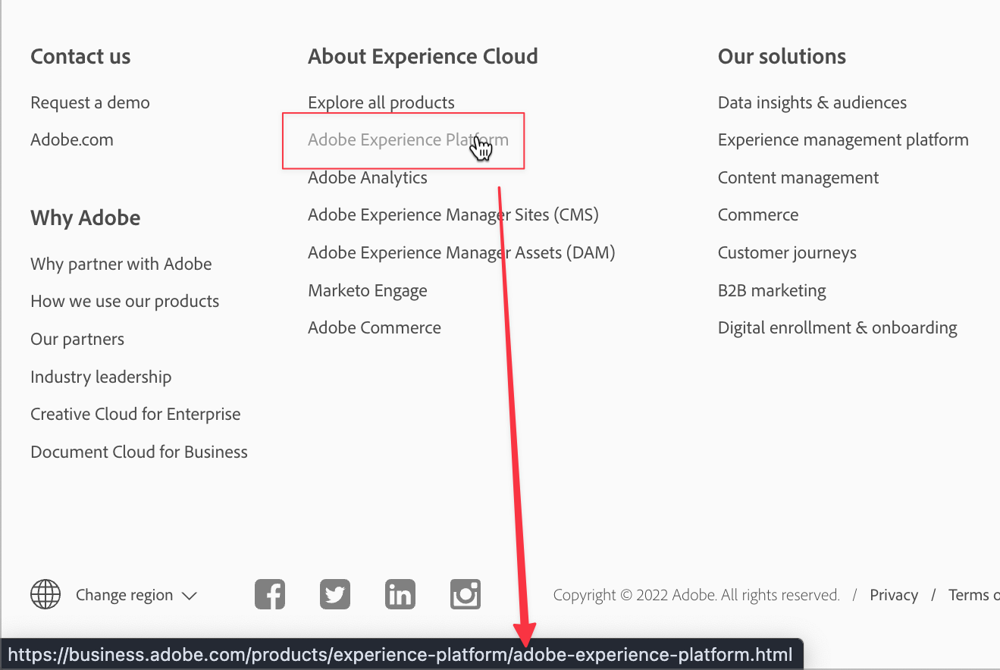

# API 101 - API에 대한 기본 소개

API는 애플리케이션 프로그래밍 인터페이스를 의미합니다. 즉, 프로그램 사이에 인터페이스가 있고 이 인터페이스 사이에 프로그램이 통신할 수 있습니다. 프로그래머가 소프트웨어 응용 프로그램을 개발할 때 다른 소프트웨어나 하드웨어와 통신하는 데 종종 소프트웨어가 필요합니다. API는 그러한 통신 및 상호 작용에 대한 이유, 방법, 시기, 위치 및 이유를 정의합니다.

API는 소프트웨어로 비즈니스 문제를 해결하는 방법입니다. 대부분의 기업에서는 공동 작업을 수행합니다. 공동 작업은 주요 용어, 개념 및 단계를 공유하여 항상 더 쉽게 수행할 수 있습니다.

웹 페이지에서 링크를 클릭하는 것에 대해 생각해 보면 링크를 클릭할 때 브라우저가 꽤 많은 API를 사용합니다. 브라우저는 클릭을 인식하고 방문할 페이지에 대해 요청을 수행하고 인터넷을 통해 페이지를 검색한 다음 화면에 표시합니다. 중간 단계에는 더 작은 단계가 있지만, 브라우저가 다양한 API와 통신하고 상호 작용하는 소프트웨어로서 웹 페이지를 보여주는 것입니다. 이 문서에서는 API를 사용하거나 논의할 때 중요한 용어, 개념 및 단계를 강조 표시합니다.

이 문서의 끝 부분에는 이러한 기본 용어, 개념 및 단계를 명확하게 이해할 수 있어야 합니다. API 설명서는 광범위할 수 있으며 API를 사용하여 특정 사용 사례를 처리하는 방법에 대한 논의를 통해 매우 자세한 내용을 얻을 수 있습니다. 설명서를 탐색하고 API에 대해 논의하는 것은 명확한 기본 사항과 공유 이해를 통해 보다 쉽고 생산적입니다.

>[!NOTE]
>
> API가 많은 동안 여기에 중점을 두는 것은 웹 및 브라우저 API입니다. 기본적으로 한 소프트웨어 애플리케이션이 인터넷을 통해 다른 애플리케이션과 상호 작용할 때

## API 용어 및 개념

어떤 단어나 구절이 의미하는 것이며, 어떻게 그것을 간단하고 쉽게 생각할 수 있습니까? API에서 &quot;application&quot; 부분은 소프트웨어 애플리케이션 또는 프로그램을 의미합니다. 프로그래밍 인터페이스 부분은 특정 목적으로 응용 프로그램이 다른 응용 프로그램과 상호 작용하는 방법 및 위치를 나타냅니다. 웹 페이지 예제에서 링크를 클릭하면 브라우저가 웹 페이지에 대한 요청을 서버에 전송합니다.



이 스크린샷에서는 마우스 커서가 Adobe Experience Platform 링크 위로 마우스를 가져갑니다. 맨 아래는 브라우저가 가져올 페이지의 &quot;주소&quot;를 표시하는 웹 브라우저 상태 표시줄입니다. 즉, Adobe Experience Platform 링크를 클릭하면 브라우저에 &quot;내 화면에서 볼 수 있도록 해당 페이지를 가져올 수 있습니다.&quot;가 표시됩니다.

링크를 클릭하면 브라우저가 서버로 페이지를 가져오도록 요청합니다. 이것은 `GET` 요청, 웹 API에 일반적으로 사용되는 요청 메서드 중 하나입니다. 브라우저가 이 요청을 충족하기 위해 필요한 한 가지 사항은 페이지 &quot;주소&quot;입니다. 이 주소는 웹에서 어디에 있습니까?

### URL의 일부


대부분의 브라우저에는 웹 페이지의 일부 또는 전부를 표시하는 &quot;주소 표시줄&quot;이 있습니다. 브라우저에서 클릭한 링크의 페이지를 &quot;가져오기&quot;하면 이 주소 표시줄에 페이지의 &quot;주소&quot;가 표시됩니다. 웹 페이지의 &quot;주소&quot;는 무엇입니까?

그 `https://business.adobe.com/products/experience-platform/adobe-experience-platform.html` 위에 있는 것은 웹에 있는 페이지의 주소이며 URL 또는 Uniform Resource Locator라고 합니다. URL은 이와 같은 페이지, 이미지 파일, 비디오 또는 기타 파일 유형을 참조할 수 있습니다.


이 주소 URL에는 웹 및 브라우저 API와 관련된 특정 부분이 있습니다.

**체계**

다음 `scheme` 상단이라고도 합니다 `protocol` 웹 API를 사용하는 경우 일반적으로 다음 중 하나가 됩니다. `http` 또는 `https`. HTTP 또는 HyperText Transfer Protocol은 웹 페이지와 같은 리소스를 웹 서버에서 웹 브라우저로 전송하는 방법입니다. HTTPS는 전송 중인 리소스에 대한 간섭을 방지하기 위한 보안을 사용하여 인터넷에서 전송이 발생하는 보안 버전입니다. HTTPS를 통해 페이지를 볼 때 브라우저 주소 표시줄에 작은 잠금 아이콘을 표시하는 것이 일반적입니다.

웹 API의 경우 이러한 리소스의 전송은 HTTP 요청(즉, HTTP를 통한 요청)을 통해 수행됩니다.

**호스트 및 도메인**

다음 `business.adobe.com` 은 요청 중인 리소스의 호스트입니다. 예제 링크를 클릭하면 브라우저가 URL의 이 부분을 사용하여 페이지가 호스팅되는 서버를 찾습니다. 웹 서버와 항상 동일하지는 않지만 기본 수준에서 브라우저가 요청한 페이지를 가져올 서버로 생각할 수 있습니다.

도메인 이름은 DNS라고 하는 도메인 이름 시스템의 일부입니다. 대부분의 사람들은 `adobe.com` 또는 `example.com` 를 &quot;도메인 이름&quot;으로 사용할 수 있지만 API와 관련된 부분이 있습니다. `www.adobe.com` 및 `business.adobe.com` 도메인 이름이라고 할 수 있지만 `www.` 그리고 `business.` 부분을 하위 도메인이라고 합니다. API는 다음과 같은 하위 도메인을 포함하는 URL과 상호 작용하는 경우가 많습니다 `api.example.com` 또는 `sub.www.example.com`.

그 용어를 보는 것은 매우 흔한 일이다 _호스트_ 과 같은 하위 도메인을 포함하는 전체 도메인 이름 을 참조하십시오. `business.adobe.com`. 이 용어를 보는 것도 일반적입니다 _도메인_ 또는 _도메인 이름_ 과 같은 하위 도메인이 없는 호스트를 참조하는 경우 `adobe.com`. 여기서 각 부분에 대한 특정 용어를 암기하는 것과 호스트의 변형은 중요하지 않습니다. 그러나 이러한 용어가 일반적으로 사용된다는 것을 인식하는 것은 비즈니스 및 토론의 관련 세부 사항을 명확히 하기 위해 중요합니다.

**Origin**

Origin은 URL의 부분과 밀접한 관련이 있는 것을 잘 알고 있는 또 다른 용어입니다. 기본적인 수준에서, 유래는 대략 `scheme` 플러스 `host` 플러스 `domain` 좋아요 `https://business.adobe.com`. 다른 값은 종종 다음과 같은 서로 다른 출처를 나타냅니다. `https://business.adobe.com` 및 `http://business.adobe.com` 조직도 달라 본인과 동지가 아니다. `https://www.adobe.com` 및 `https://business.adobe.com` 또한 서로 다른 하위 도메인으로 인해 많은 사용에서 동일한 출처가 아닙니다.

**경로**

위의 URL 예에서 마지막 비트는 입니다 `path` 리소스 - 이 예제의 페이지에 표시됩니다. 다음 `/products/experience-platform/` 이 부분은 일반적으로 웹 서버의 폴더 또는 디렉터리를 나타냅니다. 문서와 사진을 위한 폴더나 디렉터리가 컴퓨터에 있는 것처럼 웹 서버에도 컨텐츠를 구성할 폴더가 있습니다. 그리고 마지막으로, `/adobe-experience-platform.html` part는 파일 이름(웹 페이지)입니다.

이 시리즈의 다음 부분에서 강조 표시될 URL의 다른 세부 부분이 있습니다.

### 타사 API

웹 API를 타사 API라고 하는 경우가 있습니다. 거래 당사자들처럼 생각해 보세요. 링크 예제에서는 페이지 요청에 있는 자사 브라우저가 됩니다. 웹 서버는 제2자입니다. 그럼 세 번째는 어디죠?

웹 페이지에서 다른 호스트나 소스의 컨텐츠나 리소스를 포함하는 것이 일반적입니다. 이러한 경우 브라우저에서 페이지를 표시하려고 하면 다른 호스트에 대한 다른 요청 세트 또는 이러한 리소스를 호스트하는 &quot;제3자&quot;를 만듭니다. 이는 매우 일반적입니다. 특히 비디오나 이미지와 같은 미디어 컨텐츠뿐만 아니라 보거나 사용할 때 업데이트해야 하는 데이터의 경우 특히 일반적입니다. 현재 시간, 현재 날씨 또는 특정 사용자에 대해 개인화된 환영 메시지를 가져오는 것은 타사 API가 적절한 시간에 적절한 리소스를 제공할 수 있는 모든 예입니다. 이러한 요청은 이러한 타사 API에서 가져오는 경우가 일반적입니다.

## 웹 API에 대한 일반적인 사용

하루 중 시간, 날씨 또는 개인화된 콘텐츠 외에도 웹 API를 위한 다양한 사용 방법이 있습니다. twitter, TikTok, Facebook, LinkedIn, Snapchat, Pinterest 등과 같은 소셜 미디어 플랫폼에는 프로그래머가 애플리케이션에 사용할 수 있는 다양한 API가 있습니다. 그리고 물론, Adobe은 또한 [다양한 API](https://developer.adobe.com/apis) 프로그래머들이 Adobe 제품 및 서비스와 상호 작용할 수 있도록 합니다. 소프트웨어 제품 및 서비스는 이러한 API를 통해 다른 소프트웨어 제품 및 서비스에 액세스합니다.

## 예제 API

브라우저 API를 사용하여 프로그래머가 브라우저의 기능과 직접 상호 작용할 수 있습니다. 배터리 API를 사용하면 필요한 경우 경고할 수 있도록 장치의 배터리 상태를 확인할 수 있습니다. 클립보드 API를 사용하여 소프트웨어의 클립보드로 복사하거나 붙여넣을 수 있습니다. 전체 화면 API를 사용하면 소프트웨어에서 보기를 YouTube과 같은 장치의 전체 화면으로 확장하는 옵션을 표시할 수 있습니다.

Adobe Experience Platform 데이터 액세스 API는 프로그래머가 Adobe Experience Platform에서 데이터 세트 파일에 액세스하고 다운로드할 수 있도록 하는 웹 API로, 자체 프로그램에서 고객 프로필 데이터를 사용할 수 있습니다. 이와 같은 API는 여러 API를 함께 사용하여 일련의 단계를 수행하도록 소프트웨어를 프로그래밍하는 소프트웨어 자동화 프로세스의 일부가 되는 것이 매우 일반적입니다. 이러한 동일한 단계를 수동으로 수행하는 것보다 비용이 많이 절감되는 경우가 많습니다.

## API 엔드포인트

프로그래머가 프로그램에서 브라우저 또는 웹 API를 &quot;사용&quot;할 때 일반적으로 웹 페이지를 요청하는 예제 브라우저와 같이 리소스를 보내거나 받도록 요청합니다. API 설명서는 이러한 요청에 대한 &quot;엔드포인트&quot;를 종종 나열합니다. 예: `https://platform.adobe.io/data/foundation/export/files/{dataSetFileId}`. 프로그래머가 데이터 집합 파일을 가져오는 데 사용할 Platform 데이터 액세스 API의 특정 패턴 또는 &quot;끝점&quot;입니다.

다음 `{dataSetFileId}` 이러한 중괄호로 둘러싸인 는 프로그래머가 요청에서 전송해야 하는 값을 나타냅니다. 따라서 실제 API 요청의 URL은 다음과 같이 표시됩니다 `https://platform.adobe.io/data/foundation/export/files/xyz123brb` 여기서 `xyz123brb` 프로그래머가 받을 데이터 세트 파일의 유효한 ID여야 합니다.

즉, 브라우저가 특정 URL에서 페이지를 가져오듯이 API 요청에서 리소스를 가져오거나 이 데이터 세트 예와 같은 특정 엔드포인트에 리소스를 보냅니다.

## HTTP 요청 메서드

이때 웹 API가 웹 페이지 또는 데이터 세트와 같은 리소스에 대해 요청을 수행하는 것은 분명해야 합니다. 대부분의 소프트웨어 개념과 마찬가지로 이러한 HTTP 요청은 반복 가능한 패턴을 따릅니다. 요청은 소프트웨어 애플리케이션에서 요청을 평가한 다음 응답하는 다른 소프트웨어 애플리케이션으로 전송됩니다. 브라우저는 웹 서버에서 페이지를 요청하고 페이지 컨텐츠에 응답합니다.

요청에서 응답까지 전체 프로세스에는 매우 간단하고 작은 단계가 포함되지만 요청 방법은 간단합니다. 요청 메서드는 요청 중인 작업을 정의합니다.

**`GET`**

다음 `GET` 요청 방법은 웹 페이지 및 데이터 세트 예와 같이 리소스를 제공하는 응답을 요청할 때 사용됩니다. 브라우저에서 링크를 클릭하거나 모바일 장치에서 링크를 탭하면 `GET` 뒷조사.

**`POST`**

다음 `POST` 메서드는 요청을 사용하여 데이터를 전송합니다. &quot;요청&quot;이 데이터를 보내는 것은 이상하게 들릴 수 있지만, API 요청을 만드는 것은 종단점(수신 소프트웨어)이 요청을 수락하도록, 또는 의 경우 `POST`로 설정되면 eVar는 전송할 데이터도 수락합니다. 전송된 데이터는 일반적으로 데이터베이스나 파일과 같은 데이터 저장소에 기록되므로 저장할 수 있습니다.

**`PUT`**

다음 `PUT` 요청 메서드는 다음과 비슷합니다 `POST` 는 데이터를 전송하지만 전송 중인 데이터가 이미 엔드포인트에 있는 경우, `PUT` 은(는) 기존 데이터를 대체하여 업데이트합니다. A `POST` 업데이트하지 않고, 전송하므로 `POST` 요청은 기존 레코드를 업데이트하는 대신 전송된 데이터의 여러 레코드를 만들 수 있습니다.

**`PATCH`**

다음 `PATCH` 요청 방법은 계정 프로필을 업데이트하여 주소를 변경하는 경우와 같이 기존 레코드의 일부를 업데이트하는 데이터를 전송하는 데 사용됩니다. 다음 포함 `POST` 추가 프로필을 만들고 `PUT`기존 프로필을 대신 `PATCH` 우리는 단순히 우리의 주소와 같이 기존의 레코드의 관련 부분을 업데이트한다.

**`DELETE`**

다음 `DELETE` 요청 메서드는 링크를 클릭하여 계정 프로필을 완전히 삭제하는 경우와 같이 요청에 지정된 리소스를 제거합니다.

몇 가지 다른 방법이 있지만 API를 사용할 때 가장 일반적인 방법 목록입니다.

### 요청 예

이제 API와 관련된 기본 용어, 개념 및 단계가 있으므로 API 요청의 예를 실제로 확인할 수 있습니다.

브라우저 예제의 페이지에 `https://business.adobe.com/products/experience-platform/adobe-experience-platform.html`. Adobe Experience Platform 링크를 클릭하면 브라우저가 `GET` 이 페이지에 대한 요청. 브라우저 내에서 작업을 수행할 수 있으므로 클릭만 하면 되지만, 프로그래머가 소프트웨어 애플리케이션에서 해당 요청이 수행되기를 원하는 경우 API 요청이 성공적으로 수행되도록 하는 데 필요한 모든 세부 정보를 제공해야 합니다.

다음은 코드에서 이 표시되는 방식입니다.

```js
fetch(
  "https://business.adobe.com/products/experience-platform/adobe-experience-platform.html",
  {
    headers: {
      accept:
        "text/html,application/xhtml+xml,application/xml;q=0.9,image/webp,image/apng,*/*;q=0.8,application/signed-exchange;v=b3;q=0.9",
      "accept-language": "en-US,en;q=0.9",
      "sec-ch-ua":
        '" Not A;Brand";v="99", "Chromium";v="101", "Microsoft Edge";v="101"',
      "sec-fetch-dest": "document",
      "sec-fetch-mode": "navigate",
      "sec-fetch-site": "none",
      "sec-fetch-user": "?1",
      "upgrade-insecure-requests": "1",
    },
    referrerPolicy: "strict-origin-when-cross-origin",
    body: null,
    method: "GET",
    mode: "cors",
    credentials: "include",
  }
);
```

위의 코드에서 다음을 볼 수 있습니다. `URL` 브라우저가 요청하는 경우 아래쪽의 아래쪽이 입니다. `method: "GET"` 요청 메서드. 다른 코드 행도 요청의 일부이지만 이 문서의 범위를 벗어납니다.


*[API]: 응용 프로그램 프로그래밍 인터페이스 *[URL]: Uniform Resource Locator *[HTTP]: 하이퍼텍스트 전송 프로토콜 *[DNS]: 도메인 이름 시스템
