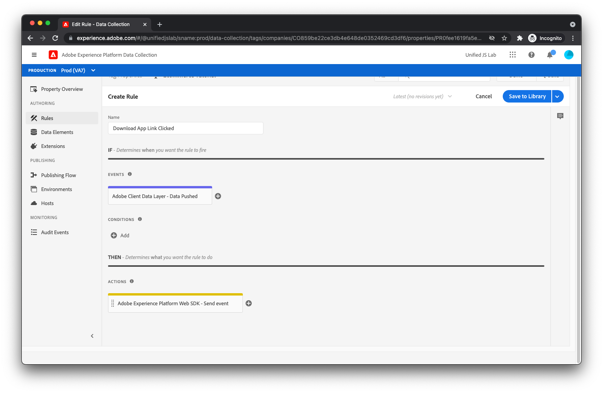

# 앱 다운로드 추적을 위한 데이터 요소 및 규칙 만들기

다시 말해서 사용자가 [!UICONTROL 앱 다운로드] 링크를 누르면 다음과 같이 데이터 레이어로 푸시됩니다.

```js
window.adobeDataLayer.push({
  "event": "downloadAppClicked",
  "eventInfo": {
    "web": {
      "webInteraction": {
        "URL": "https://example.com/download",
        "name": "App Download",
        "type": "download"
      }
    }
  }
});
```

다음을 사용했습니다. `eventInfo` 키: 데이터 계층에 이벤트와 함께 이 데이터를 전달하지만 _아님_ 데이터 레이어 내에 데이터를 유지합니다. 링크 클릭의 경우, 클릭한 링크에 대한 정보를 데이터 레이어에 추가하는 것은 유용하지 않습니다. 이는 나중에 페이지에서 발생할 수 있는 다른 이벤트에 적용할 수 없기 때문입니다.

이 구현의 경우 (1) 데이터 계층의 계산된 상태 및 (2) 의 콘텐츠가 병합된 결과가 포함된 경험 이벤트를 Adobe Experience Platform에 보냅니다. `eventInfo`.

이렇게 하려면 먼저 이러한 두 개의 정보 청크를 병합하는 데이터 요소를 만들어야 합니다.

## 데이터 요소 만들기

적절한 데이터 요소를 만들려면 [!UICONTROL 데이터 요소] 왼쪽 메뉴에서 을 클릭합니다. 그런 다음 [!UICONTROL 데이터 요소 추가] 링크를 클릭합니다.

데이터 요소 이름에 을 입력합니다. `computedStateAndEventInfo`. 의 경우 [!UICONTROL 확장] 필드, 선택 [!UICONTROL 코어] 아직 선택하지 않은 경우. 의 경우 [!UICONTROL 데이터 요소 유형] 필드, 선택 [!UICONTROL 병합된 오브젝트]. 이 데이터 요소를 사용하여 여러 개체를 깊게 병합할 수 있습니다. 병합된 결과가 데이터 요소에 의해 반환됩니다.

병합에 포함할 첫 번째 객체에 대해 을 입력합니다 `%event.fullState%`. 에 의해 트리거된 규칙 내에서 사용될 때 [!UICONTROL 데이터 푸시됨] 규칙 이벤트입니다. 이 이벤트는 규칙이 트리거될 때 Adobe 클라이언트 데이터 레이어의 계산된 상태를 참조합니다.

클릭 [!UICONTROL 다른 항목 추가].

두 번째 객체의 경우 다음을 입력합니다. `%event.eventInfo%`. 에 의해 트리거된 규칙 내에서 사용될 때 [!UICONTROL 데이터 푸시됨] 규칙 이벤트입니다. 이 이벤트는 `eventInfo` Adobe 클라이언트 데이터 레이어에 푸시된 부분입니다.


데이터 요소가 완료되었습니다. 다음을 클릭하여 데이터 요소를 저장합니다. [!UICONTROL 저장] 단추를 클릭합니다.

## 규칙 만들기

에서 클릭 추적을 위한 규칙을 만들려면 [!UICONTROL 앱 다운로드] 링크, 먼저 클릭 [!UICONTROL 규칙] 왼쪽 메뉴에서 을 클릭합니다.

[!UICONTROL 규칙 추가]를 클릭합니다.

규칙 이름에 을 입력합니다. _클릭한 앱 링크 다운로드_.

## 이벤트 추가

다음을 클릭합니다. [!UICONTROL 추가] 아래에 있는 단추 [!UICONTROL 이벤트]. 이제 이벤트 보기에 가 표시됩니다. 의 경우 [!UICONTROL 확장] 필드, 선택 [!UICONTROL Adobe 클라이언트 데이터 레이어]. 의 경우 [!UICONTROL 이벤트 유형] 필드, 선택 [!UICONTROL 데이터 푸시됨].

왜냐하면 다음과 같은 경우에만 이 규칙이 트리거되도록 하기 때문입니다. `downloadAppClicked` 이벤트가 데이터 레이어로 푸시된 후 [!UICONTROL 특정 이벤트] 아래에 라디오 [!UICONTROL 들어보기] 및 유형 _downloadAppClicked_ 대상: [!UICONTROL 등록할 이벤트/키]  표시되는 텍스트 필드입니다.


[!UICONTROL 변경사항 유지]를 클릭합니다.

## 작업 추가

이제 규칙 보기로 돌아왔으므로 [!UICONTROL 추가] 아래에 있는 단추 [!UICONTROL 작업]. 이제 작업 보기에 있어야 합니다. 의 경우 [!UICONTROL 확장] 필드, 선택 [!UICONTROL Adobe Experience Platform 웹 SDK]. 의 경우 [!UICONTROL 작업 유형] 필드, 선택 [!UICONTROL 이벤트 보내기].

화면 오른쪽에서 [!UICONTROL 유형] 필드 및 선택 `web.webinteraction.linkClicks`.

의 경우 [!UICONTROL XDM 데이터] 필드에서 데이터 요소 선택기 버튼을 클릭하고 다음을 선택합니다. [!UICONTROL computedStateAndEventInfo]. 방금 만든 데이터 요소입니다.

이 규칙(사용자가 만든 다른 규칙과 달리)의 경우 [!UICONTROL 문서가 언로드됩니다.] 확인란. 이는 본질적으로 사용자가 링크를 클릭할 때 페이지에서 멀어질 것임을 SDK에 알려줍니다. 이는 사용자가 페이지를 떠나더라도 요청이 백그라운드에서 계속 실행되고 서버에 도달하는 방식을 SDK가 요청할 수 있기 때문에 중요합니다. 이 확인란의 선택을 취소하면 이 방식으로 요청이 수행되지 않으므로 현재 문서가 언로드될 때 취소될 수 있습니다.

여러분은 아마 스스로에게 물어보고 있을지도 모릅니다. &quot;그거 좋군요. 이 옵션이 항상 활성화되지 않는 이유는 무엇입니까?&quot;

약간 복잡하지만 이 기능을 사용할 때 SDK는 라는 브라우저 메서드를 사용합니다 [`sendBeacon`](https://developer.mozilla.org/ko-KR/docs/Web/API/Navigator/sendBeacon) 요청을 보냅니다. 을 사용하여 요청을 보낼 때 `sendBeacon`, 브라우저는 SDK(또는 기타 항목)가 서버에서 반환된 데이터에 액세스하는 것을 허용하지 않습니다. SDK가 모든 요청에 대해 이 기능을 사용해야 한다면 SDK는 서버에서 데이터를 수신할 수 없습니다. 따라서 다음을 확인하는 것이 중요합니다. [!UICONTROL 문서가 언로드됩니다.] 확인란은 현재 문서를 언로드할 때만 나타나며, 이 경우 응답 데이터를 삭제할 수 있습니다.


다음 아이콘을 클릭하여 작업을 저장합니다. [!UICONTROL 변경 내용 유지] 단추를 클릭합니다.

## 규칙을 저장합니다

이제 규칙을 완료해야 합니다.



을(를) 클릭하여 규칙 저장 [!UICONTROL 저장].
