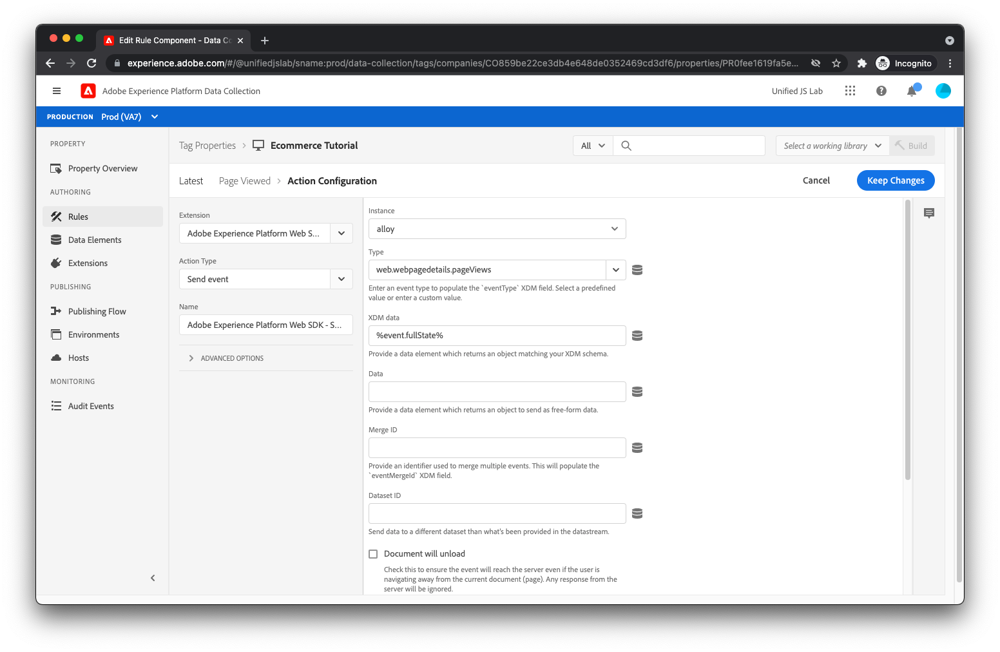

# 페이지 보기 및 상거래 이벤트 추적 규칙 만들기

사용자가 제품 페이지를 보았는지 추적하려면, Adobe Experience Platform 태그 내에 규칙을 만듭니다. 다음을 클릭하여 수행합니다 [!UICONTROL 규칙] 왼쪽 메뉴에서 [!UICONTROL 규칙 추가].

규칙 이름에 을 입력합니다. _페이지 조회수_.

## 이벤트 추가

을(를) 클릭합니다. [!UICONTROL 추가] 버튼 아래 [!UICONTROL 이벤트]. 이제 이벤트 보기에 표시됩니다. 대상 [!UICONTROL 확장] 필드, 선택 [!UICONTROL Adobe 클라이언트 데이터 레이어]. 대상 [!UICONTROL 이벤트 유형] 필드, 선택 [!UICONTROL 푸시된 데이터].

왜냐하면 `pageViewed` 이벤트가 데이터 레이어에 푸시되면 [!UICONTROL 특정 이벤트] 아래에 [!UICONTROL 다음 사항] 및 유형 _pageViewed_ 로 [!UICONTROL 등록할 이벤트/키] 텍스트 필드.

[!UICONTROL 변경사항 유지]를 클릭합니다.

## 작업 추가

규칙 보기로 다시 이동되었으므로 [!UICONTROL 추가] 버튼 아래 [!UICONTROL 작업]. 이제 작업 보기에 있어야 합니다. 대상 [!UICONTROL 확장] 필드, 선택 [!UICONTROL Adobe Experience Platform Web SDK]. 대상 [!UICONTROL 작업 유형] 필드, 선택 [!UICONTROL 이벤트 보내기]. 이 작업을 통해 Adobe Experience Platform Edge Network에 경험 이벤트를 보낼 수 있습니다.

화면 오른쪽에서 [!UICONTROL 유형] 필드 및 선택 `web.webpagedetails.pageViews`. Adobe Experience Platform에서 제공하는 표준 경험 이벤트 유형 중 하나입니다. 페이지 보기를 나타냅니다.

대상 [!UICONTROL XDM 데이터] 필드, 입력 `%event.fullState%`. 규칙이 트리거될 때 캡처되는 데이터 레이어의 계산된 상태(전체 상태라고도 함)를 경험 이벤트의 일부로 전송해야 함을 나타냅니다.

웹 사이트에서 데이터 레이어로 푸시한 데이터가 XDM 스키마를 따르지 않거나 데이터 레이어의 계산된 상태의 일부만 전송하려는 경우, [!UICONTROL XDM 개체] 스키마와 일치하는 적절한 개체를 만들기 위한 데이터 요소 유형(Adobe Experience Platform Web SDK 확장에서 제공)입니다.

을(를) 클릭합니다. [!UICONTROL 변경 내용 유지] 버튼을 클릭합니다.

## 규칙을 저장합니다

이제 규칙이 완료되어야 합니다.

을 클릭하여 규칙을 저장합니다 [!UICONTROL 저장].

## 프로세스를 반복합니다

제품을 보고, 장바구니가 열리며, 제품이 장바구니에 추가되는 경우에 대한 규칙을 만들려면 위에 설명된 프로세스를 반복합니다. 규칙 간의 유일한 차이점은 에 입력된 값, 규칙 이름입니다. [!UICONTROL 등록할 이벤트/키] 의 필드 [!UICONTROL 푸시된 데이터] 이벤트 및 [!UICONTROL 유형] 의 필드 [!UICONTROL 이벤트 보내기] 작업. 다음은 각 규칙의 값입니다.

제품 보기 규칙:

* **규칙 이름**: _본 제품_
* **등록할 이벤트/키** within [!UICONTROL 푸시된 데이터] 이벤트: `productViewed`
* **유형** within [!UICONTROL 이벤트 보내기] 작업: `commerce.productViews`

장바구니 열린 규칙:

* **규칙 이름**: _장바구니 열림_
* **등록할 이벤트/키** within [!UICONTROL 푸시된 데이터] 이벤트: `cartOpened`
* **유형** within [!UICONTROL 이벤트 보내기] 작업: `commerce.productListOpens`

장바구니 규칙에 추가된 제품:

* **규칙 이름**: _장바구니에 추가된 제품_
* **등록할 이벤트/키** within [!UICONTROL 푸시된 데이터] 이벤트: `productAddedToCart`
* **유형** within [!UICONTROL 이벤트 보내기] 작업: `commerce.productListAdds`

다음으로, 추적 클릭이 [!UICONTROL 앱 다운로드] 링크를 클릭합니다.
