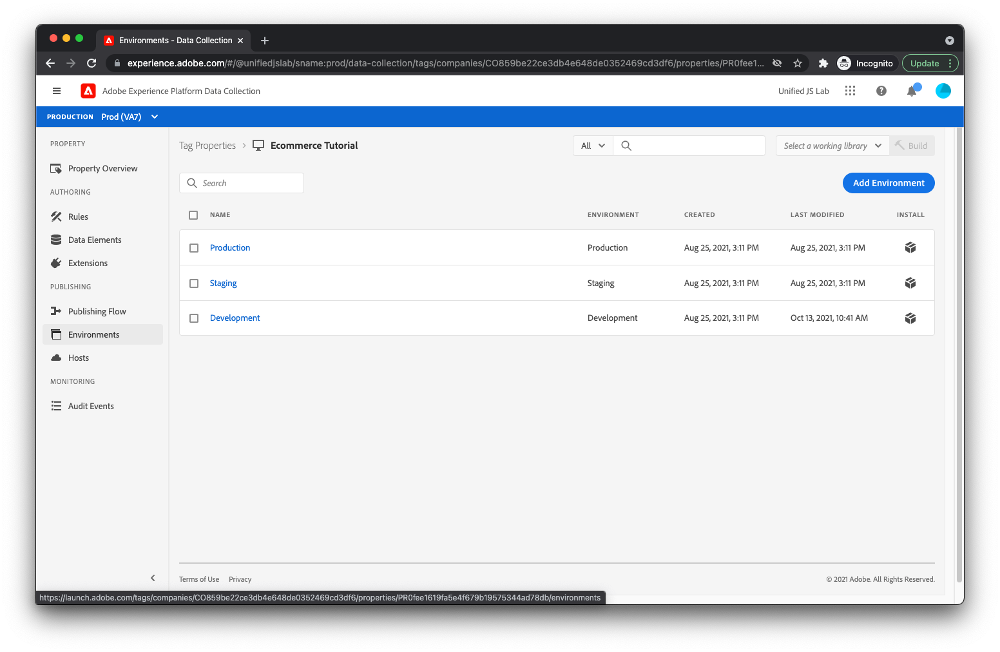

# 라이브러리 게시

이제 웹 사이트에 태그 라이브러리를 배포할 차례입니다.

## 라이브러리 만들기

먼저 만든 확장, 규칙 및 데이터 요소를 포함하는 라이브러리를 만들어야 합니다. 라이브러리를 만들려면 다음을 선택합니다 [!UICONTROL 게시 플로우] 왼쪽 메뉴에서 을 클릭합니다.

선택 [!UICONTROL 라이브러리 추가].

라이브러리 만들기 보기가 표시됩니다.


라이브러리에 다음과 같은 이름을 지정하십시오. _데모_. 선택 [!UICONTROL 개발] 다음에서 [!UICONTROL 환경] 드롭다운입니다. 그런 다음 [!UICONTROL 변경된 모든 리소스 추가].

이제 아래에 나열된 모든 확장, 규칙 및 데이터 요소가 표시됩니다. [!UICONTROL 리소스 변경 사항]. 클릭 [!UICONTROL 개발에 저장 및 구축].

## HTML에 포함 코드 추가

이제 새로 빌드된 태그 라이브러리를 로드하는 제품 페이지 HTML에 스크립트 태그를 추가해야 합니다.

클릭하여 시작 [!UICONTROL 환경] 왼쪽 메뉴에서 을 클릭합니다. 세 가지 다른 환경이 나열되어 있습니다.



에서 패키지 아이콘 클릭 [!UICONTROL 개발] 환경 행입니다. 페이지에 Launch 라이브러리 스크립트를 설치하는 지침이 표시됩니다.


스크립트 태그를 복사합니다(편의상 클립보드로 복사 버튼이 있음). 제품 페이지 HTML을 열고 앞에 스크립트 태그를 삽입합니다. `</head>` 태그에 가깝게 배치하십시오. 최종 HTML은 다음과 같아야 합니다.

```html
<!DOCTYPE html>
<html lang="en">
  <head>
    <title>Product Page</title>
    <script>
      window.adobeDataLayer = window.adobeDataLayer || [];
      window.adobeDataLayer.push({
        "event": "pageViewed",
        "web": {
          "webPageDetails": {
            "name": "Foam Roller",
            "siteSection": "Equipment"
          },
        },
        "productListItems": [
          {
            "SKU": "eqfr08",
            "currencyCode": "USD",
            "name": "Foam Roller",
            "priceTotal": 18.95
          }
        ]
      });
      window.adobeDataLayer.push({
        "event": "productViewed"
      });
      window.onAddToCartClick = function() {
        // In a real implementation, you would change this condition to 
        // only pass if a cart doesn't already exist. You would typically 
        // do this by checking a cookie or variable value.
        if (true) {
          window.adobeDataLayer.push({
            "event": "cartOpened",
          });
        }
        window.adobeDataLayer.push({
          "event": "productAddedToCart"
        });
      };
      window.onDownloadAppClick = function() {
        window.adobeDataLayer.push({
          "event": "downloadAppClicked",
          "eventInfo": {
            "web": {
              "webInteraction": {
                "URL": "https://example.com/download",
                "name": "App Download",
                "type": "download"
              }
            }
          }
        });
      };
    </script>
    <!--Swap this script tag with your own-->
    <script src="https://assets.adobedtm.com/xxxxxxxxxxxx/xxxxxxxxxxxx/launch-xxxxxxxxxxxx-development.min.js" async></script>
  </head>
  <body>
    <h1>Foam Roller</h1>
    <p>This foam roller is composed of durable material that holds its shape and delivers deep tissue therapy. Purchase now for only $18.95!</p>
    <button type="button" onclick="onAddToCartClick()">Add to cart</button>
    <a href="https://example.com/download" onclick="onDownloadAppClick()">Download the app</a>
  </body>
</html>
```

다음을 확인하십시오. [태그에 대한 게시 설명서](https://experienceleague.adobe.com/docs/experience-platform/tags/publish/overview.html) 게시 프로세스에 대해 자세히 알아보려면 다음을 수행하십시오.

그런 다음 새 구현을 테스트합니다!
