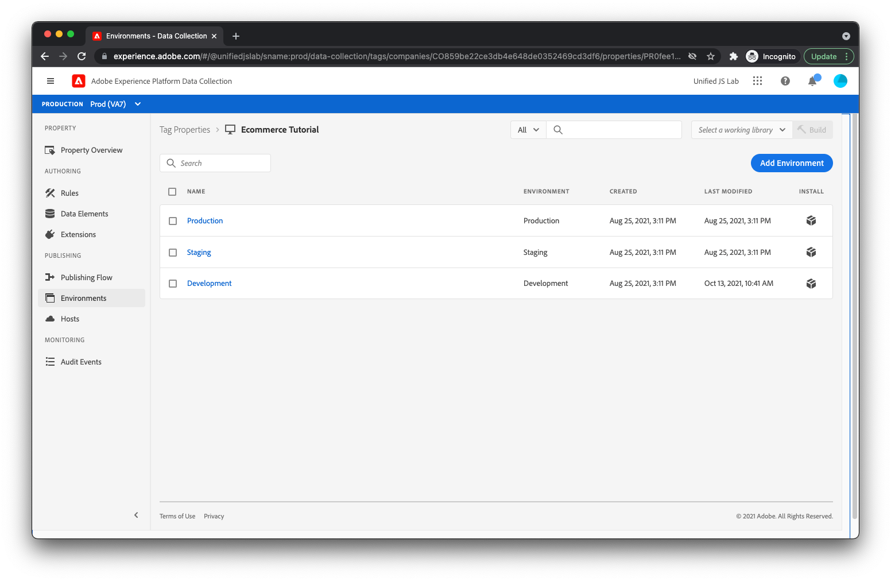

# 데이터 스트림 만들기

웹 사이트에서 보내는 데이터가 [Adobe Experience Platform Edge](https://business.adobe.com/products/experience-platform/experience-platform-edge-network.html). 이 네트워크는 데이터를 [이전에 만든 Adobe Experience Platform 데이터 세트](create-a-schema.md) 및 Adobe Experience Cloud 내의 기타 제품을 사용할 수 있습니다. 이러한 Adobe 제품은 웹 페이지에 대한 데이터로도 응답할 수 있습니다. 예를 들어 Edge Network는 Adobe Target의 개인화 콘텐츠를 반환할 수 있습니다.

Edge Network에서 데이터를 주고받는 Adobe 제품을 구성하려면 데이터 스트림을 만들어야 합니다. Edge Network가 웹 페이지에서 데이터를 받으면 생성한 데이터 스트림을 컨설팅하고 해당 구성을 읽은 다음 데이터를 적절한 Adobe 제품으로 전달합니다.

데이터 스트림을 만들려면 먼저 [!UICONTROL 데이터 스트림] 내에서 보기 [!UICONTROL 데이터 수집]. 클릭 [!UICONTROL 데이터 스트림 만들기] 오른쪽 상단 모서리에서 데이터 스트림의 이름을 입력합니다.

다음 화면에서는 웹 사이트에서 전송한 데이터를 받아야 하는 Adobe 제품을 구성할 수 있습니다. 이 자습서를 사용하려면 Adobe Experience Platform만 활성화하고 이전에 만든 데이터 세트(기본값)를 선택합니다 [!UICONTROL Prod] sandbox)를 클릭하고 [!UICONTROL 저장].

데이터 스트림이 생성되었습니다.

## 데이터 스트림 환경

회사에는 일반적으로 모든 웹 사이트 업데이트에 대한 프로모션 경로가 있습니다. 회사의 누군가(변경에 따라 마케터 또는 엔지니어)는 일반적으로 해당 사용자만 사용하는 개발 환경에서 변경 사항을 테스트합니다. 변경 사항이 마음에 들면 변경 사항이 추가 테스트를 받는 스테이징 환경으로 승격됩니다. 마지막으로, 변경 사항이 사용자가 보는 프로덕션 웹 사이트에 게시됩니다. 데이터 저장소는 이 프로모션 패턴을 지원합니다.

클릭한 후 [!UICONTROL 저장]: 다음 세 개의 데이터 스트림 환경이 자동으로 생성되었음을 알고 있어야 합니다. [!UICONTROL 개발 환경], [!UICONTROL 스테이징 환경], 및 [!UICONTROL 프로덕션 환경].

각 데이터 스트림 환경을 클릭하면 제공된 것과 동일한 구성이 모두 제공되었음을 알 수 있습니다. 그러나 이러한 환경을 개별적으로 사용자 지정할 수 있습니다.

Adobe Experience Platform 태그를 잘 알고 있는 경우 개발, 스테이징 및 프로덕션 환경의 개념에 익숙할 수 있습니다. 태그 내의 환경은 데이터 스트림 내의 환경과 관련되어 있습니다. 태그 게시 작업 과정을 통해 태그 라이브러리를 개발, 스테이징, 프로덕션으로 이동하면 사용되는 데이터 스트림 환경도 마찬가지로 자동으로 [!UICONTROL 개발 환경]에 대해 [!UICONTROL 스테이징 환경]에 대해 [!UICONTROL 프로덕션 환경]. 이렇게 하면 변경 사항이 개발 중인 동안 데이터를 하나의 데이터 세트에 보내고 변경 사항이 프로덕션 상태에 있으면 데이터를 다른 데이터 세트에 보낼 수 있습니다. 이렇게 하면 개발 프로세스 중에 생성할 수 있는 불필요한 데이터 없이 프로덕션 데이터를 유지할 수 있습니다. 나중에 태그 속성에서 확장을 구성할 때 데이터 스트림 환경에 대해 설명합니다.

이제 서버가 웹 페이지에서 데이터를 수신하도록 완전히 구성되었습니다.
