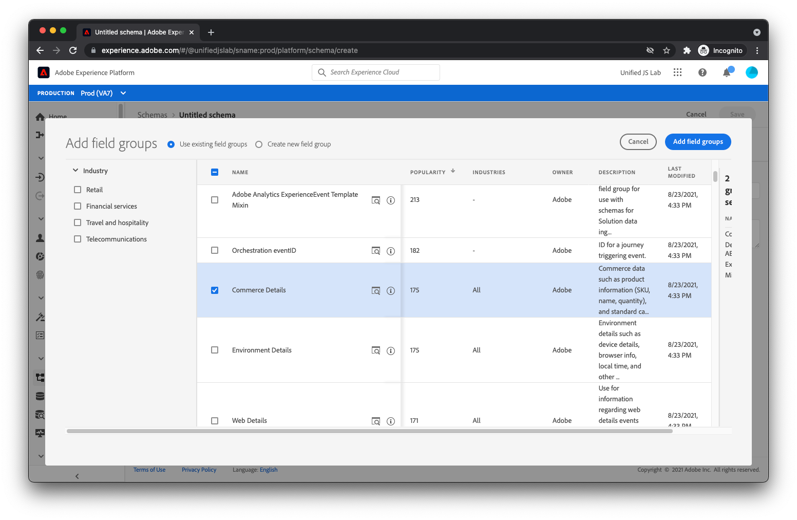

# 스키마 만들기

에서 설명한 대로 [데이터 구조화](../structuring-your-data.md): Adobe Experience Platform으로 전송된 데이터는 XDM에 있어야 합니다. 보다 구체적으로 설명하면 데이터가 _스키마_. 스키마는 기본적으로 데이터가 어떤 모습인지에 대한 설명입니다. 필드의 이름 및 데이터 내에서 필드의 위치를 설명합니다. 또한 각 필드에 포함해야 하는 값의 유형(예: 부울, 길이가 12자인 문자열, 숫자 배열)에 대해서도 설명합니다.

Adobe Experience Platform은 업계에서 일반적으로 사용되는 필드 그룹이라고 하는 기본 제공 빌딩 블록을 제공합니다. 예를 들어, 금융 서비스 산업의 경우, 잔액 이전 및 대출 지원을 위한 필드 그룹이 있습니다. 여행과 숙박업에서는 항공숙박업이나 숙박업소를 위한 체험단체가 있다.

스키마를 생성할 때 가능하면 기본 제공 필드 그룹을 사용하는 것이 좋습니다. 또한 귀사에 고유한 필드가 필요할 수도 있습니다. 이러한 이유로 생성한 스키마 내에서 사용할 사용자 지정 필드 그룹을 직접 만들 수 있습니다.

일반적인 전자 상거래 웹 사이트를 위한 스키마 만드는 과정을 살펴보겠습니다.

먼저 다음 위치로 이동합니다. [!UICONTROL 스키마] Adobe Experience Platform 내부 보기

선택 [!UICONTROL 스키마 만들기] 오른쪽 상단 모서리에서 메뉴가 표시됩니다. 선택 [!UICONTROL XDM ExperienceEvent].

이때 스키마에 추가할 필드 그룹을 묻는 대화 상자가 표시됩니다. 선택해야 하는 첫 번째 필드 그룹은 이름이 인 필드 그룹입니다 [!UICONTROL AEP 웹 SDK ExperienceEvent]. 이 필드 그룹은 Adobe Experience Platform Web SDK에서 자동으로 수집한 데이터를 포함하는 필드 세트를 추가합니다.

이 자습서의 웹 사이트는 전자 상거래 웹 사이트이므로 [!UICONTROL 상거래 세부 사항] 필드 그룹. 이 그룹을 사용하면 보고 있는 제품, 장바구니에 추가 및 구매와 같은 일반적인 상거래 데이터를 전송할 수 있습니다.

을(를) 클릭합니다. [!UICONTROL 필드 그룹 추가] 대화 상자의 오른쪽 맨 위에 있는 단추입니다. 이 시점에서 스키마의 구조를 볼 수 있습니다.

추가한 필드 그룹이 왼쪽에 나열됩니다. 필드 그룹을 선택하면 해당 필드 그룹이 제공한 오른쪽에 있는 필드가 강조 표시됩니다. 잠시 사용 가능한 필드를 살펴보십시오.

마지막으로 다음을 선택합니다. [!UICONTROL 제목 없는 스키마] 화면 왼쪽에서 화면 오른쪽에 이름과 설명을 입력하고 을 클릭합니다. [!UICONTROL 저장].

스키마가 생성되었습니다. 다음으로, 데이터를 보유할 데이터 세트를 만드는 방법을 알아봅니다.

스키마 만들기에 대한 자세한 내용은 [스키마 만들기(UI)](https://experienceleague.adobe.com/docs/experience-platform/xdm/tutorials/create-schema-ui.html?lang=ko).
