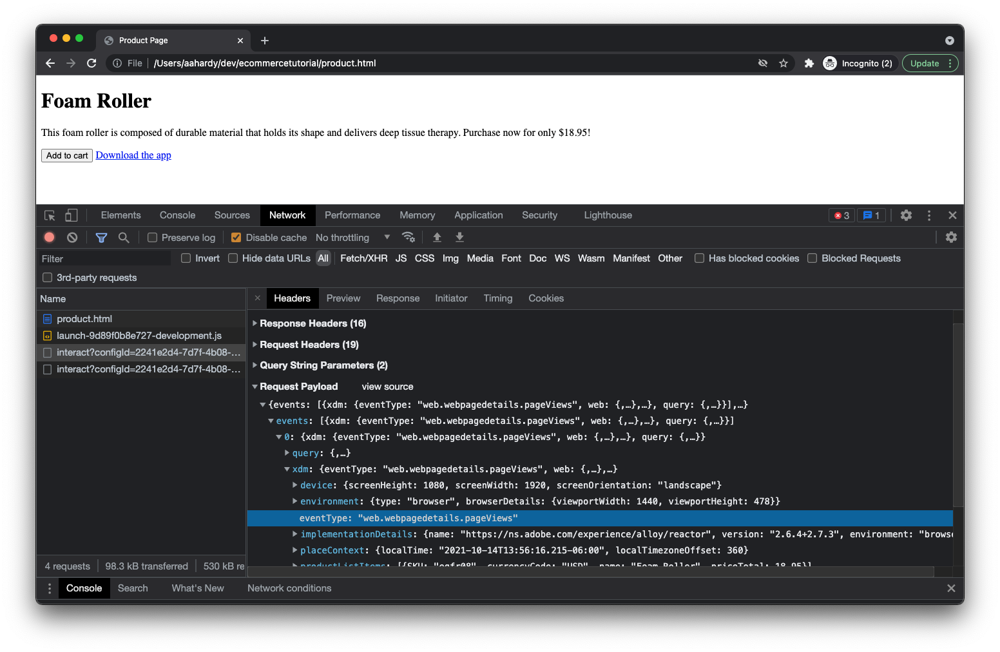

# 구현 테스트

웹 페이지를 설정하고 Adobe Experience Platform 태그 라이브러리를 배포했으므로 구현을 테스트할 차례입니다.

브라우저에서 제품 페이지를 엽니다. 다음을 클릭하여 수행할 수 있습니다 _파일_ 그런 다음 _파일 열기..._ 브라우저에서 페이지를 호스팅하거나 웹 서버에서 적절한 URL을 입력할 수 있습니다.

페이지가 로드되면 다음과 같은 항목이 표시됩니다.

예쁘지는 않지만, 그래도 할 수 있을 거예요.

## Inspect 페이지 보기 및 제품 보기 이벤트

브라우저에서 개발자 도구를 열고 네트워크 패널을 클릭합니다. 페이지를 새로 고칩니다.

이 시점에서 네 개의 요청이 표시됩니다.

1. product.html - 웹 페이지입니다.
2. launch-############-development.js - Launch 라이브러리입니다.
3. 상호 작용 - 서버로 전송되는 페이지 보기 이벤트입니다.
4. 상호 작용 - 서버로 전송되는 제품 보기 이벤트입니다.

각 요청의 페이로드를 자유롭게 검사하십시오. 첫 번째 `interact` 요청을 수행하면 페이로드가 `eventType` 의 `web.webpagedetails.pageViews`.

두 번째 `interact` 요청을 수행하면 페이로드가 `eventType` 의 `commerce.productViews`.

제품 정보를 포함하여 전송 중인 나머지 데이터를 자유롭게 편집할 수 있습니다.

## Inspect 장바구니 열기 및 장바구니 이벤트에 추가

이제 _장바구니에 추가_ 버튼을 클릭합니다.

두 개의 추가 요청이 표시됩니다. 먼저 요청이 있고 `eventType` 의 `commerce.productListOpens` (새 장바구니를 여는 경우) 및 (으)로 두 번째 장바구니 `eventType` 의 `commerce.productListAdds` (장바구니에 제품 추가).

## Inspect 다운로드 앱 링크 클릭 이벤트

브라우저에 따라 현재 페이지에서 멀리 탐색하는 링크를 클릭하면 네트워크 패널이 지워질 수 있습니다. 페이지에서 멀리 탐색하기 직전에 발생하는 링크 클릭 이벤트에 대한 네트워크 요청을 검사하려면 페이지 간에 네트워크 로그를 보존하도록 브라우저를 구성해야 합니다. 이 작업은 _로그 유지_ 네트워크 패널(Chrome, Safari, Edge)에서 확인란을 선택하거나 톱니바퀴 아이콘을 클릭하고 _로그 유지_ 표시된 메뉴(Firefox)의 항목.

이제 _앱 다운로드_ 링크를 클릭합니다.

한 명 더 보게 `interact` 요청이 네트워크 패널에 표시됩니다. 요청을 검사하면 `eventType` 의 `web.webinteraction.linkClicks` 뿐만 아니라 클릭한 링크에 대한 세부 정보도 포함되어 있습니다.

## 데이터가 Adobe Experience Platform 데이터 세트에 도달하는지 확인합니다

요청이 전송되고 있으므로 데이터가 생성한 Adobe Experience Platform 데이터 세트에 안전하게 도착하는지 여부도 확인할 수 있습니다. 다음으로 이동 [!UICONTROL 데이터 세트] Adobe Experience Platform 내부 보기

이전에 만든 데이터 세트를 선택합니다.

몇 분 정도 기다려야 할 수 있지만 곧 처리 및 데이터 세트에 삽입되는 데이터가 표시됩니다. 또한 처리 성공 또는 실패 여부를 확인해야 합니다. 실패하면, 왜 실패했는지 알 수 있을 것입니다. 오류는 일반적으로 전송하는 데이터가 스키마와 일치하지 않으므로 데이터 또는 스키마를 적절하게 조정해야 하기 때문에 발생합니다.

## Adobe Experience Platform Debugger 확장 프로그램 사용

브라우저 및 Adobe 서버에서 구현이 작동하는 방식에 대한 자세한 내용은 Adobe Experience Platform Debugger 브라우저 확장을 확인하십시오!

[Chrome용 Adobe Experience Platform Debugger 확장 프로그램](https://chrome.google.com/webstore/detail/adobe-experience-platform/bfnnokhpnncpkdmbokanobigaccjkpob)

[Firefox용 Adobe Experience Platform Debugger 확장 프로그램](https://addons.mozilla.org/ko-KR/firefox/addon/adobe-experience-platform-dbg/)
