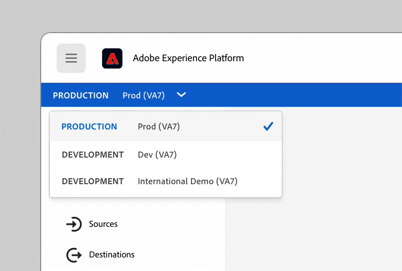

# 샌드박스 사용

Experience Platform 샌드박스가 데이터 격리 및 환경을 제공하는 방법에 대해 알아보십시오. 새로운 기능이나 기존 기능을 사용해 보고, &quot;장애 조치(fail fast)&quot; 접근 방식을 사용하여 개발 이니셔티브를 재설정 및 재시작할 수 있습니다.

>[!VIDEO](https://video.tv.adobe.com/v/29838/?quality=12&learn=on)

>[!NOTE]
>
>이 비디오를 기록한 후 샌드박스 전환기가 Experience Cloud 인터페이스의 오른쪽 맨 위로 이동하여 작업에 집중할 수 있는 더 많은 수직 공간을 제공합니다.
>
> 

자세한 내용은 [샌드박스 사용 안내서](https://experienceleague.adobe.com/docs/experience-platform/sandbox/home.html?lang=ko).
